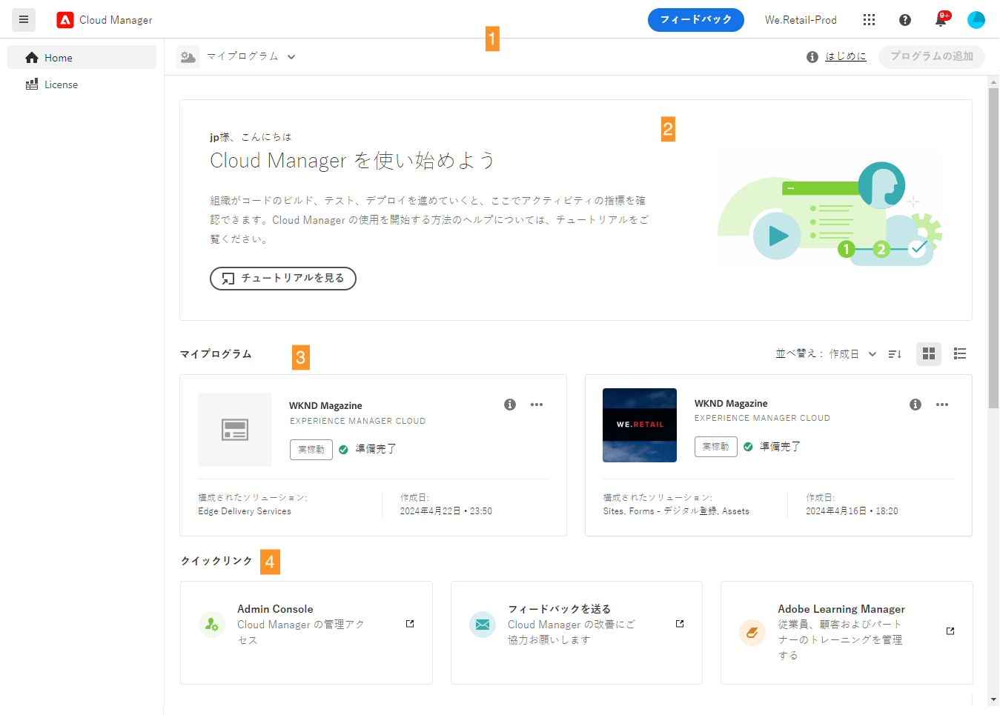
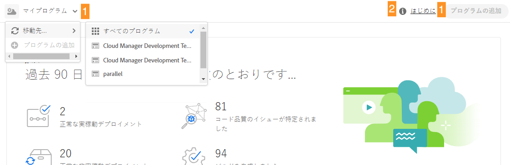
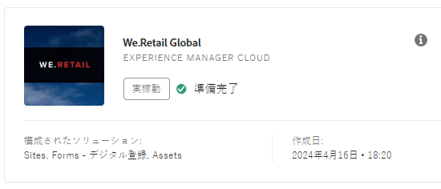
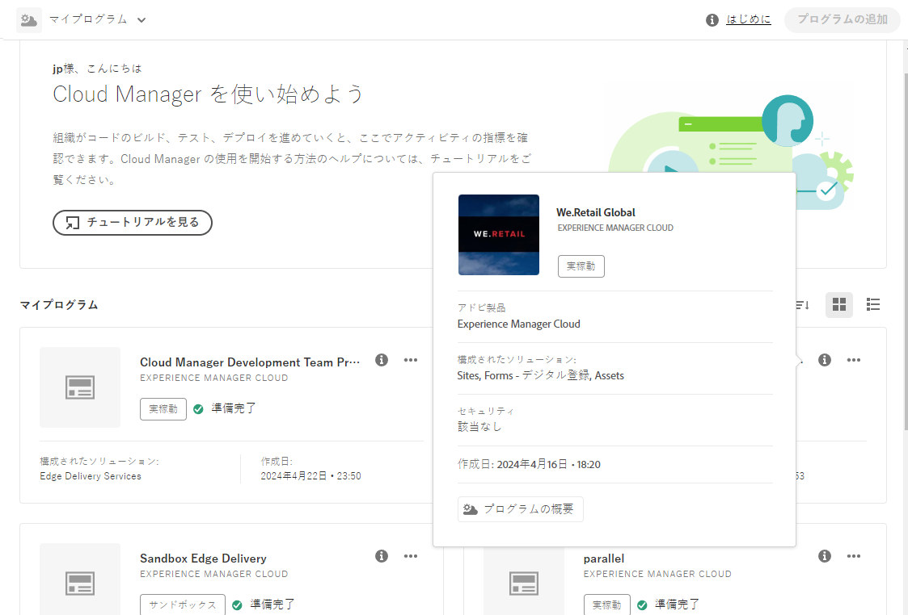
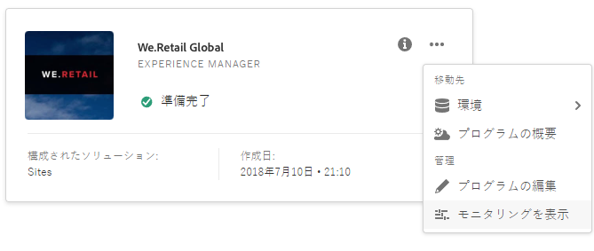
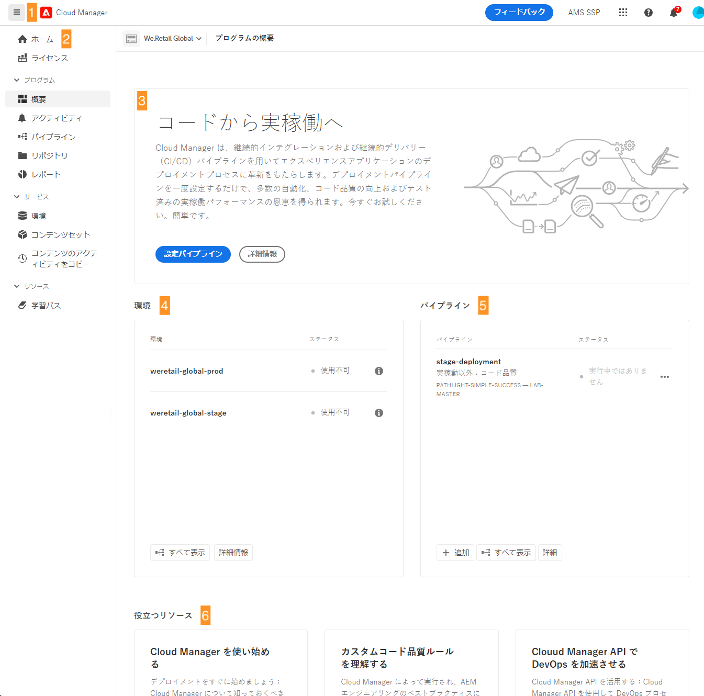
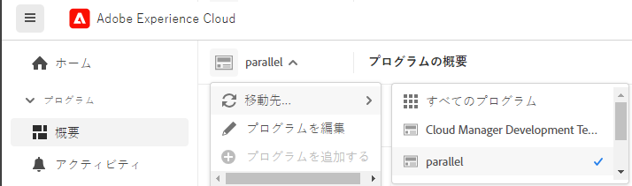
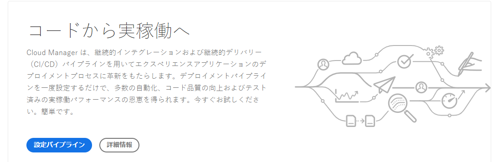

# Cloud Manager UI の操作 {#navigation}

Cloud Manager UI の整理方法と、プログラムと環境を管理する操作方法について説明します。

Cloud Manager UI は、主に次の 2 つのグラフィカルインターフェイスで構成されます。

* [マイプログラムコンソール](#my-programs)：すべてのプログラムを表示および管理できます。
* [プログラムの概要ウィンドウ](#program-overview)：個々のプログラムの詳細を確認して管理できます。

## マイプログラムコンソール {#my-programs}

[my.cloudmanager.adobe.com](https://my.cloudmanager.adobe.com/) で Cloud Manager にログインし、適切な組織を選択すると、**マイプログラム**&#x200B;コンソールが表示されます。

マイプログラムコンソールには、選択した組織でアクセス権を持つすべてのプログラムの概要が表示されます。複数のパーツで構成されます。

1. [ツールバー](#toolbars-my-programs-toolbars)：組織の選択、アラート、アカウント設定を行います。
1. [統計とコールトゥアクション](#statistics)：最近のアクティビティの概要を確認します。
1. [プログラムとライセンス](#programs-license)：現在のライセンスステータスを把握し、プログラムを管理します。
1. [クイックリンク](#quick-links)：関連するリソースに簡単にアクセスします。

>[!TIP]
>
>プログラムについて詳しくは、[プログラムとプログラムタイプ](/help/getting-started/program-setup.md)ドキュメントを参照してください。

### ツールバー {#my-programs-toolbars}

2 つのツールバーが重なり合っています。

#### Cloud Manager ヘッダー {#cloud-manager-header}

1 つ目は Cloud Manager ヘッダーで、Cloud Manager を操作する際に保持されます。Cloud Manager プログラム全体に適用される設定と情報にアクセスできるアンカーです。

1. Cloud Manager ボタンをクリックすると、Cloud Manager のどこにいても、Cloud Manager のマイプログラムコンソールコンソールに戻ります。
1. 「フィードバック」ボタンをタップまたはクリック、Cloud Manager に関するフィードバックをアドビに送信します。
1. 組織セレクターには、現在ログインしている組織（この例では、Foundation 内部）が表示されます。Adobe ID が複数の組織に関連付けられている場合、別の組織に切り替えるには、タップまたはクリックします。
1. ソリューション切り替えボタンをタップまたはクリックすると、他の Experience Cloud ソリューションに素早くジャンプできます。
1. ヘルプアイコンを使用すると、学習リソースやサポートリソースに素早くアクセスできます。
1. 通知アイコンには、現在割り当てられている未完了の[通知](/help/using/notifications.md)の数を示すバッジが付きます。
1. ユーザー設定にアクセスするには、ユーザーを表すアイコンを選択します。ユーザー画像が設定されていない場合、アイコンがランダムに割り当てられます。

#### プログラムツールバー {#program-toolbar}

プログラムツールバーには、Cloud Manager プログラムとコンテキストに適したアクションを切り替えるリンクが表示されます。

1. プログラムセレクターが開き、ドロップダウンで他のプログラムをすばやく選択したり、新しいプログラムの作成など、コンテキストに適したアクションを実行したりできます。
1. 「はじめに」リンクから、[オンボーディングドキュメントジャーニー](https://experienceleague.adobe.com/ja/docs/experience-manager-cloud-service/content/onboarding/journey/overview)にアクセスして、Cloud Manager を使い始めることができます。
   * オンボーディングジャーニーは、AMS のクラウドサービスではなく、AEM as a Cloud Service 向けに設計されていますが、多くの概念は同じです。
1. アクションボタンを使用すると、新しいプログラムの作成など、コンテキストに適したアクションを実行できます。

### 統計 {#statistics}

統計セクションでは、組織の集計データが提供されます。例えば、プログラムを正常に設定した場合、過去 90 日間のアクティビティの統計には、次の内容が表示されることがあります。

* [デプロイ](/help/using/code-deployment.md)数
* 特定された[コード品質の問題](/help/using/code-quality-testing.md)の数
* ビルド数

組織の設定を開始したばかりの場合は、次の手順やドキュメントのリソースに関するヒントが表示される場合があります。

### プログラムとライセンス {#programs-license}

マイプログラムコンソールの主なコンテンツは、プログラムのリストとライセンスのステータスです。

#### 「プログラム」タブ {#programs}

「**プログラム**」タブには、アクセス権のある各プログラムを表すカードが一覧表示されます。カードをタップまたはクリックすると、**プログラムの概要**&#x200B;ページにアクセスしてプログラムの詳細を確認できます。

並べ替えオプションを使用すると、必要なプログラムを見つけやすくなります。

* 並べ替え
   * 作成日（デフォルト）
   * プログラム名
   * ステータス
* 昇順（デフォルト）／降順
* グリッド表示（デフォルト）
* リスト表示

すべてのプログラムはカード（またはテーブルの行）で表され、プログラムの概要と、アクションを実行するためのクイックリンクを提供します。

* プログラム画像（設定されている場合）
* プログラム名
* サービスタイプ：[AEM as a Cloud Service プログラム](https://experienceleague.adobe.com/ja/docs/experience-manager-cloud-service/content/implementing/home)の **Experience Manager Cloud** または AMS プログラムの **Experience Manager**
* ステータス
* 設定済みのソリューション
* 作成日

また、情報アイコンを使用すると、プログラムに関する追加情報にすばやくアクセスできます（リスト表示で役立ちます）。

省略記号アイコンを使用すると、プログラムに対して実行できる追加のアクションにアクセスできます。

* プログラムの特定の[環境](/help/using/managing-environments.md)に移動
* [プログラムの概要](#program-overview)を開く
* [プログラムを編集](/help/getting-started/program-setup.md)
* モニタリングを表示

#### 「ライセンス」タブ {#license-tab}

「**ライセンス**」タブからライセンスダッシュボードにすばやくアクセスできます。

### クイックリンク {#quick-links}

「クイックリンク」セクションでは、一般的に使用される関連リソースにアクセスできます。

## プログラムの概要ウィンドウ {#program-overview}

マイプログラムコンソールでプログラムを選択すると、プログラムの概要に移動できます。

プログラムの概要では、Cloud Manager プログラムのすべての詳細にアクセスできます。マイプログラムコンソールと同様に、複数のパーツで構成されます。

1. [ツールバー](#program-overview-toolbar)：マイプログラムコンソールにすばやく戻ったり、プログラム内を移動したりできます。
1. [タブ](#program-tabs)：プログラムの様々な側面を切り替えることができます。
1. [コールトゥアクション](#cta)：プログラムの最後のアクションに基づきます。
1. [環境の概要](#environments)：プログラムの環境について。
1. [パイプラインの概要](#pipelines)：プログラムのパイプラインについて。
1. [役立つリソース](#useful-resources)：リンク先が含まれます。

### ツールバー {#program-overview-toolbar}

プログラムの概要のツールバーは、マイプログラムコンソールのツールバーと類似しています。ここでは違いのみを説明します。

#### Cloud Manager ヘッダー {#cloud-manager-header-2}

Cloud Manager ヘッダーには、自動的に開くハンバーガーメニューがあり、プログラムの概要の移動可能なタブを表示できます。

ハンバーガーメニューのアイコンをタップまたはクリックすると、タブを非表示にできます。

#### プログラムツールバー {#program-toolbar-2}

プログラムツールバーを使用すると、他のプログラムにすばやく切り替えることができますが、プログラムの追加や編集など、コンテキストに適したアクションにもアクセスできます。

また、ハンバーガーメニューを使用してタブを非表示にすることを選択した場合、ツールバーには常に表示するタブが表示されます。

### プログラムタブ {#program-tabs}

各プログラムには、多数のオプションとデータが関連付けられています。これらのデータはタブに集められ、プログラムの操作が簡単になります。タブを使用すると、次のパーツにアクセスできます。

* 概要 - 現在のドキュメントに記載されているプログラムの概要
* [アクティビティ](/help/using/managing-pipelines.md#activity) - プログラムのパイプライン実行の履歴
* [パイプライン](/help/using/managing-pipelines.md#pipelines) - プログラムに対して設定されたすべてのパイプライン
* [リポジトリ](/help/managing-code/repositories.md) - プログラムに対して設定されたすべてのリポジトリ
* [レポート](/help/using/monitoring-environments.md#system-monitoring-overview) - SLA データなどの指標
* [環境](/help/using/managing-environments.md) - プログラムに対して設定されたすべての環境
* [コンテンツセット](/help/using/content-copy.md) - コピー目的に対して作成されたコンテンツのセット
* [コンテンツをコピーアクティビティ](/help/using/content-copy.md) - コンテンツをコピーするアクティビティ
* 学習パス - Cloud Manager に関するその他の学習リソース

デフォルトでは、プログラムを開くと、「**概要**」タブが表示されます。現在のタブがハイライト表示されます。別のタブを選択すると、その詳細が表示されます。

[Cloud Manager ヘッダー](#cloud-manager-header-2)のハンバーガーメニューを使用すると、タブが非表示になります。

### コールトゥアクション {#cta}

「コールトゥアクション」セクションでは、プログラムのステータスに応じて役立つ情報を提供します。新しいプログラムの場合は、次の手順が提供されるほか、[プログラム作成時に設定された公開日のリマインダーが表示される場合があります。](/help/getting-started/program-setup.md)

ライブプログラムの場合、最後のデプロイメントのステータスと、詳細および新しいデプロイメントを開始するためのリンクが表示されます。

### 環境カード {#environments}

**環境**&#x200B;カードには、環境の概要とクイックアクションへのリンクが表示されます。

**環境**&#x200B;カードには 3 つの環境のみ表示されます。「**すべて表示**」ボタンをクリックすると、プログラムのすべての環境が表示されます。

環境の管理方法について詳しくは、[環境の管理](/help/using/managing-environments.md)ドキュメントを参照してください。

### パイプラインカード {#pipelines}

**パイプライン**&#x200B;カードには、パイプラインの概要とクイックアクションへのリンクが表示されます。

**パイプライン**&#x200B;カードには 3 つのパイプラインのみ表示されます。「**すべて表示**」をクリックすると、プログラムのすべてのパイプラインが表示されます。

パイプラインの管理方法について詳しくは、[パイプラインの管理](/help/using/managing-pipelines.md)ドキュメントを参照してください。

### 役立つリソース {#useful-resources}

「**役立つリソース**」セクションには、Cloud Manager のその他の学習リソースへのリンクが含まれます。
