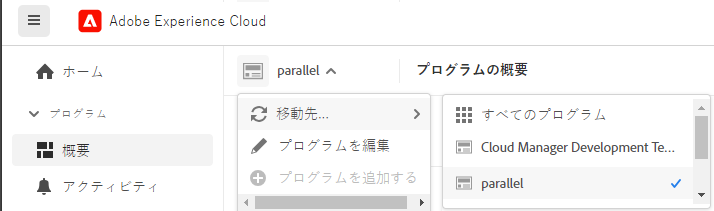
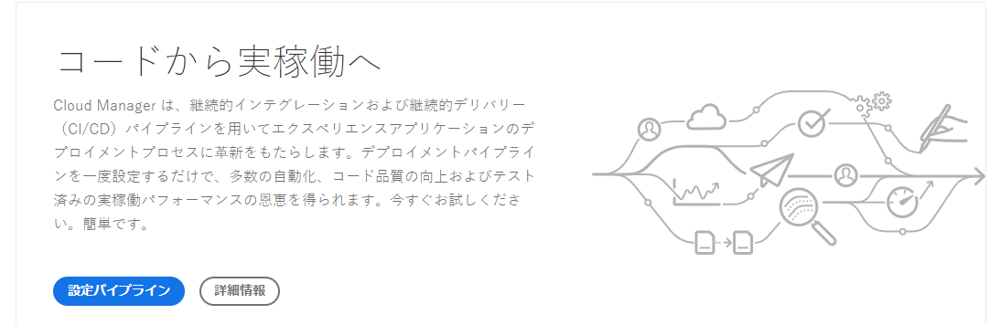

# Cloud Manager UI の操作 {#navigation}

Cloud Manager UI の整理方法と、プログラムと環境を管理する操作方法について説明します。

Cloud Manager UI は、主に次の 2 つのグラフィカルインターフェイスで構成されます。

* [マイプログラムコンソール](#my-programs-console)：すべてのプログラムを表示および管理できます。
* [&#x200B; プログラムの概要ウィンドウ &#x200B;](#program-overview)では、個々のプログラムの詳細と管理を確認できます。

## マイプログラムコンソール {#my-programs-console}

[experience.adobe.com](https://experience.adobe.com/experiencemanager)でCloud Managerにログインし、適切な組織を選択すると、**マイプログラム** コンソールが表示されます。

**マイプログラム** コンソールには、選択した組織でアクセスできるすべてのプログラムの概要が表示されます。 いくつかの部分で構成されています。

|   | 領域 | 説明 |
| --- | --- | --- |
| 1 | [&#x200B; ツールバー](#toolbars-my-programs-toolbars) | 組織の選択、アラート、アカウントの設定に使用します。 |
| 2 | 左側のパネルタブ | プログラムの現在のビューを切り替える様々なタブがあります。次のタブがあります。 <ul><li>**Experience Manager**&#x200B;は、様々なAEM ソリューションのホームページを開きます</li><li>すべての利用可能なプログラムを表示する&#x200B;**すべてのプログラム**。</li><li>**ライセンス**&#x200B;がライセンスダッシュボードを開きます。 ライセンスダッシュボードは、*AEM as a Cloud Service プログラム* （AEMaaCS）にのみ適用され、AEM 6.5やAEM 6.5 LTSなどのAdobe Managed Services プログラムには適用されません。 プログラムが持つサービスの種類（AEMaaCSまたはAMS）を判断するには、この記事の「[&#x200B; プログラムカード」の節](#program-cards)を参照してください。 タブはデフォルトで閉じられ、[Cloud Manager ヘッダー](#cloud-manager-header)の左側にある ドロップダウンメニューを使用して表示できます。</li></ol> |
| 3 | [自分のプログラム &#x200B;](#my-programs-section) | 選択できる利用可能なすべてのプログラムが一覧表示されます。プログラムの詳細については、  プログラムとプログラムの種類[&#128279;](/help/getting-started/program-setup.md)を参照してください。 |
| 4 | [&#x200B; コールトゥアクションと統計](#cta-statistics) | 最近のアクティビティの概要を表示します。 |
| 5 | [&#x200B; クイックリンク &#x200B;](#quick-links) | 関連情報へのすばやいアクセス。 |

### ツールバー {#my-programs-toolbars}

2つのツールバーがあります。

#### Cloud Manager ヘッダー {#cloud-manager-header}

1 つ目は Cloud Manager ヘッダーです。 Cloud Managerを使用している間は、常にヘッダーが表示されます。 これは、すべてのCloud Manager プログラムに適用される設定と情報へのアクセスを提供する一元的な場所です。

| 領域 | 説明 |
| --- | --- |
| を表示 | 個々のプログラムの特定の部分に対するタブへのアクセスを提供するドロップダウンメニュー。  プログラムのサービスの種類（AMSまたはAEMaaCS）を判断するには、このドキュメントの[&#x200B; プログラムカードの節](#program-cards)を参照してください。 |
|  Cloud Manager | Cloud Managerの場所に関係なく、Cloud Managerの&#x200B;**マイプログラム** コンソールをクリックして開きます。 |
| *`Name of selected organization`* | 組織セレクターには、現在ログインしている組織（この例では、*Foundation Internal*）が表示されます。 Adobe IDが複数の組織に関連付けられている場合は、クリックして別の組織に切り替えます。 |
|  フィードバック | クリックして、Cloud Managerに関するAdobeへのフィードバックを提供します。 |
|  | AI アシスタントは、AEM関連のクエリに対する回答を効率的に見つけるように設計された、会話型インターフェイスを提供します。 [AI アシスタント &#x200B;](https://experienceleague.adobe.com/ja/docs/experience-manager-65/content/ai-in-aem/ai-assistant/ai-assistant-in-aem#)を参照 |
|  | クリックすると、学習およびサポートリソースに素早くアクセスできます。 |
|  | クリックすると、現在割り当てられている未完了の[通知](/help/using/notifications.md)の数が表示されます |
|  | AEM ホームページとAEM ソリューションの間をすばやく移動するには、クリックします |
| *`Dynamic Account icon`* | ユーザーの写真をクリックして、**アカウント設定**&#x200B;および&#x200B;**プログラム設定**&#x200B;にアクセスするか、ログアウトします。  ユーザー画像を追加しないことを選択した場合、アイコンがランダムに割り当てられます（上のツールバー画像を参照）。 |

<!--
1. The  icon on the left side of the header is  
   * The License Dashboard only applies to AEM as a Cloud Service programs, not AMS programs.
   * To determine the type of service your program has (AMS or AEMaaCS), see the [Program Cards section](#program-cards) of this document.
1. The **Adobe Cloud Manager** button takes you back to the **My Programs** console of Cloud Manager no matter where you are in Cloud Manager.
1. Click **Feedback** to provide feedback to Adobe about Cloud Manager.
1. The organization selector displays the organization that you are currently signed into (in this example, Foundation Internal). Click to switch to another organization if your Adobe ID is associated with multiple.
1. Clicking the solutions switcher lets you quickly jump to other Experience Cloud solutions.
1. The Help icon provides quick access to learning and support resources.
1. The notifications icon is badged with the number of currently assigned incomplete [notifications](/help/using/notifications.md)
1. Select the icon representing your user to access your user settings. If you do not select a user picture, an icon is randomly assigned. 
-->

#### プログラムツールバー {#program-toolbar}

プログラムツールバーには、Cloud Manager プログラムとコンテキストに関連するアクションを切り替えるためのリンクが用意されています。

|   | 領域 | 説明 |
| --- | --- | --- |
| 1 | マイプログラム | クリックしてドロップダウンリストを開き、プログラムの追加、他の既存のプログラムの選択、またはExperience Manager ホームページに戻ることができます。 |
| 2 | はじめに | [&#x200B; オンボーディングドキュメントのジャーニー](https://experienceleague.adobe.com/ja/docs/experience-manager-cloud-service/content/onboarding/journey/overview)にアクセスして、Cloud Managerの使用を開始します。  オンボーディングジャーニーは、Cloud Manager Adobe Experience Manager as a Cloud Service版（AEMaaCS）用に設計されており、Cloud Manager Adobe Managed Services版（AMS）用ではありません。 ただし、多くの概念は同じです。 |
| 3 | *`Dynamic action button`* | アクションボタンでは、「**プログラムを追加**」（上記の例に示す）やドメインの追加など、コンテキストに応じたアクションをクリックできます。 |

### コールトゥアクションと統計 {#cta-statistics}

「call-to-actionと統計」セクションには、組織の集計データが表示されます。 例えば、プログラムを正常に設定した場合、過去90日間のアクティビティの統計情報が表示されます。次の情報が表示されます。

* [デプロイ](/help/using/code-deployment.md)数
* 特定された[コード品質の問題](/help/using/code-quality-testing.md)の数
* ビルド数

組織のセットアップを開始する場合は、次の手順やドキュメントリソースに関するガイダンスがあります。

### マイプログラム {#my-programs-section}

マイプログラムコンソールのメインコンテンツは、プログラムを個々のカードとしてリストする「**マイプログラム**」セクションです。 カードをクリックすると、**プログラムの概要**&#x200B;ページにアクセスしてプログラムの詳細を確認できます。

権限によっては、特定のプログラムを選択できない場合があります。

次の並べ替えオプションを使用して、必要なプログラムをすばやく見つけることができます。

* 並べ替え：
   * 作成日
   * プログラム名
   * ステータス
*  /  プログラムの上または下の並べ替えはそれぞれ。
*  /  グリッドフォームまたはリストフォーム内のプログラムをそれぞれ表示します。

#### プログラムカード {#program-cards}

テーブル内のカードまたは行は、各プログラムを表し、プログラムの概要とアクションを実行するためのクイックリンクを提供します。

* プログラム画像（設定されている場合）
* プログラム名（上記の例では、*WKND Magazine*）
* サービスタイプ：
   * AMS プログラムの **Experience Manager**
   * [AEM as a Cloud Service プログラム](https://experienceleague.adobe.com/ja/docs/experience-manager-cloud-service/content/implementing/home)の **Experience Manager クラウド**
* ステータス（上記の例では、*Ready*）
* 設定済みのソリューション
* 作成日

「をクリックすると、プログラムに関する追加情報にすばやくアクセスできます（リスト表示で便利です）。

Cloud Manager AMSの情報ポップアップ

でプログラムに対して実行できる追加のアクションにアクセスできます。

* Experience Manager ホーム
* プログラムの特定の[環境](/help/using/managing-environments.md)に移動
* [プログラムの概要](#program-overview)を開く
* [プログラムを編集](/help/getting-started/program-setup.md)
* モニタリングを表示

### クイックリンク {#quick-links}

クイックリンク セクションでは、役立つ関連リソースにアクセスできます。

## プログラムの概要ウィンドウ {#program-overview}

[**マイプログラム**&#x200B;コンソール](#my-programs-console)でプログラムを選択すると、**プログラムの概要**&#x200B;ページに移動できます。

**プログラムの概要**&#x200B;では、Cloud Manager プログラムのすべての詳細にアクセスできます。 **マイプログラム**&#x200B;と同様に、いくつかの部分で構成されています。

1. [&#x200B; ツールバー](#program-overview-toolbar)を使用して&#x200B;**マイプログラム** コンソールにすばやく戻り、プログラムを移動します。
1. プログラムの様々な側面を切り替えるには、[&#x200B; タブ領域](#program-tabs)が必要です。
1. [コールトゥアクション](#cta)：プログラムの最後のアクションに基づきます。
1. プログラムの[環境](#environments)が関連付けられました。
1. プログラムの[&#x200B; パイプライン &#x200B;](#pipelines)を関連付けました。

### ツールバー {#program-overview-toolbar}

プログラムの概要のツールバーは、[マイプログラムコンソール](#my-programs-toolbars)のツールバーと類似しています。 ここでは違いのみを説明します。

#### Cloud Manager ヘッダー {#cloud-manager-header-2}

Cloud Manager ヘッダーには、 ドロップダウンメニューがあり、プログラム概要のナビゲーション可能なタブを表示するために自動的に開きます。

「」をクリックして、タブを非表示にします。

#### プログラムツールバー {#program-toolbar-2}

プログラムツールバーには、他のプログラムにすばやく切り替えるためのアクセス権が引き続き提供されますが、さらに、プログラムの追加や編集などのコンテキストに適したアクションへのアクセス権も提供されます。

さらに、してタブを非表示にした場合でも、ツールバーには現在のタブが表示されます。

### プログラムタブ {#program-tabs}

各プログラムには、多数のオプションとデータが関連付けられています。 このデータは、プログラムのナビゲーションを簡素化するためにタブに整理されています。 タブでは、次のアクセス権が付与されます。

* 概要 - 現在のドキュメントに記載されているプログラムの概要
* [アクティビティ](/help/using/managing-pipelines.md#activity) - プログラムのパイプライン実行の履歴
* [パイプライン](/help/using/managing-pipelines.md#pipelines) - プログラムに対して設定されたすべてのパイプライン
* [リポジトリ](/help/managing-code/managing-repositories.md) - プログラムに対して設定されたすべてのリポジトリ
* [レポート](/help/using/monitoring-environments.md#system-monitoring-overview) - SLA データなどの指標
* [環境](/help/using/managing-environments.md) - プログラムに対して設定されたすべての環境
* [コンテンツセット](/help/using/content-copy.md) - コピー目的に対して作成されたコンテンツのセット
* [コンテンツをコピーアクティビティ](/help/using/content-copy.md) - コンテンツをコピーするアクティビティ
* 学習パス - Cloud Manager に関するその他の学習リソース

デフォルトでは、プログラムを開くと、「**概要**」タブが表示されます。 現在のタブがハイライト表示されます。 別のタブを選択すると、その詳細が表示されます。

タブを非表示にするには、[Cloud Manager ヘッダー](#cloud-manager-header-2)のを使用します。

### コールトゥアクション {#cta}

「コールトゥアクション」セクションでは、プログラムのステータスに応じて役立つ情報を提供します。 新しいプログラムの場合は、次の手順が提供され、プログラムの作成中に[&#x200B; セットが公開された日付を知らせるリマインダーが表示されます](/help/getting-started/program-setup.md)。

ライブプログラムの場合、最後のデプロイメントのステータスが表示され、詳細のリンクや新しいデプロイメントの開始が表示されます。

### 環境カード {#environments}

**環境**&#x200B;カードには、環境の概要とクイックアクションへのリンクが表示されます。

**環境**&#x200B;カードには 3 つの環境のみ表示されます。 「**すべて表示**」ボタンをクリックすると、プログラムのすべての環境が表示されます。

環境の管理方法について詳しくは、[環境の管理](/help/using/managing-environments.md)を参照してください。

### パイプラインカード {#pipelines}

**パイプライン**&#x200B;カードには、パイプラインの概要とクイックアクションへのリンクが表示されます。

**パイプライン**&#x200B;カードには 3 つのパイプラインのみ表示されます。 「**すべて表示**」をクリックすると、プログラムのすべてのパイプラインが表示されます。

パイプラインの管理方法について詳しくは、[パイプラインの管理](/help/using/managing-pipelines.md)を参照してください。

### 役立つリソース {#useful-resources}

「**役立つリソース**」セクションには、Cloud Manager のその他の学習リソースへのリンクが含まれます。
