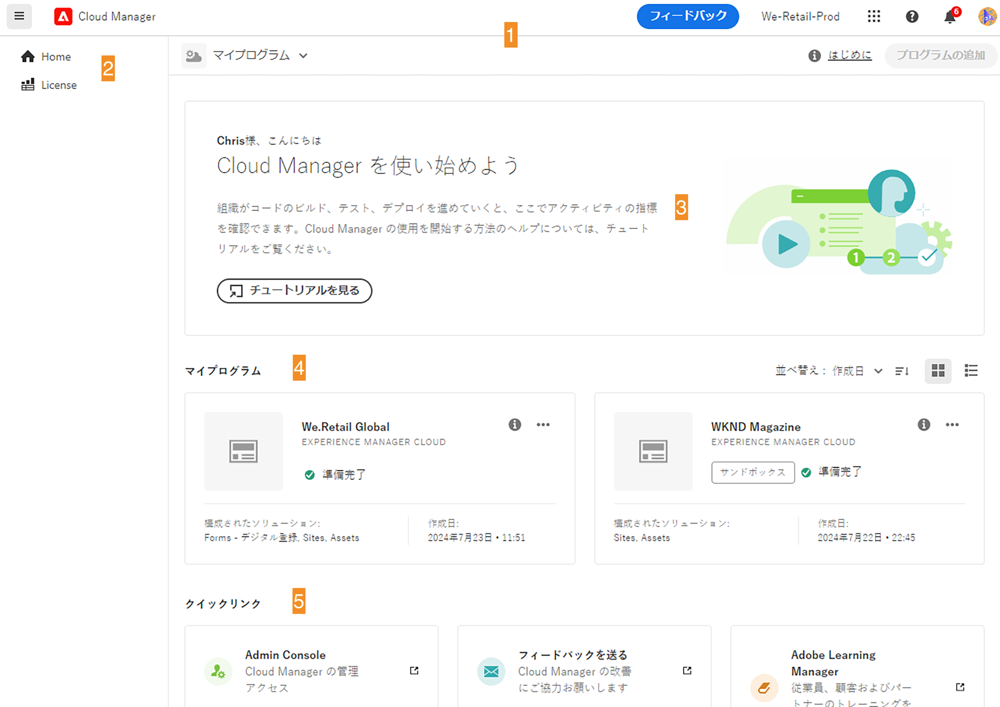
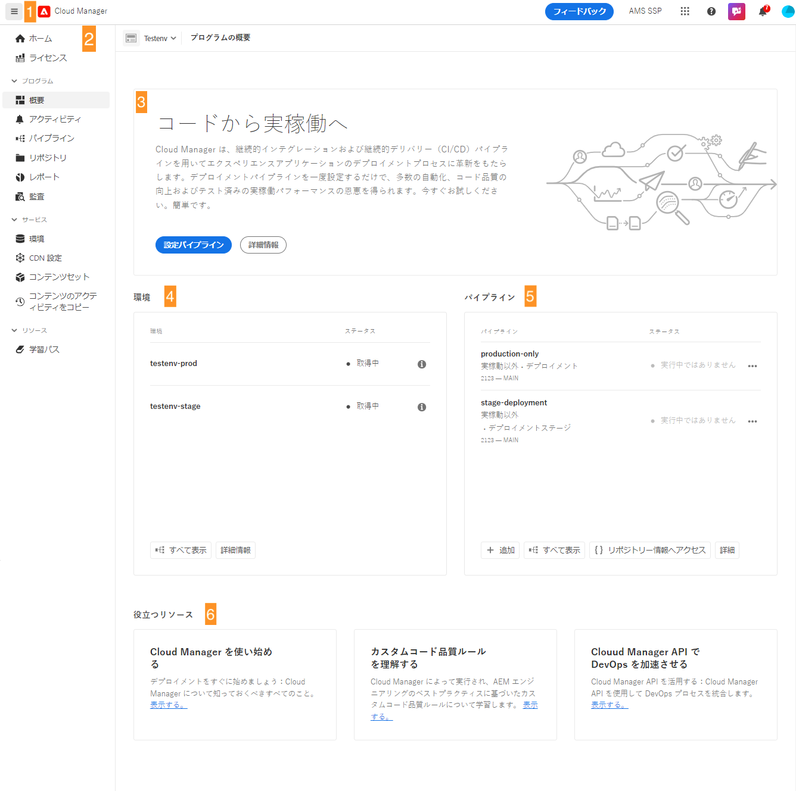

# Cloud Manager UI の操作 {#navigation}

Cloud Manager UI の整理方法と、プログラムと環境を管理する操作方法について説明します。

Cloud Manager UI は、主に次の 2 つのグラフィカルインターフェイスで構成されます。

* [ マイプログラムコンソール ](#my-programs-console) で、すべてのプログラムを表示および管理できます。
* [ プログラムの概要ウィンドウ ](#program-overview) で、個々のプログラムの詳細を確認し、管理できます。

## マイプログラムコンソール {#my-programs-console}

[my.cloudmanager.adobe.com](https://my.cloudmanager.adobe.com/) で Cloud Manager にログインし、適切な組織を選択すると、**マイプログラム**&#x200B;コンソールが表示されます。

マイプログラムコンソールには、選択した組織でアクセス権を持つすべてのプログラムの概要が表示されます。複数のパーツで構成されます。

1. 組織の選択、アラートおよびアカウント設定の [ ツールバー ](#toolbars-my-programs-toolbars)。
1. プログラムの現在の表示を切り替えるタブ。

   * **ホーム** ビュー（デフォルト）：すべてのプログラムの概要を表示する **マイプログラム** ビューを選択します。
   * **ライセンス**：ライセンスダッシュボードにアクセスします。ライセンスダッシュボードは、*AEM as a Cloud Service プログラム* （AEMaaCS）にのみ適用され、AMS プログラムには適用されません。 プログラムのサービスの種類（AEMaaCS または AMS）を確認するには、この記事の [ プログラムカード ](#program-cards) の節を参照してください。
   * タブはデフォルトで閉じられ、[Cloud Manager ヘッダーの左側にあるハンバーガーのアイコン ドロップダウンメニューを使用して表示でき ](#cloud-manager-header) す。

1. [コールトゥアクションと統計](#cta-statistics)：最近のアクティビティの概要を確認します。
1. [**「マイプログラム」**&#x200B;セクション](#my-programs-section)：すべてのプログラムの概要を表示します
1. 関連リソースに簡単にアクセスできる [ クイックリンク ](#quick-links)

>[!TIP]
>
>プログラムについて詳しくは、[ プログラムとプログラムタイプ ](/help/getting-started/program-setup.md) を参照してください。

### ツールバー {#my-programs-toolbars}

2 つのツールバーが重なり合っています。

#### Cloud Manager ヘッダー {#cloud-manager-header}

1 つ目はCloud Manager ヘッダーです。 このヘッダーは、Cloud Managerを操作しても変わりません。 Cloud Manager プログラム全体に適用される設定と情報にアクセスできるアンカーです。

1. ヘッダーの左側にあるハンバーガーアイコンは、個々のプログラムの特定の部分のタブにアクセスできるドロップダウンメニューです。 コンテキストに応じて、ライセンスダッシュボードと **[マイプログラム](#my-programs-console)** コンソールを切り替えることもできます。
   * ライセンスダッシュボードは、AEM as a Cloud Service プログラムにのみ適用され、AMS プログラムには適用されません。
   * プログラムのサービスの種類（AMS または AEMaaCS）を特定するには、このドキュメントの [ プログラムカードの節 ](#program-cards) を参照してください。
1. 「Cloud Manager」ボタンをクリックすると、Cloud Managerのどこにいても、Cloud Managerのマイプログラム コンソールに戻ります。
1. 「フィードバック」ボタンをクリックして、Cloud Managerに関するAdobeをフィードバックに入力します。
1. 組織セレクターには、現在ログインしている組織（この例では、Foundation Internal）が表示されます。 Adobe IDが複数の組織に関連付けられている場合、クリックすると別の組織に切り替わります。
1. ソリューション切り替えボタンをクリックすると、他のExperience Cloudソリューションにすばやくジャンプできます。
1. ヘルプアイコンを使用すると、学習リソースやサポートリソースにすばやくアクセスできます。
1. 通知アイコンには、現在割り当てられている未完了の [ 通知 ](/help/using/notifications.md) の数を示すバッジが付きます
1. ユーザー設定にアクセスするには、ユーザーを表すアイコンを選択します。ユーザー画像を選択しない場合、アイコンがランダムに割り当てられます。

#### プログラムツールバー {#program-toolbar}

プログラムツールバーには、Cloud Manager プログラムとコンテキストに適したアクションを切り替えるリンクが表示されます。

1. プログラムセレクターが開き、ドロップダウンで他のプログラムをすばやく選択したり、新しいプログラムの作成など、コンテキストに適したアクションを実行したりできます。
1. 「はじめに」リンクをクリックすると、Cloud Managerを使い始めるための [ オンボーディングドキュメントジャーニー ](https://experienceleague.adobe.com/ja/docs/experience-manager-cloud-service/content/onboarding/journey/overview) にアクセスできます。
オンボーディングジャーニーは、Adobe Experience Manager as a Cloud ServiceのCloud Manager（AEMaaCS）向けに設計されており、Adobe Managed ServicesのCloud Manager（AMS）向けではありません。 ただし、多くの概念は同じです。
1. アクションボタンを使用すると、新しいプログラムの作成など、コンテキストに適したアクションを実行できます。

### コールトゥアクションと統計 {#cta-statistics}

「コールトゥアクションと統計」セクションでは、組織の集計データが提供されます。例えば、プログラムを正常に設定した場合、過去 90 日間のアクティビティの統計には、次の内容が表示されることがあります。

* [デプロイ](/help/using/code-deployment.md)数
* 特定された[コード品質の問題](/help/using/code-quality-testing.md)の数
* ビルド数

組織の設定を開始したばかりの場合は、次の手順やドキュメントのリソースに関するヒントが表示される場合があります。

### マイプログラム {#my-programs-section}

マイプログラムコンソールのメインコンテンツは、プログラムを個々のカードとしてリストする「**マイプログラム**」セクションです。カードをクリックすると、プログラムの詳細を表示する **プログラムの概要** ページにアクセスできます。

>[!NOTE]
>
>権限によっては、特定のプログラムを選択できない場合があります。

次の並べ替えオプションを使用して、必要なプログラムを見つけやすくします。

* 並べ替え
   * 作成日（デフォルト）
   * プログラム名
   * ステータス
* 昇順（デフォルト）／降順
* グリッド表示（デフォルト）
* リスト表示

#### プログラムカード {#program-cards}

テーブルのカードまたは行は、すべてのプログラムを表し、プログラムの概要と、アクションを実行するためのクイックリンクを提供します。

* プログラム画像（設定されている場合）
* プログラム名
* サービスタイプ：
   * AMS プログラムの **Experience Manager**
   * [AEM as a Cloud Service プログラム](https://experienceleague.adobe.com/ja/docs/experience-manager-cloud-service/content/implementing/home)の **Experience Manager クラウド**
* ステータス
* 設定済みのソリューション
* 作成日

また、情報アイコンを使用すると、プログラムに関する追加情報にすばやくアクセスできます（リスト表示で役立ちます）。

省略記号アイコンを使用すると、プログラムに対して実行できる追加のアクションにアクセスできます。

* プログラムの特定の[環境](/help/using/managing-environments.md)に移動
* [プログラムの概要](#program-overview)を開く
* [プログラムを編集](/help/getting-started/program-setup.md)
* モニタリングを表示

### クイックリンク {#quick-links}

「クイックリンク」セクションでは、役立つ関連リソースにアクセスできます。

## プログラムの概要ウィンドウ {#program-overview}

[**マイプログラム** コンソール ](#my-programs-console) でプログラムを選択すると、**プログラムの概要** ページに移動します。

プログラムの概要では、Cloud Manager プログラムのすべての詳細にアクセスできます。 マイプログラムコンソールと同様に、複数のパーツで構成されます。

1. [ ツールバー ](#program-overview-toolbar) をクリックすると、**マイプログラム** コンソールにすばやく戻り、プログラムを移動できます。
1. [ タブ ](#program-tabs)：プログラムの様々な側面を切り替えます。
1. プログラムの最後のアクションに基づく [ コールトゥアクション ](#cta)。
1. プログラムの [ 環境の概要 ](#environments)。
1. プログラムの [ パイプラインの概要 ](#pipelines)。
1. [ 役に立つリソース ](#useful-resources) へのリンク。

### ツールバー {#program-overview-toolbar}

プログラムの概要のツールバーは、[ マイプログラムコンソール ](#my-programs-toolbars) のツールバーに似ています。 ここでは違いのみを説明します。

#### Cloud Manager ヘッダー {#cloud-manager-header-2}

Cloud Managerのヘッダーには、ハンバーガーのアイコン ドロップダウンメニューが自動的に開き、ナビゲート可能な「プログラムの概要」タブが表示されます。

ハンバーガーアイコンをクリックして、タブを非表示にします。

#### プログラムツールバー {#program-toolbar-2}

プログラムツールバーを使用すると、他のプログラムにすばやく切り替えることができますが、プログラムの追加や編集など、コンテキストに適したアクションにもアクセスできます。

また、ハンバーガーアイコンを使用してタブを非表示にした場合でも、現在使用しているタブがツールバーに表示されます。

### プログラムタブ {#program-tabs}

各プログラムには、多数のオプションとデータが関連付けられています。 これらのデータはタブに集められ、プログラムの操作が簡単になります。タブを使用すると、次のパーツにアクセスできます。

* 概要 - 現在のドキュメントに記載されているプログラムの概要
* [アクティビティ](/help/using/managing-pipelines.md#activity) - プログラムのパイプライン実行の履歴
* [パイプライン](/help/using/managing-pipelines.md#pipelines) - プログラムに対して設定されたすべてのパイプライン
* [リポジトリ](/help/managing-code/managing-repositories.md) - プログラムに対して設定されたすべてのリポジトリ
* [レポート](/help/using/monitoring-environments.md#system-monitoring-overview) - SLA データなどの指標
* [環境](/help/using/managing-environments.md) - プログラムに対して設定されたすべての環境
* [コンテンツセット](/help/using/content-copy.md) - コピー目的に対して作成されたコンテンツのセット
* [コンテンツをコピーアクティビティ](/help/using/content-copy.md) - コンテンツをコピーするアクティビティ
* 学習パス - Cloud Manager に関するその他の学習リソース

デフォルトでは、プログラムを開くと、「**概要**」タブが表示されます。現在のタブがハイライト表示されます。別のタブを選択すると、その詳細が表示されます。

タブを非表示にするには、[Cloud Managerヘッダー ](#cloud-manager-header-2) ハンバーガーアイコンを使用します。

### コールトゥアクション {#cta}

コールトゥアクションセクションには、プログラムのステータスに応じて役立つ情報が表示されます。 新規プログラムの場合は、次の手順が提供され、開始日 [ プログラムの作成時に設定 ](/help/getting-started/program-setup.md) が通知されます。

ライブプログラムの場合、最後のデプロイメントのステータスと、詳細および新しいデプロイメントを開始するためのリンクが表示されます。

### 環境カード {#environments}

**環境** カードには、環境の概要とクイックアクション用のリンクが表示されます。

**環境**&#x200B;カードには 3 つの環境のみ表示されます。「**すべて表示**」ボタンをクリックすると、プログラムのすべての環境が表示されます。

環境の管理方法について詳しくは、[ 環境の管理 ](/help/using/managing-environments.md) を参照してください。

### パイプラインカード {#pipelines}

**パイプライン** カードには、クイックアクション用のパイプラインとリンクの概要が表示されます。

**パイプライン**&#x200B;カードには 3 つのパイプラインのみ表示されます。「**すべて表示**」をクリックすると、プログラムのすべてのパイプラインが表示されます。

パイプラインの管理方法について詳しくは、[ パイプラインの管理 ](/help/using/managing-pipelines.md) を参照してください。

### 役に立つリソース {#useful-resources}

**役に立つリソース** の節では、Cloud Managerに関するその他のラーニングリソースへのリンクを示しています。
