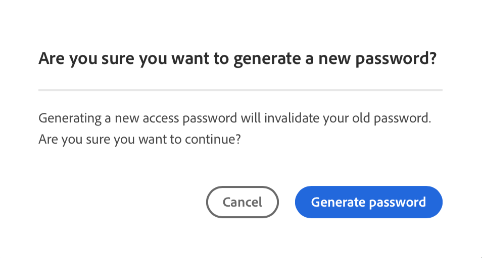

# リポジトリのアクセス情報 {#accessing-repos}

Cloud Managerのセルフサービス Git アカウント管理を使用して、Adobeが管理する Git リポジトリにアクセスして管理する方法について説明します。

## 概要ページからのリポジトリ情報へのアクセス {#overview-page}

1. [my.cloudmanager.adobe.com](https://my.cloudmanager.adobe.com/) で Cloud Manager にログインし、適切な組織とプログラムを選択します。

1. **プログラムの概要** ページから **パイプライン** カードに移動します。

   

1. **リポジトリ情報にアクセス** をクリックします。 **次のリポジトリ情報…** ダイアログボックスで、以下を表示できます。

   * Git ユーザー名。
   * Git パスワード。
   * Cloud Manager Git リポジトリへの URL。
   * リモートを Git リポジトリにすばやく追加し、コードをプッシュするための Git コマンドを事前に作成しました。

   

1. パスワードにアクセスするには、新しいパスワードを生成する必要があります。「**`Generate password`**」をクリックします。

1. **よろしいですか…** ダイアログボックスで、「**パスワードを生成**」をクリックして、パスワードの生成を確認します。

   

1. 「**パスワード**」フィールドにパスワードが生成されます。 コピーアイコンをクリックして、クリップボードにコピーします。

   * パスワードを生成すると、以前のパスワードが無効になります。
   * Cloud Managerはアクセスパスワードを保存しません。 このパスワードは必ず安全に保存してください。
   * パスワードを失った場合は、新しく生成する必要があります。

   

これらの資格情報を使用して、リポジトリのローカルコピーを複製し、そのローカルリポジトリで変更を加えることができます。変更できたら、Cloud Manager のリモートコードリポジトリにコードの変更をコミットして戻すことができます。

>[!NOTE]
>
>* 「**リポジトリー情報にアクセス**」オプションは、**開発者** の役割または **デプロイメントマネージャー** の役割、あるいはその両方を持つユーザーに表示されます。
>* 「**リポジトリ情報にアクセス**」ボタンをクリックすると、アドビが管理するリポジトリのリポジトリアクセス情報のみが表示されます。[プライベートリポジトリ](private-repositories.md)に関するアクセス情報は、Cloud Manager では利用できません。

## リポジトリーウィンドウからのリポジトリー情報へのアクセス {#repositories-window}

**リポジトリ情報にアクセス** ボタンは、[**リポジトリ** ウィンドウ ](managing-repositories.md) のツールバーでも使用できます。 Adobeが管理するリポジトリへのアクセスに関する同じ情報が表示されます。

## アクセスパスワードの失効 {#revoke-password}

アクセスパスワードはいつでも失効できます。[ このようなリクエストのサポートチケットを作成します ](https://experienceleague.adobe.com/ja?support-solution=Experience+Manager&amp;support-tab=home#support)。

チケットは高い優先度で処理され、通常は 1 日以内に失効します。
