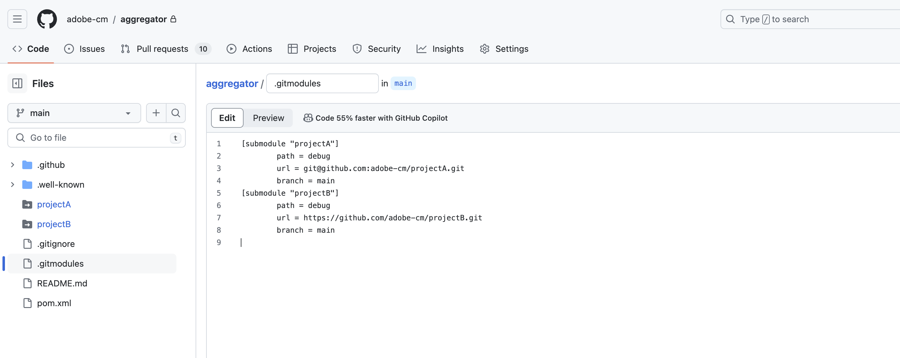

# Adobe リポジトリに対する Git サブモジュールのサポート {#git-submodule-support}

Git サブモジュールを使用すると、ビルド時に Git リポジトリ間で複数のブランチのコンテンツを結合できます。

Cloud Manager のビルドプロセスを実行すると、最初にパイプラインのリポジトリが複製され、設定済みのブランチがチェックアウトされます。 ブランチのルート ディレクトリに `.gitmodules` ファイルが含まれる場合は、コマンドが実行されます。

```
$ git submodule update --init
```

このプロセスにより、各サブモジュールが適切なディレクトリにチェックアウトされます。 この手法は、Git サブモジュールの使用に慣れていて、外部マージプロセスの管理を望まない組織にとっては、[複数のソース Git リポジトリの操作](/help/managing-code/multiple-git-repos.md)の代わりになる可能性があります。

例えば、3 つのリポジトリがあり、それぞれに `main` という名前のブランチが 1 つあるとします。 プライマリリポジトリ（パイプラインで設定されたもの）の `main` ブランチには、他の 2 つのリポジトリに含まれるプロジェクトを宣言している `pom.xml` ファイルがあります。

```xml
<?xml version="1.0" encoding="UTF-8"?>
<project xmlns="http://maven.apache.org/POM/4.0.0" xmlns:xsi="http://www.w3.org/2001/XMLSchema-instance"
    xsi:schemaLocation="http://maven.apache.org/POM/4.0.0 http://maven.apache.org/maven-v4_0_0.xsd">
    <modelVersion>4.0.0</modelVersion>
   
    <groupId>customer.group.id</groupId>
    <artifactId>customer-reactor</artifactId>
    <version>0.0.1-SNAPSHOT</version>
    <packaging>pom</packaging>
   
    <modules>
        <module>project-a</module>
        <module>project-b</module>
    </modules>
   
</project>
```

この状況で、他の 2 つのリポジトリにサブモジュールを追加します。

```shell
$ git submodule add -b main https://git.cloudmanager.adobe.com/ProgramName/projectA/ project-a
$ git submodule add -b main https://git.cloudmanager.adobe.com/ProgramName/projectB/ project-b
```

`.gitmodules` ファイルの結果は次のようになります。

```text
[submodule "project-a"]
    path = project-a
    url = https://git.cloudmanager.adobe.com/ProgramName/projectA/
    branch = main
[submodule "project-b"]
    path = project-b
    url = https://git.cloudmanager.adobe.com/ProgramName/projectB/
    branch = main
```

Git サブモジュールについて詳しくは、[Git リファレンスマニュアル](https://git-scm.com/book/ja/v2/Git-Tools-Submodules)を参照してください。

## 制限事項 {#limitations}

Git サブモジュールを使用する場合は、次に注意してください。

* Git の URL は、上記の構文に正確に一致している必要があります。
* セキュリティ上の理由から、これらの URL に資格情報を埋め込まないでください。
* ブランチのルートにあるサブモジュールのみがサポートされます。
* Git サブモジュール参照は、特定の Git コミットに保存されます。 その結果、サブモジュールリポジトリに対して変更を加えた場合は、 参照されるコミットを更新する必要があります。 `git submodule update --remote` を使用する例は、次のとおりです。
* 特に必要がない限り、アドビでは、各サブモジュールに対して `git config -f .gitmodules submodule.<submodule path>.shallow true` を実行して、「シャロー」サブモジュールを使用することをお勧めします。


## プライベートリポジトリに対する Git サブモジュールのサポート {#private-repositories}

[プライベートリポジトリ](private-repositories.md)を使用する場合の Git サブモジュールのサポートは、Adobe リポジトリを使用する場合とほとんど同じです。

ただし、`pom.xml` ファイルを設定して `git submodule` コマンドを実行した後、Cloud Manager でサブモジュールの設定を検出するために、集積リポジトリのルートディレクトリに `.gitmodules` ファイルを追加する必要があります。




### 制限事項と推奨事項 {#limitations-recommendations-private-repos}

プライベートリポジトリで Git サブモジュールを使用する場合は、次の制限事項に注意してください。

* サブモジュールの Git URL は、HTTPS 形式または SSH 形式のいずれかになりますが、Github.com リポジトリにリンクする必要があります。 Adobe リポジトリサブモジュールを GitHub 集積リポジトリに追加したり、その逆を行ったりすることはできません。
* GitHub サブモジュールは、Adobe GitHub アプリからアクセスできる必要があります。
* また、[アドビが管理するリポジトリで Git サブモジュールを使用する場合の制限事項](#limitations-recommendations)も適用されます。
