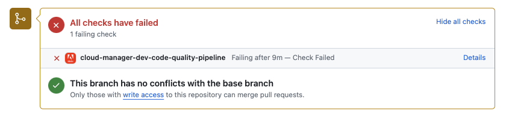

# GitHub チェック注釈 {#github-annotations}

GitHub チェックがプライベートリポジトリの PR に注釈を付けて、役立つフィードバックを提供する方法について説明します。

## 概要 {#overview}

Cloud Manager プログラムに [&#x200B; プライベートリポジトリ &#x200B;](private-repositories.md) を使用している場合、プルリクエストのたびに GitHub が自動的にチェックインされます。 これらのチェックには、コードに関する問題をできるだけ早く理解するのに役立つ有用な情報が注釈として付けられます。

[SonarQube](/help/using/custom-code-quality-rules.md) によって検出された[コード品質](/help/using/code-quality-testing.md)の問題が明確にリストされます。

問題のあるコードの正確な行が提供され、これをクリックすると、関連するコードを表示できます。これらの注釈は、プルリクエストで変更された問題だけでなく、すべてのコードの問題に対して提供されます。

注釈付きの行はすべて、GitHub プルリクエストの「**変更済みファイル**」タブに集約されます。プルリクエストで変更されなかったファイルの注釈は、独自のセクションに表示されます。

## コード品質パイプライン {#code-quality-pipelines}

[コード品質](/help/using/code-quality-testing.md)の結果は、「**チェック**」タブの下部で Cloud Manager によって自動的にトリガーされるパイプラインにも表示されます。また、プルリクエストのチェックの&#x200B;**詳細**&#x200B;からもアクセスできます。

また、問題を CSV 形式で視覚化することもできます。この方法は、[Cloud Manager でパイプライン実行の詳細を表示](/help/using/managing-pipelines.md)することで実行できます。
