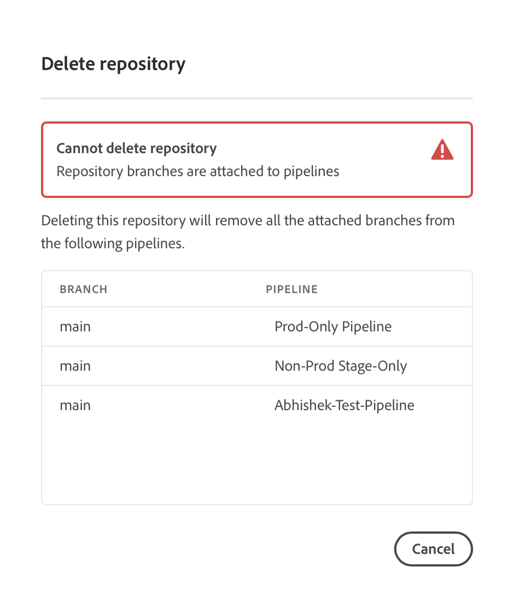

# Cloud Manager リポジトリ {#cloud-manager-repos}

Cloud Managerで Git リポジトリを作成、表示、編集する方法について説明します。

## 概要 {#overview}

リポジトリは、Git を使用してプロジェクトのコードを保存および管理するために使用されます。Cloud Manager で作成するすべてのプログラムには、アドビが管理するリポジトリが作成されます。

Adobeが管理するリポジトリを作成し、独自のプライベートリポジトリを追加することもできます。 プログラムに関連付けられているすべてのリポジトリは、**リポジトリ**&#x200B;ウィンドウで表示できます。

Cloud Managerで作成されたリポジトリは、パイプラインの追加や編集の際にも使用できます。 詳しくは、[CI／CD パイプライン](/help/overview/ci-cd-pipelines.md)を参照してください。

どのパイプラインにも、単一のプライマリリポジトリまたはブランチがあります。[Git サブモジュールのサポート ](git-submodules.md) を使用すると、ビルド時に多数のセカンダリブランチを含めることができます。

## リポジトリーウィンドウ {#repositories-window}

1. [my.cloudmanager.adobe.com](https://my.cloudmanager.adobe.com/) で Cloud Manager にログインし、適切な組織とプログラムを選択します。

1. **プログラムの概要**&#x200B;ページで、「**リポジトリ**」タブをクリックして「**リポジトリ**」ページに切り替えます。

1. **リポジトリ**&#x200B;ウィンドウには、プログラムに関連付けられているすべてのリポジトリが表示されます。

   

**リポジトリ**&#x200B;ウィンドウには、リポジトリに関する次の詳細が表示されます。

* リポジトリのタイプ。
   * **アドビ**&#x200B;は、アドビが管理するリポジトリを示します
   * **GitHub** は、ユーザーが管理するプライベート GitHub リポジトリを示します
* 作成日時
* リポジトリに関連付けられているパイプライン

ウィンドウでリポジトリを選択し、省略記号ボタンをクリックすると、選択したリポジトリに対してアクションを実行できます。

* **[ブランチを確認／プロジェクトを作成](#check-branches)**（Adobe リポジトリでのみ使用可能）
* **[リポジトリ URL をコピー](#copy-url)**
* **[表示と更新](#view-update)**
* **[削除](#delete)**

## リポジトリーの追加 {#adding-repositories}

**リポジトリ**&#x200B;ウィンドウの「**リポジトリを追加**」ボタンをクリックして、**リポジトリを追加**&#x200B;ウィザードを開始します。

Cloud Manager は、アドビが管理するリポジトリ（**Adobe リポジトリ**）と、独自に管理するリポジトリ（**プライベートリポジトリ**）の両方をサポートします。必須フィールドは、追加するリポジトリのタイプによって異なります。

[Cloud ManagerでのAdobeリポジトリの追加 ](adobe-repositories.md) を参照してください。
[Cloud Managerでのプライベートリポジトリの追加 ](private-repositories.md) を参照してください。

>[!NOTE]
>
>リポジトリを追加するには、**デプロイメントマネージャー**&#x200B;または&#x200B;**ビジネスオーナー**&#x200B;の役割が必要です。
>
>特定の企業または IMS 組織のすべてのプログラムで使用できるリポジトリは 300 個までです。

## リポジトリ情報へのアクセス {#repo-info}

**リポジトリ**&#x200B;ウィンドウでリポジトリを表示する際に、ツールバーの「**リポジトリ情報へアクセス**」ボタンをクリックすると、アドビが管理するリポジトリにプログラムでアクセスする方法の詳細を表示できます。

**リポジトリ情報**&#x200B;ウィンドウが開き、詳細が表示されます。リポジトリ情報へのアクセスについて詳しくは、[リポジトリ情報へのアクセス](accessing-repositories.md)を参照してください。

## ブランチを確認 {#check-branches}

**ブランチを確認／プロジェクトを作成**&#x200B;アクションでは、リポジトリの状態に応じて 2 つの機能を実行します。

リポジトリを新しく作成する場合は、[AEM プロジェクトアーキタイプ ](https://experienceleague.adobe.com/ja/docs/experience-manager-core-components/using/developing/archetype/overview) に基づいてサンプルプロジェクトが作成されます。

リポジトリにサンプルプロジェクトが既に作成されている場合は、リポジトリとこのブランチの状態を確認し、サンプルプロジェクトが既に存在するかどうかを報告します。

## リポジトリー URL をコピー {#copy-url}

**リポジトリ URL をコピー**&#x200B;アクションでは、**リポジトリ**&#x200B;ウィンドウで選択したリポジトリの URL をクリップボードにコピーし、他の場所で使用できます。

## 表示と更新 {#view-update}

**表示と更新**&#x200B;アクションでは、**リポジトリを更新**&#x200B;ダイアログを開きます。これを使用すると、**名前**&#x200B;と&#x200B;**リポジトリ URL のプレビュー**&#x200B;を表示し、リポジトリの&#x200B;**説明**&#x200B;を更新できます。

## 削除 {#delete}

**削除**&#x200B;アクションでは、プロジェクトからリポジトリを削除します。リポジトリは、パイプラインに関連付けられている場合、削除できません。

Cloud Managerでリポジトリを削除すると、削除済みとマークされ、ユーザーからアクセスできなくなります。 ただし、回復のためにシステム内で維持されます。

同じ名前のリポジトリを削除した後に新しいリポジトリを作成しようとすると、`An error has occurred while trying to create repository. Contact your CSE or Adobe Support.` というエラーメッセージが表示されます。

このエラーメッセージが表示された場合は、アドビサポートに連絡し、削除したリポジトリの名前を変更するか、新しいリポジトリ用に別の名前を選択します。
