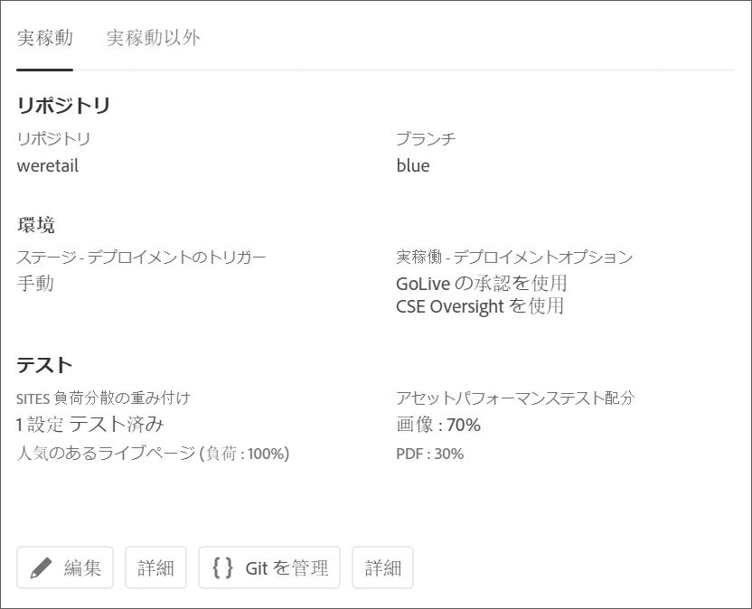
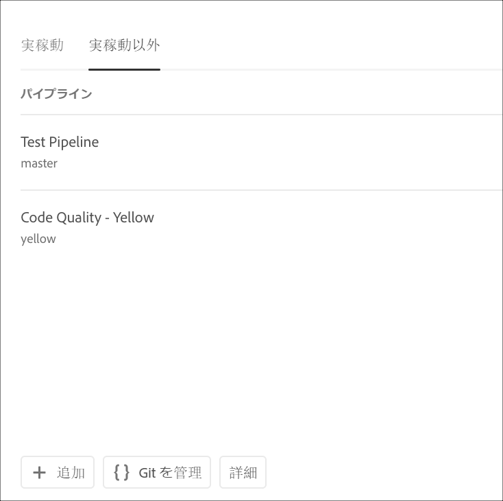
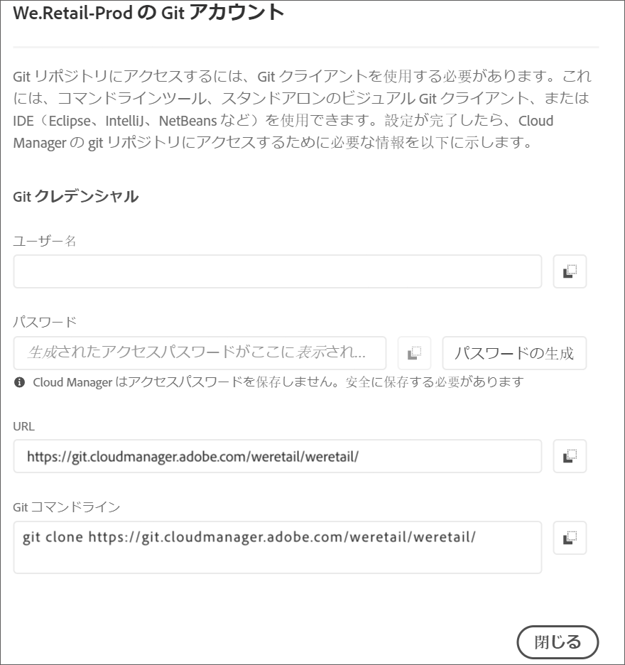

# リポジトリへのアクセス {#accessing-repos}

Cloud Manager UI のセルフサービス Git アカウント管理を使用して、Git リポジトリーにアクセスし、管理できます。

## セルフサービス Git アカウント管理の使用 {#self-service-git}

Cloud Manager UI から利用できる「**Git を管理**」ボタンを使用します。このボタンはパイプラインカードで最も目立つ場所にあります。

1. 「*プログラムの概要*」ページに移動し、パイプラインカードに移動します。

1. Git リポジトリーにアクセスして管理するための「**Git を管理**」オプションが表示されます。

   

   さらに、「**実稼動以外**」パイプラインタブを選択すると、そこにも「**Git を管理**」オプションが表示されます。

   

>[!NOTE]
>
>「**Git を管理**」オプションは、デベロッパーまたはデプロイメントマネージャーのロールを持つユーザーに表示されます。このボタンをクリックすると、Cloud Manager Git リポジトリーへの URL およびユーザー名とパスワードを確認できるダイアログが開きます。

