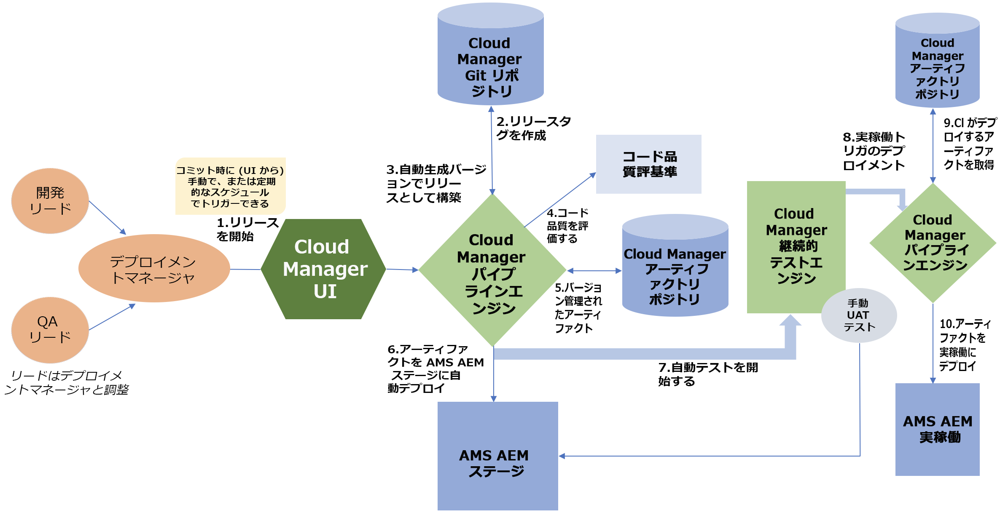
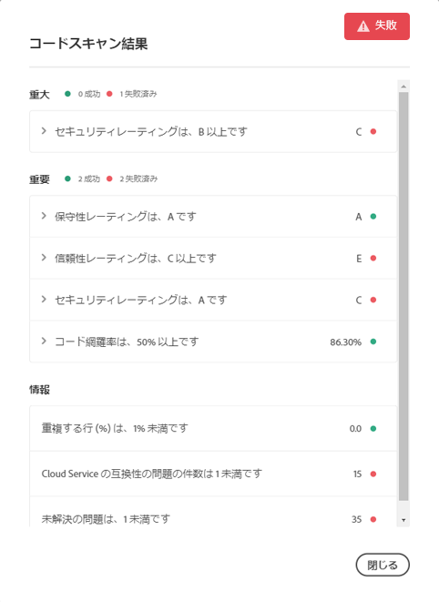

# CI／CD パイプライン {#ci-cd-pipeline}

## パイプラインの概要 {#pipeline-overview}

[!UICONTROL Cloud Manager] には、継続的な統合（CI）および継続的な配信（CD）フレームワークが含まれており、実装チームは新しいコードや更新されたコードを迅速にテストして配信できます。例えば、コーディングに関するアドビのベストプラクティスを活用して綿密なコードスキャンを実行し最高のコード品質を確保する自動 CI／CD パイプラインを、実装チームが設定および開始できます。

また、CI／CD パイプラインは、単体テストおよびパフォーマンステストプロセスを自動化して、デプロイメント効率を高め、デプロイメント後の修正にコストがかかる重大な問題を事前に特定することもできます。実装チームは、包括的なコードパフォーマンスレポートにアクセスして、コードが実稼動環境にデプロイされた場合の KPI への潜在的な影響や重要なセキュリティ検証を見通すことができます。

## パイプラインプロセス {#pipeline-process}

[!UICONTROL Cloud Manager] でリリースがトリガーされると何が起こるかを次の図に示します。付属の表では、ワークフローの各ステップについて説明します。

プロセスの各ステップでの動作を次の表で詳しく説明します。

| パイプラインプロセスステップ | 動作 |
|---|---|
| 1. リリースの開始 | デプロイメントマネージャーが、Git コミットを使用して手動で、または定期的な実行スケジュールに基づいて、リリースをトリガーします。 |
| 2. リリースタグの作成 | [!UICONTROL Cloud Manager] が Git タグを作成し、自動生成したバージョン番号を使用してリリースをマークします。例： 2018.531.245527.0000001222 |
| 3. 自動生成したバージョンのリリースとしてビルド | [!UICONTROL Cloud Manager] が、新しく割り当てたバージョン番号を使用してアプリケーションをビルドします。 |
| 4. コード品質の評価 | コードをステージング環境にデプロイする前に、[!UICONTROL Cloud Manager] がソースコードをスキャンし概要の情報を提供します。 |
| 5. バージョン管理されたアーティファクトの保存 | リリースアーティファクトが、デプロイメントステップで後で使用するために保存されます。 |
| 6. AMS AEM ステージへのアーティファクトの自動デプロイメント | リリースアーティファクトがステージング環境にデプロイされます。 |
| 7. 自動テストのトリガー | [!UICONTROL Cloud Manager] が、アーティファクトに対してパフォーマンステストとセキュリティテストを実行します。 |
| 8. 実稼動トリガーのデプロイメント | 自動テストの完了後、[!UICONTROL Cloud Manager] が実稼動環境へのデプロイメントを開始します。 |
| 9. [!UICONTROL Cloud Manager] によるデプロイ対象アーティファクトの取得 | 保存したリリースアーティファクトを [!UICONTROL Cloud Manager] が取り込みます。 |
| 10. 実稼動環境へのアーティファクトのデプロイメント | リリースアーティファクトが実稼動環境にデプロイされます。 |

### CI／CD パイプラインの設定方法 {#how-to-setup-a-ci-cd-pipeline}

パイプラインの設定について詳しくは、[パイプラインの設定](configuring-pipeline.md)を参照してください。

## 品質ゲート {#quality-gates}

CI／CD パイプラインは、品質ゲートつまり受け入れ条件を提供します。コードをステージング環境からデプロイメント環境に移動するには、この条件を満たす必要があります。パイプラインには次の 3 つのゲートがあります。

* コード品質
* パフォーマンステスト
* セキュリティテスト

これらのゲートごとに、次の 3 つのレベルの問題が特定されます。

* **重大** - ゲートで特定される問題のうち、パイプラインの即時失敗につながるものです。
* **重要** - ゲートで特定される問題のうち、パイプラインの一時停止につながるものです。デプロイメントマネージャー、プロジェクトマネージャーまたはビジネスオーナーは、問題をオーバーライドできます。この場合、パイプラインは続行されます。または、問題を承認できます。この場合、パイプラインはエラーで停止します。
* **情報** - ゲートで特定される問題のうち、情報提供だけを目的とするもので、パイプラインの実行には影響しません。

コードスキャンで特定されたコードの問題の例を以下に示します。

### ゲートの設定方法 {#how-to-setup-gates}

コード、品質およびパフォーマンスに関するゲートの設定について詳しくは、**[ゲートの設定](configuring-pipeline.md)**&#x200B;を参照してください。
