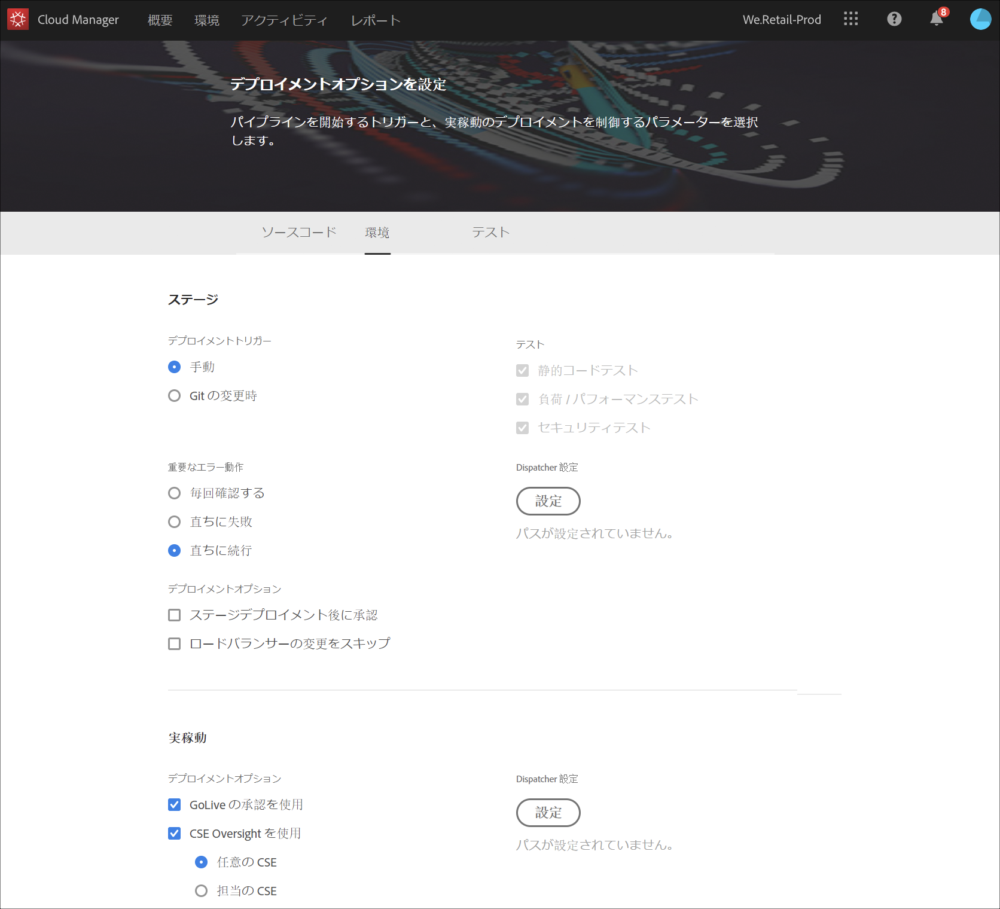
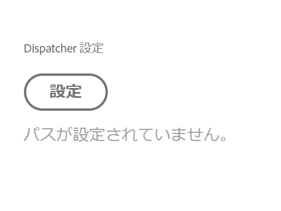
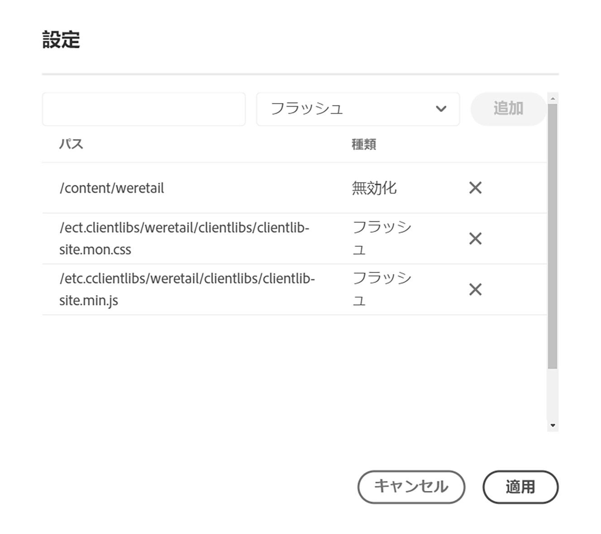
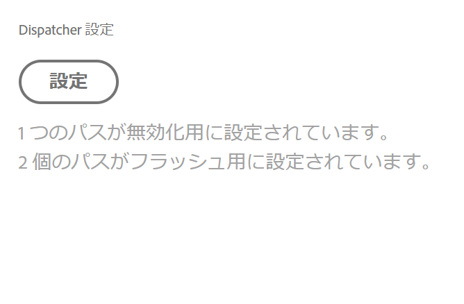
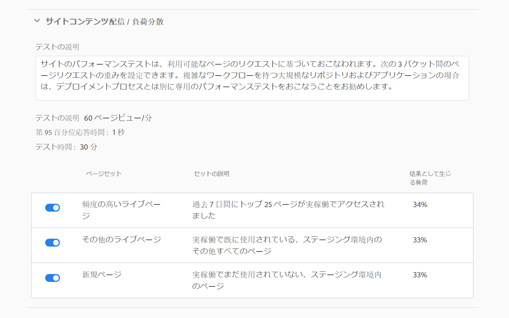
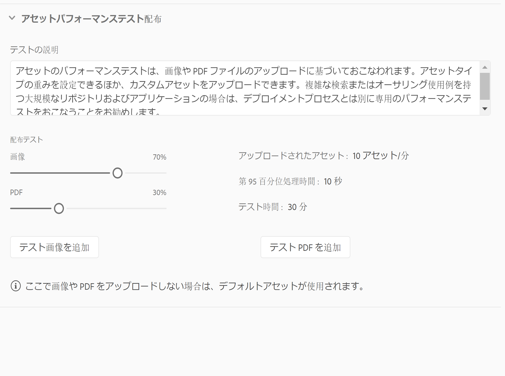
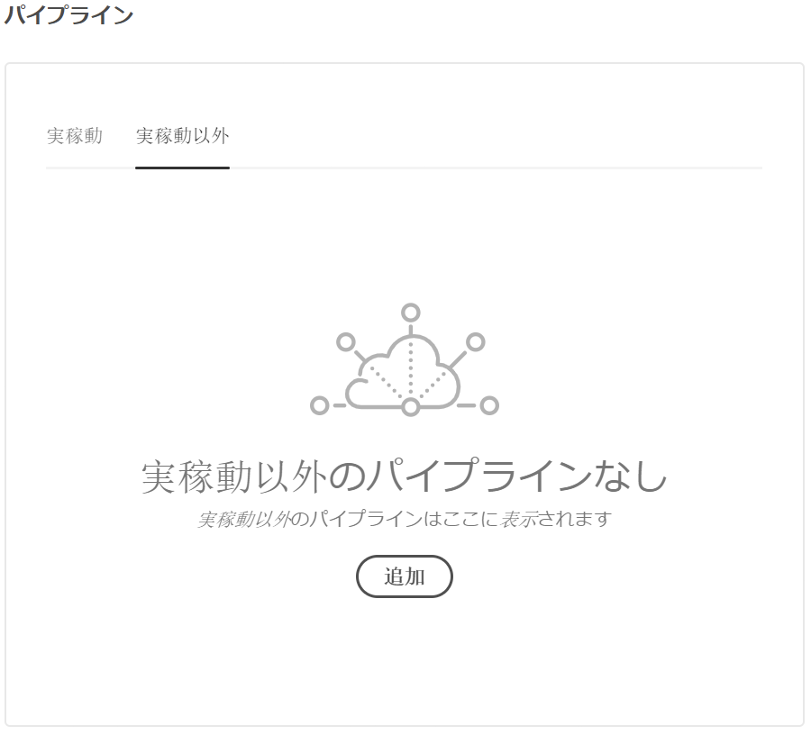
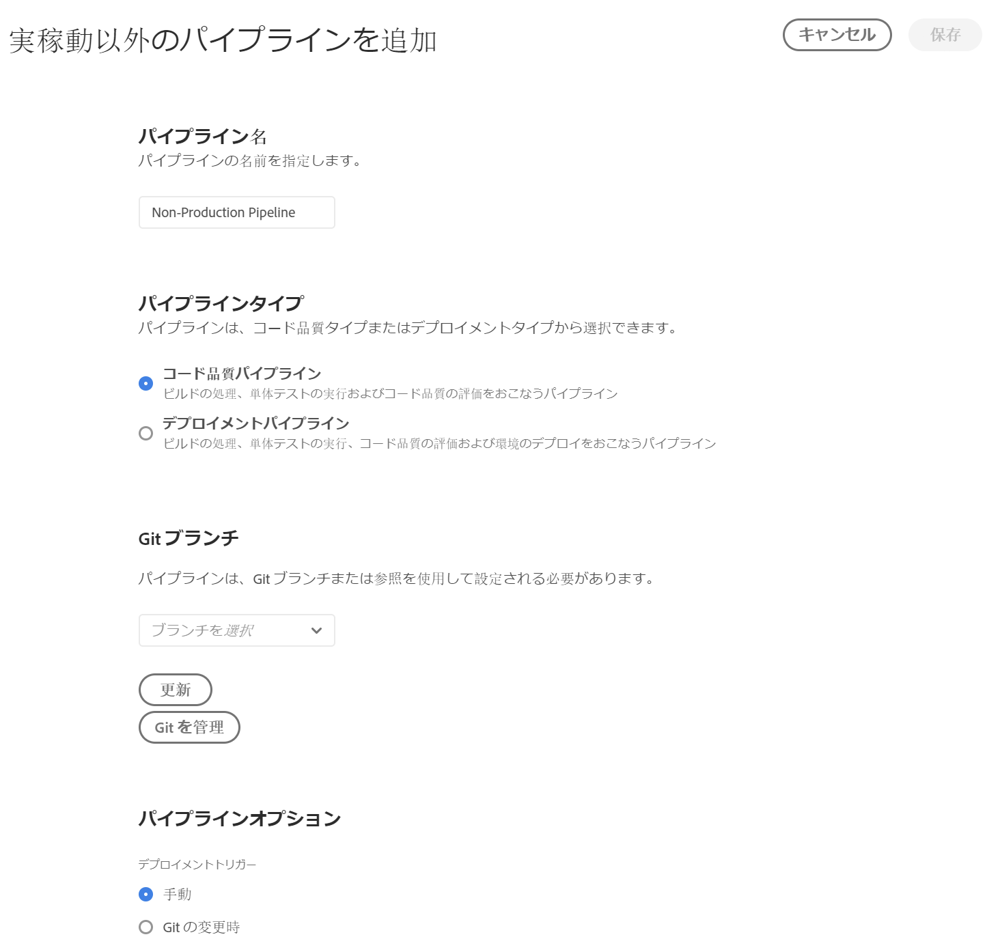
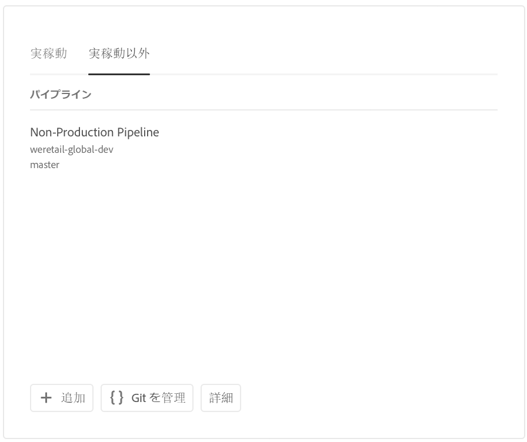

# CI／CD パイプラインの設定 {#configure-your-ci-cd-pipeline}

以下のページでは、**パイプライン**&#x200B;の設定方法について説明します。パイプラインの動作の仕組みについて詳しくは、[CI／CD パイプラインの概要](ci-cd-pipeline.md)を参照してください。

## ビデオチュートリアル {#video-tutorial-one}

### Cloud Manager でのパイプラインの設定 {#config-pipeline-video}

CI／CD 実稼働パイプラインの設定は、パイプラインを開始するトリガー、実稼働環境のデプロイメントを制御するパラメーター、およびテストパラメーターのパフォーマンスを定義します。

>[!VIDEO](https://video.tv.adobe.com/v/26314/)

## フローについて {#understanding-the-flow}

[!UICONTROL Cloud Manager] UI の&#x200B;**パイプライン設定**&#x200B;タイルからパイプラインを設定することができます。

パイプラインの設定はデプロイメントマネージャーが担当します。その際は、まず **Git リポジトリ**&#x200B;からブランチを選択します。パイプライン設定は以下で構成されます。

* パイプラインを開始するトリガーの定義
* 実稼動デプロイメントを制御するパラメーターの定義
* パフォーマンステストパラメーターの設定

## パイプラインの設定 {#setting-up-the-pipeline}

>[!CAUTION]
>
>パイプラインは、Git リポジトリが少なくとも 1 つのブランチを持ち、[プログラム設定](setting-up-program.md)が完了するまで、設定できません。

コードのデプロイを開始する前に、[!UICONTROL Cloud Manager] からパイプライン設定を指定する必要があります。

>[!NOTE]
>
>初期設定後にパイプライン設定を変更できます。

### [!UICONTROL Cloud Manager] からパイプライン設定を指定する{#configuring-the-pipeline-settings-from-cloud-manager}

[!UICONTROL Cloud Manager] UI を使用してプログラムを設定したら、パイプラインを設定する準備ができました。

パイプラインの動作と環境を設定するには、次の手順に従います。

1. 「**パイプラインを設定**」をクリックして、パイプラインを設定します。

   

1. **パイプラインを設定**&#x200B;画面が表示されます。

   3 ステップのウィザードでは、**ブランチ**、**環境**&#x200B;および&#x200B;**テスト**&#x200B;環境を設定できます。Git ブランチを選択し、「**次へ**」をクリックします。

   >[!NOTE]
   >
   >Git リポジトリにあるブランチがプログラムにリンクされます。

   

1. 「**環境**」タブにアクセスして、「**ステージ**」および「**実稼動**」オプションを選択します。

   パイプラインを開始するトリガーを定義できます。

   * **Git の変更時** - 設定された Git ブランチにコミットが追加されるたびに CI／CD パイプラインを開始します。このオプションを選択しても、常にパイプラインを手動で開始できます。
   * **手動** - UI を使用して、パイプラインを手動で開始します。

   パイプラインの設定または編集中に、デプロイメントマネージャーは、コード品質、セキュリティテスト、パフォーマンステストなどの品質ゲートのいずれかで重要なエラーが検出された場合のパイプラインの動作を定義できます。

   これは、より自動化されたプロセスを求めるお客様に役に立ちます。使用できるオプションは以下のとおりです。

* **毎回確認する** - デフォルトの設定。重要なエラーが検出されたときに手動で介入する必要があります。
* **直ちに失敗** - 重要なエラーが検出されると、常にパイプラインはキャンセルされます。このオプションでは、基本的に、各エラーをユーザーが手動で拒否する状況をエミュレートします。
* **直ちに続行** - 重要なエラーが検出されても、常にパイプラインは自動的に続行されます。このオプションでは、基本的に、各エラーをユーザーが手動で承認する状況をエミュレートします。

   ここで、実稼動デプロイメントを制御するパラメーターを定義します。次の 3 つのオプションが使用可能です。

* **GoLive の承認を使用** - [!UICONTROL Cloud Manager] UI を使用して、ビジネスオーナー、プロジェクトマネージャー、デプロイメントマネージャーのいずれかがデプロイメントを手動で承認する必要があります。
* **CSE Oversight を使用** - CSE が実際にデプロイメントを開始します。CSE Oversight が有効になっている場合は、パイプラインの設定または編集中に、デプロイメントマネージャーは次のオプションを選択できます。

   * **任意の CSE**：対応可能な任意の CSE に問い合わせます。
   * **担当の CSE**：顧客に割り当てられている特定の CSE（CSE が不在の場合はバックアップ）に問い合わせます。

* **スケジュール設定** - このオプションを使用すると、ユーザーはスケジュールされた実稼動デプロイメントを有効にできます。

>[!NOTE]
>
>「**スケジュール設定**」オプションが選択されている場合は、パイプラインでステージングデプロイメント（および、「**GoLive の承認を使用**」が有効な場合はその承認）の&#x200B;**後**&#x200B;に実稼動デプロイメントをスケジュールして、スケジュールが設定されるのを待つことができます。ユーザーは、実稼動デプロイメントをすぐに実行することもできます。
>
>デプロイメントのスケジュールを設定する、または実稼動デプロイメントをすぐに実行する場合は、[**コードのデプロイ&#x200B;**](deploying-code.md)を参照してください。

>[!NOTE]
>
>「**CSE Oversight を使用**」オプションは、すべての顧客に使用できるわけではありません。

**ステージデプロイメント後に承認**

**ステージのデプロイ後に承認**をおこなうオプションの手順は、実稼働パイプラインで設定できます。
これは、**パイプライン編集**&#x200B;画面の新しいオプションで有効になります。

次に、パイプライン実行中に別のステップとして表示されます。

>[!NOTE]
>
>**ステージのデプロイ後に承認**&#x200B;機能は、実稼働環境のデプロイメント前の承認と同様に機能しますが、ステージのデプロイメント手順の直後に発生します。つまり、テストの実行前に発生します。一方、実稼働環境のデプロイメント前の承認は、すべてのテストが完了した後におこなわれます。

**Dispatcher の無効化**

デプロイメントマネージャーは、AEM Dispatcher キャッシュから&#x200B;**無効化**&#x200B;または&#x200B;**フラッシュ**&#x200B;する一連のコンテンツパスを、パイプラインの設定または編集中に設定できます。

ステージングデプロイメントと実稼動デプロイメントに別々に一連のパスを設定できます。設定した場合、これらのキャッシュアクションは、コンテンツパッケージがデプロイされた直後にデプロイメントパイプラインステップの一部として実行されます。これらの設定では、標準の AEM Dispatcher 動作を使用します。無効化は、コンテンツがオーサーからパブリッシュにアクティブ化された場合と同様に、キャッシュを無効化します。フラッシュはキャッシュを削除します。

一般に、無効化アクションを使用する方が望ましいですが、フラッシュが必要な場合もあります（特に、AEM HTML クライアントライブラリを使用する場合など）。

>[!NOTE]
>
>Dispatcher のキャッシュについて詳しくは、[Dispatcher の概要](dispatcher-configurations.md)を参照してください。

Dispatcher の無効化を設定するには、次の手順に従います。

1. Dispatcher 設定の見出しの下にある「**設定**」をクリックします

   

1. パスを入力し、**タイプ**&#x200B;からアクションを選択して、「**追加**」をクリックします。1 環境につき最大 100 個のパスを指定できます。パスを追加したら、「**適用**」をクリックします。

   

1. **パイプライン設定**&#x200B;ページに戻ると、選択内容の最新の概要が表示されます。

   「**保存**」をクリックして、この設定を保持します。

   

1. 「**テスト**」タブにアクセスして、プログラムのテスト条件を定義します。

   ここで、パフォーマンステストのパラメーターを設定できます。

   ライセンスを取得している製品に応じて、*AEM Sites* および *AEM Assets* のパフォーマンステストを設定できます。

   **AEM Sites：**

   Cloud Managerは、ステージ公開サーバー上のページ（デフォルトでは未認証ユーザー）に30分のテスト期間をリクエストし、各ページの応答時間と様々なシステムレベルの指標を測定することで、AEM Sitesプログラムのパフォーマンステストを実行します。

   30 分のテスト期間が開始される前に、Cloud Manager は、カスタマーサクセスエンジニアが設定した 1 つ以上の&#x200B;*シード* URL セットを使用してステージング環境をクロールします。これらの URL から、各ページの HTML を調べ、幅優先方式でリンクが探索されます。このクロール処理は、最大 5000 ページに制限されています。クローラーからのリクエストのタイムアウトは 10 秒に固定されています。

   ページは 3 つの&#x200B;**ページセット**&#x200B;で選択されます。1 セットから 3 セットまでの任意のセットを選択できます。トラフィックの配分は、選択したセットの数によって決まります。つまり、3 つのセットがすべて選択されている場合、合計ページビューの 33% が各セットに送られます。2 つのセットが選択されている場合は、各セットに 50% ずつ送られます。1 つのセットが選択された場合は、トラフィックの 100% がそのセットに送られます。

   例えば、「頻度の高いライブページ」と「新規ページ」セットで 50% ずつ配分し（この例では、「その他のライブページ」は使用されていません）、「新規ページ」セットには 3,000 ページが含まれるとします。「1 分あたりのページビュー数」KPI は 200 に設定されます。30 分間のテストの結果は次のようになります。

   * 「頻度の高いライブページ」セットの 25 ページが各 240 回ヒットします - ((200 * 0.5) / 25) * 30 = 120

   * 「新規ページ」セットの 3000 ページが各 1 回ヒットします - ((200 * 0.5) / 3000) * 30 = 1

   

   **AEM Assets：**

   Cloud Manager で AEM Assets のパフォーマンステストが実行される場合は、30 分のテスト時間中にアセットを繰り返しアップロードし、各アセットの処理時間および様々なシステムレベルの指標を測定します。この機能では、画像と PDF ドキュメントの両方をアップロードできます。1 分ごとにアップロードされる各タイプのアセット数の配分は、パイプライン設定または編集画面で設定します。

   例えば、次の図のように 70% と 30% に配分した場合は、1 分あたり 10 個のアセットがアップロードされ、うち 7 個が画像、3 個がドキュメントになります。

   

   >[!NOTE]
   >
   >デフォルトの画像および PDF ドキュメントもありますが、ほとんどの場合、顧客は自分たちのアセットをアップロードすることを希望します。この操作は、パイプライン設定または編集画面でおこなうことができます。JPEG、PNG、GIF、BMP などの一般的な画像形式のほか、Photoshop ファイル、Illustrator ファイル、Postscript ファイルがサポートされています。

1. 「**保存**」をクリックして、パイプライン設定プロセスを完了します。

   >[!NOTE]
   >
   >さらに、パイプラインを設定した後でも、[!UICONTROL Cloud Manager] UI の「**パイプライン設定**」タイルを使用して、同じ設定を編集できます。

   

## 非実稼動パイプラインとコード品質専用パイプライン

ステージングおよび実稼動環境にデプロイするメインパイプラインに加えて、顧客は、**非実稼動パイプライン**&#x200B;と呼ばれる追加のパイプラインを設定できます。このパイプラインでは、常にビルドステップとコード品質ステップを実行します。また、オプションで Adobe Managed Services 環境にデプロイすることもできます。

## ビデオチュートリアル {#video-tutorial-two}

### Cloud Manager 非実稼働とコード品質専用パイプライン {#non-prod-video}

CI／CD 非実稼働パイプラインは、コード品質パイプラインとデプロイパイプラインの 2 つのカテゴリに分類されます。コード品質は、Git ブランチのすべてのコードをパイプライン化し、Cloud Manager のコード品質スキャンに対して構築および評価されます。

>[!VIDEO](https://video.tv.adobe.com/v/26316/)

ホーム画面には、このパイプラインが新しいカードに一覧表示されます。

1. Cloud Manager のホーム画面から「**非実稼動パイプライン**」タイルにアクセスします。

   

1. 「追加」ボタンをクリックして、「パイプライン名」、「パイプラインタイプ」および「Git ブランチ」を指定します。

   さらに、パイプラインオプションから「デプロイメントトリガー」と「重要なエラー時の動作」も設定できます。

   

1. 「**保存**」をクリックすると、パイプラインが次の 3 つのアクションと共にホーム画面上のカードに表示されます。

   * **編集** - パイプライン設定を編集できます
   * **詳細** - 直近のパイプライン実行を表示します（存在する場合）
   * **ビルド** - 実行ページに移動し、そこからパイプラインを実行できるようになります

   

   >[!NOTE]
   >
   >パイプラインの実行中は、現在のステップが表示され、**詳細**&#x200B;アクションのみ使用可能です。

## 次の手順 {#the-next-steps}

パイプラインを設定したら、コードをデプロイする必要があります。

詳しくは、[コードのデプロイ](deploying-code.md)を参照してください。
