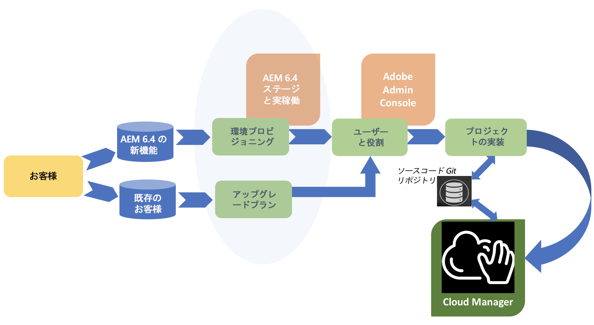

# カスタマージャーニー {#customer-journey}

お客様は、Adobe Experience Manager（AEM）を初めてお使いの場合、現在 AEM 6.4 を使用している場合、または [!UICONTROL Cloud Manager] を使用するために AEM 6.4 リリースにアップグレードする必要がある場合があります。以下のシナリオでは、新規または既存のお客様として、[!UICONTROL Cloud Manager] を使い始めるためのカスタマージャーニーについて説明します。

>[!NOTE]
>
>[!UICONTROL Cloud Manager] は、AEM 6.4 以上を使用している Adobe Managed Services ユーザーのみが利用できます。

## [!UICONTROL Cloud Manager] のオンボーディング {#on-boarding-to-cloud-manager}

1. **Adobe Managed Services の新しい AEM ユーザー**

   新しいお客様は、Adobe Managed Services のオンボーディングプロセスの一環として [!UICONTROL Cloud Manager] にオンボーディングされます。

   [!UICONTROL Cloud Manager] にアクセスするための URL は、[!UICONTROL Experience Cloud] にログインする手順と共にお知らせメールに記載されています。また、[!UICONTROL Cloud Manager] にアクセスする必要のあるユーザーとその権限を管理するために、Adobe Admin Console を使用します。

1. **Adobe Managed Services の既存の AEM ユーザー**

   既存のお客様は、最初に既存の実稼動環境および実稼動以外の環境を AEM 6.4 リリースにアップグレードする必要があります。アップグレードを実行すると同時に、オンボーディングされ、[!UICONTROL Cloud Manager] にアクセスするための URL が提供されます。さらに、[!UICONTROL Cloud Manager] にアクセスする必要のあるユーザーとその権限を管理するために、Adobe Admin Console を使用し始める必要があります。

   また、AEM 環境に新しいコードの変更をデプロイするために、[!UICONTROL Cloud Manager] の使用を開始する際には、既存の AEM プロジェクトを、推奨されるベストプラクティスに従う必要があります。

   AEM 6.4 へのアップグレードの利点について詳しくは、[AEM 6.4 へのアップグレード](https://helpx.adobe.com/jp/experience-manager/6-4/sites/deploying/using/upgrade.html)を参照してください。

## [!UICONTROL Cloud Manager] へのアクセス {#accessing-cloud-manager}

Adobe Identity Management 資格情報を使用して [!UICONTROL Experience Cloud] ランディングページにログインし、ソリューション切り替えインターフェイスから AEM を選択するだけで、[!UICONTROL Cloud Manager] および AEM 環境にアクセスできます。

[!UICONTROL Cloud Manager] に初めてログインした後、[!UICONTROL Cloud Manager] UI から直接 AEM 環境にアクセスできます。最初のコードブランチをステージおよび実稼動環境にデプロイすると、この時点で、[!UICONTROL Cloud Manager] のすべての機能を確認する準備が整います。

[!UICONTROL Cloud Manager] を確認して使用を開始するには、[初回ログイン](first-time-login.md)を参照してください。AEM について詳しくは、[AEM 6.4 の概要](https://helpx.adobe.com/ja/experience-manager/6-4/sites/deploying/using/deploy.html)を参照してください。さらに、[AEM の関連資料](https://www.adobe.com/jp/marketing-cloud/experience-manager/resources.html?promoid=759X6WV8&amp;mv=other)も参照してください。

## [!UICONTROL Cloud Manager] の概要{#getting-started-with-cloud-manager}

[!UICONTROL Cloud Manager] にログインすると、まずコードリポジトリ環境を設定した後、チームと役割を設定することになります。具体的には、Admin Console UI を使用してユーザーを [!UICONTROL Cloud Manager] プロファイルに追加することで、役割のメンバーシップが割り当てられます。

次に、**Git リポジトリ**&#x200B;にソースコードのブランチを設定する必要があります。これにより、ロードおよびパフォーマンス KPI に関して目標を定義し、すべての品質チェックに正常に合格したら、ステージおよび実稼動環境にコードを適切にデプロイするためのテストシナリオを定義します。

## エンドツーエンドのプロセス {#end-to-end-journey}

以下の図に、[!UICONTROL Cloud Manager] CI／CD パイプラインを使用してコード変更をステージおよび実稼動環境にデプロイする場合の、カスタマージャーニーの概要を示します。

