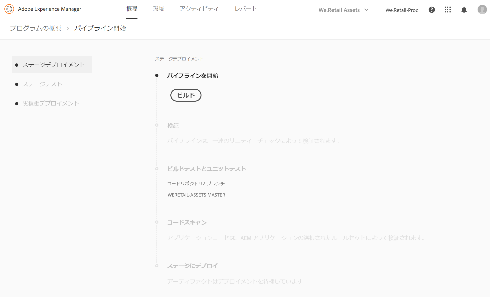
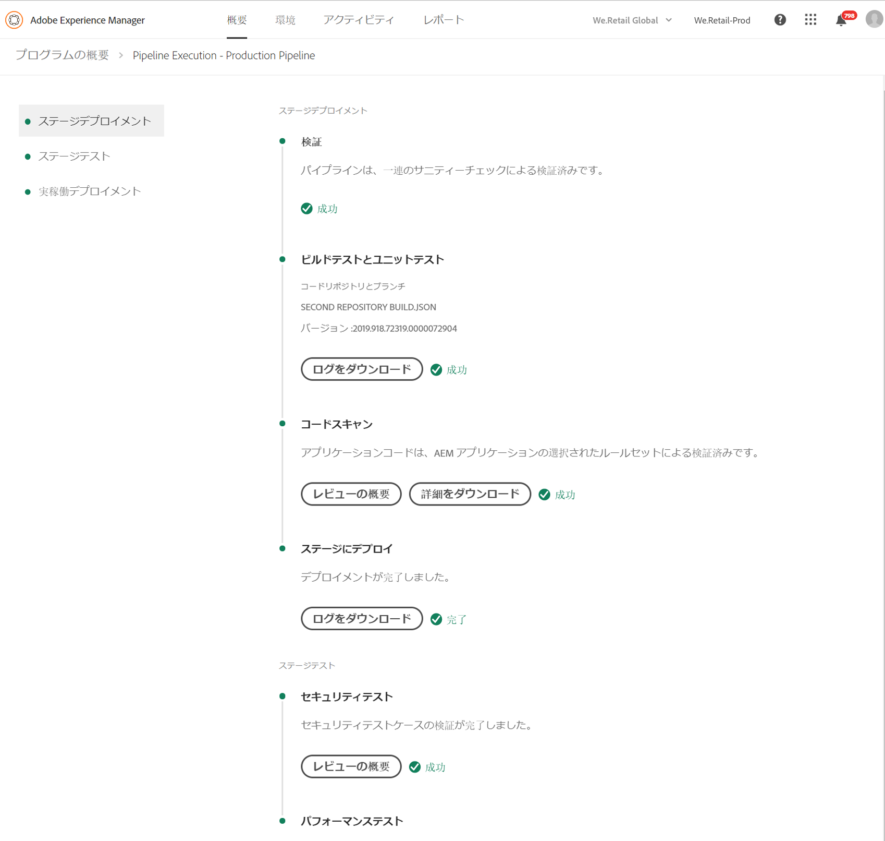
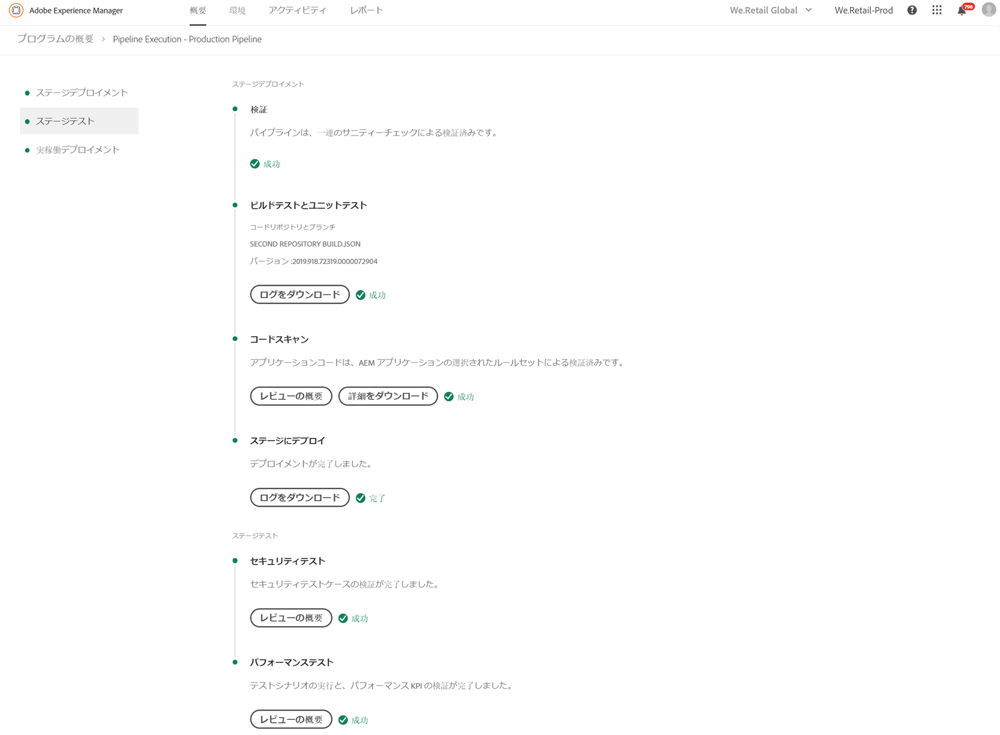
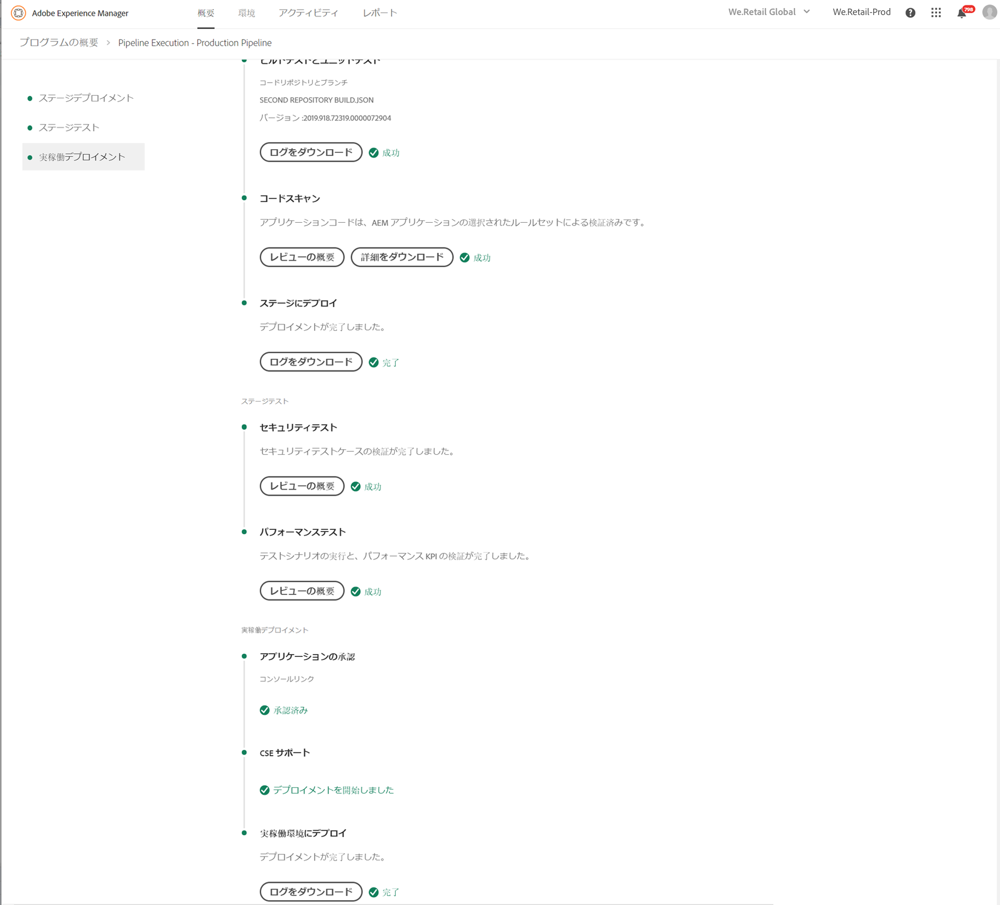
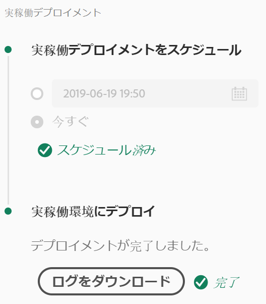

# コードのデプロイ {#deploy-your-code}

## Cloud Manager でのコードのデプロイ {#deploying-code-with-cloud-manager}

>[!NOTE]
>AEM as a Cloud Servic での Cloud Manager 用コードのデプロイについては、[こちら](https://experienceleague.adobe.com/docs/experience-manager-cloud-service/implementing/using-cloud-manager/deploy-code.html?lang=ja#using-cloud-manager)を参照してください。

実稼動パイプライン（リポジトリー、環境、テスト環境）を設定したら、コードをデプロイする準備が整います。

1. Cloud Manager で「**デプロイ**」をクリックして、デプロイメントプロセスを開始します。

   

1. **パイプライン実行**&#x200B;画面が表示されます。

   「**ビルド**」をクリックしてプロセスを開始します。

   

1. 完全なビルドプロセスによってコードがデプロイされます。

   ビルドプロセスには、以下のステージが含まれます。

   1. ステージのデプロイメント
   1. ステージテスト
   1. 実稼動のデプロイメント

   >[!NOTE]
   >
   >さらに、テスト条件のログを表示したり、結果を確認したりすることで、様々なデプロイメントプロセスから手順を確認できます。

   **ステージのデプロイメント**&#x200B;には、以下の手順が含まれます。

   * 検証：この手順では、現在使用できるリソース（設定済みのブランチが存在する場合など）を使用するようにパイプラインが設定され、環境が使用できることを確認します。
   * ビルドテストとユニットテスト：この手順では、コンテナ化されたビルドプロセスを実行します。ビルド環境の詳細については、「[ビルド環境について](/help/using/build-environment-details.md)」を参照してください。
   * コードスキャン：この手順では、アプリケーションコードの品質を評価します。テストプロセスについて詳しくは、[テスト結果の理解](understand-your-test-results.md)を参照してください。
   * ステージにデプロイ

   

   **ステージテスト**&#x200B;には、以下の手順が含まれます。

   * セキュリティテスト：この手順では、AEM 環境でのアプリケーションコードのセキュリティに対する影響を評価します。テストプロセスについて詳しくは、[テスト結果の理解](understand-your-test-results.md)を参照してください。
   * パフォーマンステスト：この手順では、アプリケーションコードのパフォーマンスを評価します。テストプロセスについて詳しくは、[テスト結果の理解](understand-your-test-results.md)を参照してください。

   

   **実稼動のデプロイメント**&#x200B;には、以下の手順が含まれます。

   * **アプリケーションの承認**（有効な場合）
   * **実稼動のデプロイメントをスケジュール**（有効な場合）
   * **CSE サポート**（有効な場合）
   * **実稼働環境にデプロイ**

   

   >[!NOTE]
   >
   >「**実稼動のデプロイメントをスケジュール**」は、パイプラインの設定時に有効になります。
   >
   >
   >このオプションを使用すると、実稼動のデプロイメントをスケジュールしたり、「**今すぐ**」をクリックして即座に実稼動のデプロイメントを実行したりできます。
   >
   >
   >スケジュールされた日時は、ユーザーのタイムゾーンで指定されます。
   >
   >
   >「**確認**」をクリックして設定を検証します。

   

   デプロイメントスケジュールを確認すると、コードのデプロイメントが完了します。

   上記の手順で「**今すぐ**」オプションが選択されている場合、以下の画面が表示されます。

   

## タイムアウト {#timeouts}

ユーザーのフィードバックを待機したままにすると、次の手順はタイムアウトします。

| ステップ | タイムアウト |
|--- |--- |
| コード品質テスト | 14 日 |
| セキュリティテスト | 14 日 |
| パフォーマンステスト | 14 日 |
| アプリケーションの承認 | 14 日 |
| 実稼動デプロイメントをスケジュール | 14 日 |
| CSE サポート | 14 日 |

## デプロイメントプロセス {#deployment-process}

以下の節では、ステージフェーズおよび実稼動フェーズでの AEM および Dispatcher パッケージのデプロイ方法について説明します。

Cloud Manager は、ビルドプロセスによって生成されたすべての target/*.zip ファイルをステージの場所にアップロードします。これらのアーティファクトは、パイプラインのデプロイフェーズで、この場所から取得されます。

Cloud Manager が実稼動以外のトポロジにデプロイされる場合、目的はできるだけ早くデプロイメントを完了することです。そのため、アーティファクトは、以下のようにすべてのノードに同時にデプロイされます。

1. Cloud Manager は、各アーティファクトが AEM または Dispatcher パッケージであるかどうかを判断します。
1. Cloud Manager は、デプロイメント中に環境を分離するために、ロードバランサーからすべての Dispatcher を削除します。

   特に設定されている場合を除き、開発およびステージデプロイメントでのロードバランサーの変更、つまり、非実稼動パイプライン（開発環境用）と実稼動パイプライン（ステージ環境用）の両方のデタッチとアタッチの手順をスキップできます。

   

   >[!NOTE]
   >
   >この機能は、主に 1-1-1 のお客様が使用すると想定されています。

1. 各 AEM アーティファクトは、パッケージマネージャー API を介して各 AEM インスタンスにデプロイされ、パッケージの依存関係がデプロイメントの順序を決定します。

   パッケージを使用した新機能のインストール、インスタンス間のコンテンツの転送、リポジトリーコンテンツのバックアップ方法について詳しくは、パッケージの使用方法を参照してください。

   >[!NOTE]
   >
   >すべての AEM アーティファクトは、オーサーとパブリッシャーの両方にデプロイされます。ノード専用の設定が必要な場合は、実行モードを使用する必要があります。特定の目的のために実行モードを使用して AEM インスタンスを調整できるようにする方法について詳しくは、実行モードを参照してください。

1. Dispatcher のアーティファクトは、以下のように各 Dispatcher にデプロイされます。

   1. 現在の設定はバックアップされ、一時的な場所にコピーされます。
   1. すべての設定は、不変ファイルを除いて削除されます。詳しくは、Dispatcher 設定の管理を参照してください。これにより、孤立したファイルが残らないようにディレクトリがクリアされます。
   1. アーティファクトは、`httpd` ディレクトリに抽出されます。不変ファイルは上書きされません。Git リポジトリー内の不変ファイルに対して加えた変更は、デプロイメント時に無視されます。これらのファイルは、AMS Dispatcher フレームワークのコアであり、変更できません。
   1. Apache が設定テストを実行します。エラーが見つからない場合は、サービスが再読み込みされます。エラーが発生した場合、設定がバックアップから復元され、サービスが再読み込みされて、エラーが Cloud Manager に再レポートされます。
   1. パイプライン設定で指定された各パスは、無効化または Dispatcher キャッシュからフラッシュされます。

   >[!NOTE]
   >Cloud Manager では、Dispatcher アーティファクトに完全なファイルセットが含まれていることが想定されています。すべての Dispatcher 設定ファイルが、Git リポジトリーに存在する必要があります。ファイルやフォルダーが見つからない場合、デプロイメントに失敗します。

1. すべての AEM および Dispatcher パッケージのすべてのノードへのデプロイメントが正常に完了すると、Dispatcher がロードバランサーに再追加され、デプロイメントが完了します。

   >[!NOTE]
   >開発およびステージデプロイメントでのロードバランサーの変更、つまり、非実稼動パイプライン（開発環境用）と実稼動パイプライン（ステージ環境用）の両方のデタッチとアタッチの手順をスキップできます。

### 実稼動フェーズへのデプロイメント {#deployment-production-phase}

AEM サイト訪問者への影響を最小限に抑えるために、実稼動トポロジへのデプロイプロセスはわずかに異なります。

実稼動のデプロイメントは、通常、上記と同じ手順に従いますが、周期的な方法で実行します。

1. オーサーに AEM パッケージをデプロイします。
1. dispatcher1 をロードバランサーから分離します。
1. AEM パッケージを publish1 にデプロイし、並行して Dispatcher パッケージを dispatcher1 にデプロイして、Dispatcher キャッシュを消去します。
1. dispatcher1 をロードバランサーに戻します。
1. dispatcher1 がサービスを再開したら、dispatcher2 をロードバランサーから分離します。
1. AEM パッケージを publish2 にデプロイし、並行して Dispatcher パッケージを dispatcher2 にデプロイして、Dispatcher キャッシュをフラッシュします。
1. dispatcher2 をロードバランサーに戻します。
このプロセスは、デプロイメントがトポロジのすべてのパブリッシャーおよび Dispatcher に到達するまで続行されます。

## 緊急パイプライン実行モード {#emergency-pipeline}

重大な状況では、Adobe Managed Services のお客様が、Cloud Manager のテストサイクルが完全に実行されるのを待たずに、ステージング環境および実稼動環境にコード変更をデプロイしなければならない場合があります。

このような状況に対処するために、Cloud Manager の実稼動パイプラインは、*緊急*&#x200B;モードで実行することができます。このモードを使用すると、セキュリティテストのステップとパフォーマンステストのステップは実行されず、設定済みの承認ステップなどの他のステップはすべて、通常のパイプライン実行モードの場合と同様に実行されます。

>[!NOTE]
>緊急パイプライン実行モード機能は、カスタマーサクセスエンジニアがプログラム単位で有効にします。

### 緊急パイプライン実行モードの使用 {#using-emergency-pipeline}

実稼動パイプラインの実行を開始する際、この機能が有効になっている場合は、ダイアログボックスから通常モードか緊急モードのどちらかで実行を開始できます（下図を参照）。


また、緊急モードで実行する場合、パイプライン実行の詳細ページを表示すると、この特定の実行に緊急モードが使用されたことを示すインジケーターが画面上部のパンくずリストに表示されます。


このような緊急モードでのパイプライン実行は、Cloud Manager API または CLI を使用して作成することもできます。緊急モードで実行を開始するには、クエリパラメーター `?pipelineExecutionMode=EMERGENCY` を使用して、パイプラインの実行エンドポイントに PUT リクエストを送信します。また、CLI を使用する場合は、次のようにします。

```
$ aio cloudmanager:pipeline:create-execution PIPELINE_ID --emergency
```

>[!IMPORTANT]
>`--emergency` フラグを使用するには、場合によっては、`aio-cli-plugin-cloudmanager` の最新バージョンに更新する必要があります。