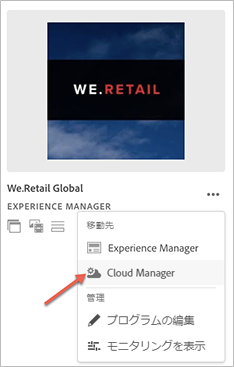

# 初回ログイン {#first-time-login}

[!UICONTROL Cloud Manager] の一般設定をセットアップしたら、[!UICONTROL Cloud Manager] でユーザーインターフェイス（UI）を使用する準備が整います。

>[!NOTE]
>[!UICONTROL Cloud Manager] で割り当てられた役割とアプリケーションの状態によっては、[!UICONTROL Cloud Manager] UI の使用中に異なる画面が表示されます。

## 初めてのログイン {#logging-in-for-the-first-time}

1. **Adobe [!UICONTROL Experience Cloud]** にログインすると、**プログラム**&#x200B;のリストが表示されます。

1. プログラムを選択します（例：**We.Retail Global**）。 ランディングページにプログラムカードが表示されたら、「**...」を選択します。**&#x200B;をクリックして、使用可能なメニューオプションを確認します。   **Cloud Manager**&#x200B;を選択して、Cloud Managerの&#x200B;**概要**&#x200B;ページに移動します。

   

1. Cloud Managerの&#x200B;**概要**&#x200B;ページが表示されます。

   

1. **プログラム**&#x200B;の説明を設定し、主要業績評価指標（KPI）を定義するには、「**プログラムを設定**」をクリックします。

   >[!NOTE]
   >
   >次の手順を完了するには、「[プログラムのセットアップ](https://helpx.adobe.com/jp/experience-manager/cloud-manager/using/setting-up-program.html)」を参照してください。

## ビデオチュートリアル {#video-tutorial-two}

### 「Cloud Manager アクティビティ」タブ  {#activity-video}

Cloud Manager を使用すれば、すべての CI／CD パイプライン実行を表示委するプログラムのアクティビティをまとめて表示し、過去と現在のアクティビティや、アクティビティの詳細を確認できます。

>[!VIDEO](https://video.tv.adobe.com/v/26313/)
