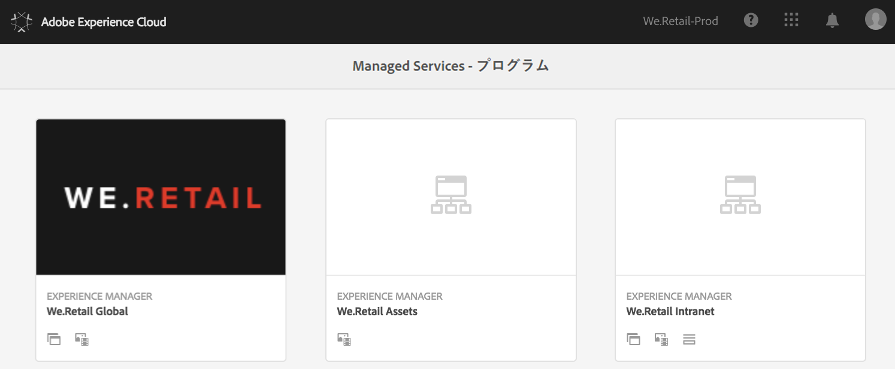
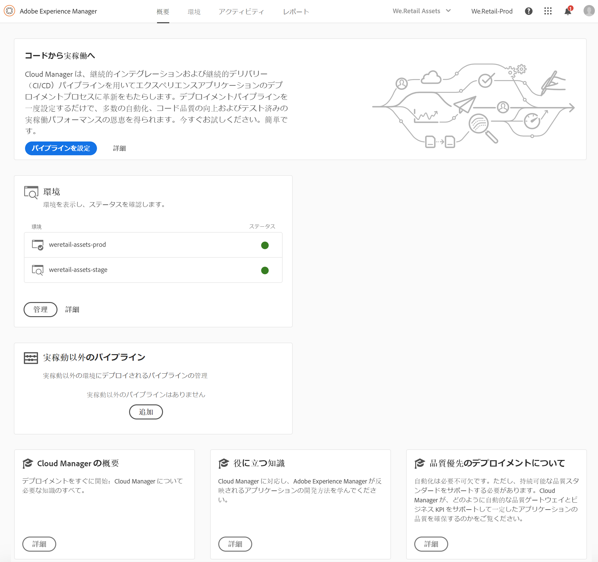

# 初回ログイン {#first-time-login}

[!UICONTROL Cloud Manager] の一般設定をセットアップしたら、[!UICONTROL Cloud Manager] でユーザーインターフェイス（UI）を使用する準備が整います。

>[!NOTE]
>
>[!UICONTROL Cloud Manager] で割り当てられた役割とアプリケーションの状態によっては、[!UICONTROL Cloud Manager] UI の使用中に異なる画面が表示されます。

## 初めてのログイン {#logging-in-for-the-first-time}

1. **Adobe[!UICONTROL Experience Cloud]** にログインすると、**プログラム** のリストが表示されます。

   

1. プログラム（例えば、**We.Retail Global**）を選択し、左上のアイコンをクリックして [!UICONTROL Cloud Manager] を開きます。

   

1. [!UICONTROL Cloud Manager] 用のダッシュボードが表示されます。

   

1. **プログラム** の説明を設定し、主要業績評価指標（KPI）を定義するには、「**プログラムを設定**」をクリックします。

   >[!NOTE]
   >
   >次の手順を完了するには、[プログラムの設定](https://helpx.adobe.com/jp/experience-manager/cloud-manager/using/setting-up-program.html)を参照してください。