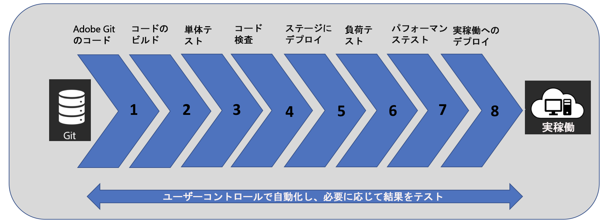

# [!UICONTROL Cloud Manager の概要] {#introduction-to-cloud-manager}

>[!CONTEXTUALHELP]
>id="aemcloud_cloudmanager_introduction"
>title="Cloud Manager の概要"
>abstract="組織がクラウド内の Experience Manager を自己管理できるようにします。このサービスには継続的統合および継続的配信（CI／CD）フレームワークが備わっているので、IT チームや実装パートナーはパフォーマンスやセキュリティを妥協することなくカスタマイズや更新を迅速に配信できます。"
>additional-url="https://experienceleague.adobe.com/docs/experience-manager-learn/cloud-service/cloud-manager/programs.html?lang=ja#cloud-manager" text="プログラムの作成"
>additional-url="https://experienceleague.adobe.com/docs/experience-manager-learn/cloud-service/cloud-manager/environments.html?lang=ja#cloud-manager" text="環境の作成"

## はじめに {#introduction}

Adobe Experience Manager の [!UICONTROL Cloud Manager] を使用すると、開発者は、Adobe Experience Manager のベストプラクティスに基づいて構築された、合理化されたワークフローを通じて、効果的な顧客エクスペリエンスを作成できます。Adobe Experience Manager に最適化された CI／CD パイプラインを使用すると、コードをチェックインするだけで開発ワークフローを簡単に統合し、本番環境に移行することができます。構築フェーズでは、実証済みおよび学習済みのベストプラクティスを使用してカスタムコードの更新が十分にテストされ、効果的なデジタルエクスペリエンスが顧客に提供されます。Cloud Manager は、オープン API アプローチを使用し、既存のプロセスやツールを中断することなくシステムとの統合を可能にします。

このドキュメントサイトでは特に、Adobe Managed Services（AMS）のお客様に向けの Cloud Manager の機能について説明します。AEM as a Cloud Service のお客様向けの同等のドキュメントについては、[AEM as a Cloud Service のアプリケーションの実装](https://experienceleague.adobe.com/docs/experience-manager-cloud-service/implementing/home.html?lang=ja)を参照してください。

Cloud Manager を使用すると、開発チームは以下のことができるようになります。

* コードの継続的統合／継続的配信により、数か月／数週間かかっていた市場投入時間を数日／数時間へと短縮します。

* 実稼動にプッシュする前に、ベストプラクティスに基づいたコード調査、パフォーマンステストおよびセキュリティの検証を行い、実稼動の中断を最小限に抑えることができます。

* 既存の DevOps プロセスを補完する API 接続。

* 自動スケーリング機能により、容量増加の必要性がインテリジェントに検出され、追加の Dispatcher／パブリッシュセグメントが自動的にオンラインになります。

以下の画像に、[!UICONTROL Cloud Manager] で使用される CI／CD プロセスフローを示します。

## [!UICONTROL Cloud Manager] の主な機能 {#key-features-in-cloud-manager}

組織は、[!UICONTROL Cloud Manager] を使用して以下の機能を利用できます。

### セルフサービスインターフェイス {#self-service-interface}

[!UICONTROL Cloud Manager] のユーザーインターフェイス（UI）を使用すると、お客様は Experience Manager アプリケーションのクラウド環境および CI／CD パイプラインに簡単にアクセスして管理できます。

お客様は、アプリケーション特有の主要業績評価指標（KPI）（1 分あたりのピークページビュー数とページ読み込みに対する予想応答時間）を定義します。これが、最終的にデプロイメントが成功したかどうかを測定するための基礎となります。様々なチームメンバーの役割と権限を簡単に定義できます。新しいセルフサービスインターフェイスでは制御は自分でできますが、必要に応じて必要なアドバイスを提供できるアドビ内の専門家にアクセスできます。

[!UICONTROL Cloud Manager] の UI を確認して使用を開始するには、[初回ログイン](https://helpx.adobe.com/jp/experience-manager/cloud-manager/using/first-time-login.html)を参照してください。

### CI／CD パイプライン {#ci-cd-pipeline}

[!UICONTROL Cloud Manager] の主要機能の 1 つは、最適化された CI／CD パイプラインを使用して、Web サイト上の新しいコンポーネントの追加などのカスタムコードやアップデートの配信を高速化する機能です。

[!UICONTROL Cloud Manager] UI を使用して、CI／CD パイプラインを設定および開始できます。このパイプラインの間、徹底したコードスキャンが実行され、高品質なアプリケーションのみが実稼動環境に渡されます。

[!UICONTROL Cloud Manager] の UI からパイプラインを設定する方法について詳しくは、[CI／CD パイプラインの設定](https://helpx.adobe.com/jp/experience-manager/cloud-manager/using/configuring-pipeline.html)を参照してください。

### 柔軟なデプロイメントモード {#flexible-deployment-modes}

[!UICONTROL Cloud Manager] には、ビジネス要件の変化に応じてエクスペリエンスを配信できるように、柔軟に設定可能なデプロイメントモードが用意されています。

自動トリガーモードでは、コードコミットなどの特定のイベントに基づいて、コードが自動的に環境にデプロイされます。また、業務時間外を含め、指定した期間、コードのデプロイメントをスケジュールすることもできます。

デプロイメントトリガーとは無関係に、デプロイメントがトリガーされるたびに、CI／CD パイプライン実行の一環として品質チェックが常に実行されます。品質チェックには、お客様およびお客様のパートナーが手を加えなくてもすぐに使えるコード調査、セキュリティテスト、パフォーマンステストが含まれています。

コードと品質チェックのデプロイについて詳しくは、[コードのデプロイ](deploying-code.md)を参照してください。

### 自動スケーリング {#autoscaling}

[!UICONTROL Cloud Manager] では、実稼動環境の負荷が異常に高くなりがちな場合に追加容量の必要性を検出し、自動スケーリング機能によって、自動的に追加容量を利用できるようにします。

自動スケーリングイベント中、[!UICONTROL Cloud Manager] は自動スケーリングプロビジョニング処理を自動的にトリガーし、自動スケーリングイベントを送信し、数分以内に追加容量を利用できるようにします。追加容量は実稼動環境の、実行中の Dispatcher／パブリッシュノードと同じシステム仕様に一致する同じリージョンでプロビジョニングされます。

自動スケーリング機能は、Dispatcher／パブリッシュ層にのみ適用され、Dispatcher とパブリッシュのペアの 1 個以上の追加セグメント、最大で 10 個のセグメントで、常に水平スケール手法を使用して実行されます。プロビジョニングされた追加容量は、CSE（カスタマーサクセスエンジニア）が指定した 10 営業日以内に、手動でスケーリングされます。

>[!NOTE]
>オートスケーリングがご使用中のアプリケーションに適しているかどうかを確認したいお客様は、CSE またはアドビ担当者にお問い合わせください。
