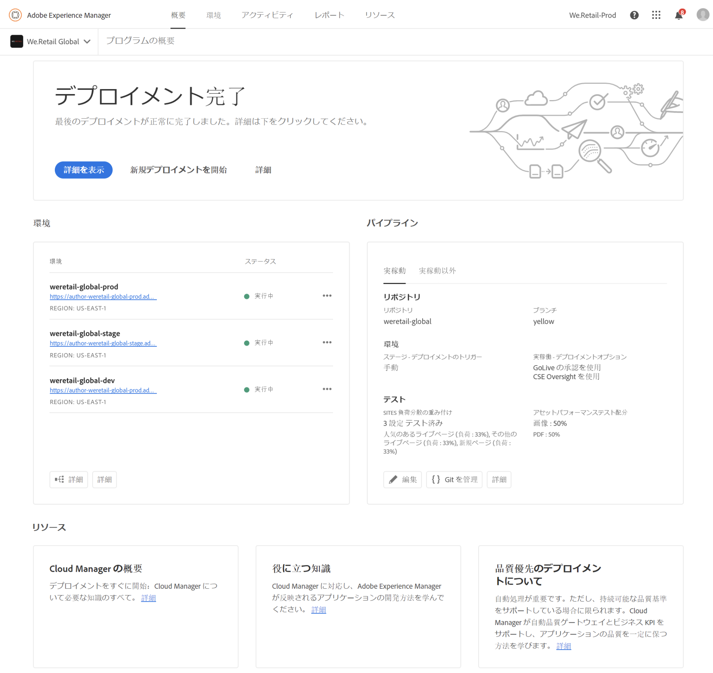
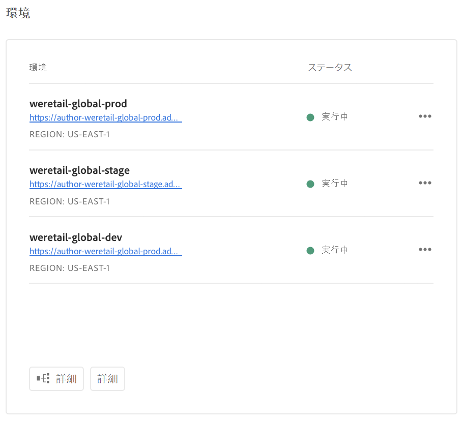
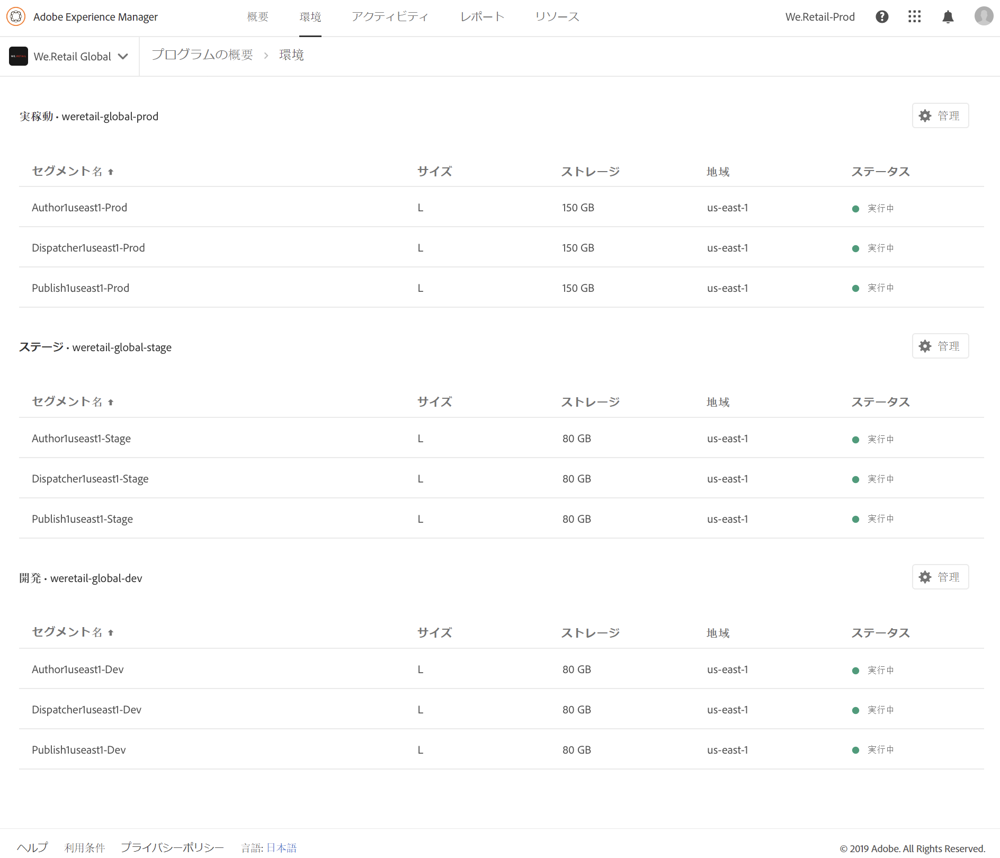

# 環境の管理 {#manage-your-environments}

Cloud Manager の&#x200B;**概要**&#x200B;ページには、管理対象のすべての AEM 環境を一覧表示する&#x200B;**環境**&#x200B;タイルが含まれています。

一覧される各環境には、関連するステータスが表示されます。

## ビデオチュートリアル {#video-tutorial}

### Cloud Manager 環境の概要 {#environ-video}

次のビデオでは、AEM Author、AEM Publish およびディスパッチャーの各インスタンスで構成される Cloud Manager 環境の概要を説明します。

>[!VIDEO](https://video.tv.adobe.com/v/26318/)

## Cloud Manager での環境へのアクセス {#accessing-environments-in-cloud-manager}

**環境**&#x200B;タイルには、プログラムでプロビジョニングされた実稼動環境とステージング環境が表示されます。

ステータスは、環境内のノード全体の総合的な稼動状態です。すべてのノードが実行中であれば緑、停止しているノードが 1 つでもあれば赤、準備中のノードが 1 つでもあれば青、稼動状態が使用不可のノードが 1 つでもあれば黄色になります。

### 環境 {#environments}

「**管理**」をクリックすると、**環境**&#x200B;画面が表示されます。

**環境**&#x200B;画面には、プログラムの&#x200B;*実稼動*&#x200B;環境および&#x200B;*ステージ*&#x200B;環境ごとにカードが表示されます。環境の名前は各カードの上部に表示されます。カードには、環境内のノードの表と、CPU（T シャツサイズで表示）、ストレージ、地域およびステータスが含まれます。

>[!NOTE]
>
>ノードの&#x200B;**ステータス**&#x200B;は、VM の稼動状態を表し、サーバー上の AEM のステータスは表しません。ステータスは&#x200B;**実行中**（緑の円）、**停止**（赤の円）、**準備中**（青の円）、**使用不可**（黄色の円）のいずれかです。

