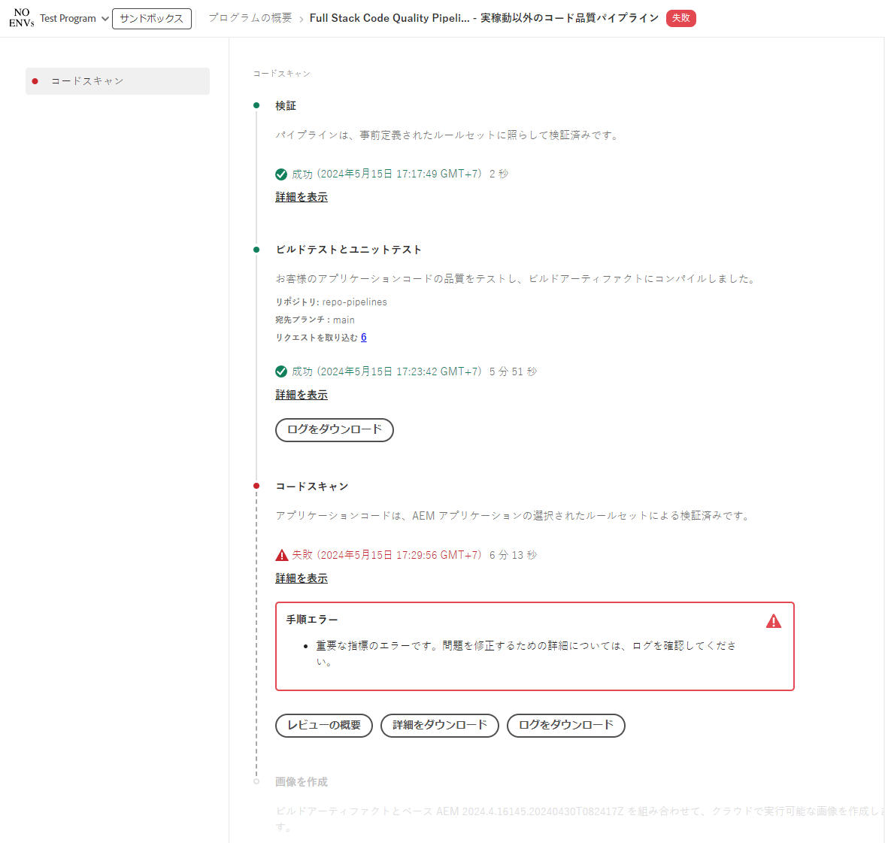

# パイプラインの管理 {#managing-pipelines}

既存のパイプラインの管理方法（編集、実行、削除を含む）を説明します。

## パイプラインカード {#pipeline-card}

Cloud Manager の&#x200B;**プログラムの概要**&#x200B;ページにある&#x200B;**パイプライン**&#x200B;カードには、すべてのパイプラインとその現在のステータスの概要が表示されます。

各パイプラインの横にある省略記号ボタンをクリックすると、次の操作を実行できます。

* [ パイプラインを実行 ](#running-pipelines).
* [ パイプラインを編集 ](#editing-pipelines).
* [ パイプラインを削除 ](#deleting-pipelines).
* [ 詳細を表示 ](#view-details).

パイプラインのリストの下部には、次の一般的なオプションがあります。

* **追加** -[ 新しい実稼動パイプラインを追加 ](/help/using/production-pipelines.md) または [ 新しい実稼動以外のパイプラインを追加 ](/help/using/non-production-pipelines.md) します。
* **すべて表示** - ユーザーを&#x200B;**パイプライン**&#x200B;画面に移動して、すべてのパイプラインをより詳細なテーブルに表示します
* **リポジトリ情報にアクセス** - Cloud Manager Git リポジトリへのアクセスに必要な情報を表示します。
* **詳細情報** - CI／CD パイプラインのドキュメントリソースに移動します。

## パイプラインウィンドウ {#pipelines}

**パイプライン**&#x200B;ウィンドウには、選択したプログラムのすべてのパイプラインの完全なリストが表示されます。このリストは、[ パイプライン ](#pipeline-card) カードで利用できる情報よりも包括的な情報を提供するので便利です。

1. [my.cloudmanager.adobe.com](https://my.cloudmanager.adobe.com/) で Cloud Manager にログインし、適切な組織とプログラムを選択します。

1. **プログラムの概要**&#x200B;ページで、「**パイプライン**」タブをクリックして、**パイプライン**&#x200B;ウィンドウに切り替えます。

1. ここでは、プログラムのすべてのパイプラインのリストを確認できるほか、**パイプラインカード**&#x200B;の場合と同様に、パイプラインの実行を開始および停止することができます。

`i` アイコンをクリックすると、パイプラインの前回または現在の実行に関する詳細が表示されます。

「**詳細を表示**」をクリックすると、[パイプライン実行の詳細](#view-details)が表示されます。

## アクティビティウィンドウ {#activity}

**アクティビティ**&#x200B;ウィンドウには、選択したプログラムのすべてのパイプライン実行の完全なリストが表示されます。

1. [my.cloudmanager.adobe.com](https://my.cloudmanager.adobe.com/) で Cloud Manager にログインし、適切な組織とプログラムを選択します。

1. **プログラムの概要**&#x200B;ページで、「**アクティビティ**」タブをクリックして、**アクティビティ**&#x200B;ウィンドウに切り替えます。

1. ここでは、現在および過去の実行を含む、プログラムのすべてのパイプライン実行のリストを確認できます。

`i` アイコンをクリックすると、選択したパイプライン実行に関する詳細が表示されます。

「**詳細を表示**」をクリックして、[ パイプライン実行の詳細 ](#view-details) を確認します。

## パイプラインの実行 {#running-pipelines}

1. [my.cloudmanager.adobe.com](https://my.cloudmanager.adobe.com/) で Cloud Manager にログインし、適切な組織とプログラムを選択します。
1. **プログラムの概要**&#x200B;ページから&#x200B;**パイプライン**&#x200B;カードに移動します。
1. 実行するパイプラインの横にある省略記号ボタンをクリックし、メニューから「**実行**」を選択します。

   ステータス列は、パイプラインの実行が開始されたタイミングを示します。

   実行の詳細を確認するには、省略記号ボタンをもう一度クリックし、「**[詳細を表示](#view-details)**」を選択します。

   パイプラインのタイプによっては、省略記号ボタンをもう一度クリックして「**キャンセル**」を選択すると、実行をキャンセルできる場合があります。

## パイプラインを編集 {#editing-pipelines}

1. [my.cloudmanager.adobe.com](https://my.cloudmanager.adobe.com/) で Cloud Manager にログインし、適切な組織とプログラムを選択します。

1. **プログラムの概要** ページから **パイプライン** カードに移動し、編集するパイプラインの横にある省略記号ボタンをクリックして、メニューから **編集** を選択します。

1. **実稼動パイプラインを編集** または **実稼動以外のパイプラインを編集** ダイアログボックスが表示されます。 パイプラインの作成時に入力したのと同じ詳細を編集できます。

   パイプラインに使用できるフィールドと設定オプションについて詳しくは、[ 実稼動パイプラインの設定 ](/help/using/production-pipelines.md) および [ 実稼動以外のパイプラインの設定 ](/help/using/non-production-pipelines.md) を参照してください。

1. 完了したら、「**更新**」をクリックします。

>[!NOTE]
>
>実行中のパイプラインは編集できません。

## パイプラインを削除 {#deleting-pipelines}

1. [my.cloudmanager.adobe.com](https://my.cloudmanager.adobe.com/) で Cloud Manager にログインし、適切な組織とプログラムを選択します。

1. **プログラムの概要** ページから **パイプライン** カードに移動し、実行するパイプラインの横にある省略記号ボタンをクリックして、メニューから **削除** を選択します。

>[!NOTE]
>
>実行中のパイプラインは削除できません。

## 詳細を表示 {#view-details}

1. [my.cloudmanager.adobe.com](https://my.cloudmanager.adobe.com/) で Cloud Manager にログインし、適切な組織とプログラムを選択します。

1. **プログラムの概要** ページから **パイプライン** カードに移動し、実行するパイプラインの横にある省略記号ボタンをクリックして、メニューから **詳細を表示** を選択します。

1. 実行中のパイプラインの詳細ページに移動します。

ここから、診断の目的で、パイプラインの様々なステップのステータスを確認し、ビルドログを取得できます。 詳しくは、[コードのデプロイメント](/help/using/code-deployment.md)のドキュメントを参照してください。

パイプライン実行のすべての手順が表示され、まだ開始されていない手順はグレーアウトされます。完了した手順には、期間が表示されます。

パイプラインの手順が完了すると、概要が表示されます。

「**詳細を表示**」リンクをクリックすると、「**期間**」セクションが表示されます。このセクションには、そのプログラムの履歴トレンドに基づくパイプラインの平均期間が含まれます。

パイプラインに問題が発生した&#x200B;**コードスキャン**&#x200B;ステップが含まれていた場合は、「**詳細をダウンロード**」ボタンをクリックして、合格しなかった[コード品質テスト](/help/using/code-quality-testing.md)のリストを表示できます。

CSV ファイルには、問題のあるコードの場所を示す&#x200B;**プロジェクトファイルの場所**&#x200B;列があります。この列はプロジェクト相対パスですが、**ファイルの場所**&#x200B;列は Maven によって生成されます。

>[!NOTE]
>
>実行中のパイプラインまたは少なくとも 1 回実行されたパイプラインの詳細のみ表示できます。
