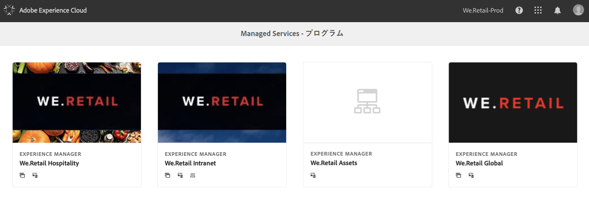
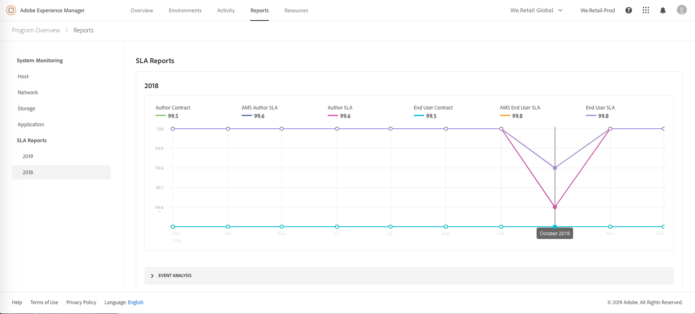

# システム監視 {#system-monitoring}

[!UICONTROL Cloud Manager] のシステム監視は、環境内の個々のインスタンスを監視し、各インスタンスの様々な指標を追跡することでおこなわれます。各指標には、*警告しきい値*&#x200B;と&#x200B;*重大しきい値*&#x200B;の 2 つのしきい値が定義されています。

指標が重大のしきい値を超えた場合は、重大な状態にあると見なされます。指標が警告しきい値を超えた（ただし、重大のしきい値は下回る）場合は、警告状態にあると見なされます。しきい値は Adobe Managed Services で設定され、[!UICONTROL Cloud Manager] で視覚化できます。ほとんどの場合、しきい値は顧客間で統一されていますが、特定の顧客要件に合わせて Adobe Managed Services がしきい値を変更する場合もあります。しきい値に関するご質問は、担当のカスタマーサクセスエンジニア（CSE）にお問い合わせください。

## システム監視へのナビゲーション {#navigating-system-monitoring}

システム監視機能に移動するには、2 とおりの方法があります。

1. **Managed Services - プログラム**&#x200B;のランディングページにログインします。

   

1. プログラムカードの 3 番目のアイコンをクリックします。

   

   *または*、

* [!UICONTROL Cloud Manager] 内の&#x200B;**レポート**&#x200B;グローバルナビゲーションメニュー項目を使用して、**システムの監視**&#x200B;ランディングページに移動します。

## システム監視の概要ページ {#system-monitoring-overview-page}

システム監視の概要ページには、プログラム内の監視対象環境が一覧表示され、次の 4 つの異なるカテゴリにわたる各環境のヘルス概要に関するレポートが表示されます。

* **主催者**
* **ストレージ**
* **ネットワーク**
* **アプリケーション**

各カテゴリのステータスは、個々の指標を要約したものです。カテゴリ内のいずれかの指標が重大な状態にある場合、概要ページ上、カテゴリ全体が重大な状態になります。同じ要約が環境レベルとインスタンスレベルでもおこなわれます。

>[!NOTE]
>
>デフォルトでは、このページに移動すると、実稼動環境のインスタンスが表示されますが、他の環境も開くことができます。

## ビデオチュートリアル {#video-tutorial}

### Cloud Managerレポートの概要 {#reports-video}

Cloud Managerのレポートは、各AEMインスタンスの様々な指標をレポートし、追跡する一連のグラフを通じて、プログラムの環境とAEMインスタンスのビューを提供します。
詳しくは、以下のビデオを参照してください。

>[!VIDEO](https://video.tv.adobe.com/v/26315/?captions=jpn)

## システム監視の詳細 {#system-monitoring-detail}

特定の指標の詳細を表示するには、左側のナビゲーションのいずれかのカテゴリをクリックするか、特定のインスタンスのカテゴリインジケーターのいずれかをクリックします。各詳細ページには、そのカテゴリに含まれる指標の一連のグラフが表示されます。環境内のすべてのインスタンスまたは特定のインスタンスの指標を表示できます。右上隅のドロップダウンボックスを使用して、環境とインスタンスを切り替えることができます。

左側のナビゲーションには、現在選択されている環境およびインスタンスのデータが存在する、現在選択中のカテゴリ内の使用可能な指標が表示されます。

個々のグラフには、ステータスとデータの時間変化のグラフのほか、しきい値が表示されます。複数のインスタンスが表示されている場合、各インスタンスのデータは別個の系列になります。

凡例で個々の系列をクリックして、その系列をグラフ上で非表示にすることができます。
例えば、警告しきい値系列をクリックすると、重大のしきい値のみ表示されます。

### 指標の定義 {#metric-definitions}

**主催者**

* コアごとの負荷：CPU で実行中のプロセスまたは待機状態にあるプロセスの数を 1 分間（load1）、5 分間（load5）、15 分間（load15）にわたって平均したものです。
* プロセス数：現在開いているプロセスの数。
* ユーザー数：シェルセッションがアクティブになっているユーザーの数。
* メモリ使用量：現在割り当てられているシステムメモリの割合（パーセント）。
* JVM メモリ（ヒープ）：割り当てられている Java ヒープのサイズ（MB 単位）。
* 旧世代領域：現在割り当てられている JVM 旧世代メモリの割合（パーセント）。

**ネットワーク**

* CQ ポートチェック：AEM または Dispatcher ポートにアクセスするための応答時間（秒単位）。作成者、パブリッシュ、ディスパッチャーには、それぞれ異なる指標があります。

**ストレージ**

* ディスク領域：ホスト上の各マウントポイントに使用されているディスク領域（MB 単位）。マウントポイントごとに異なる指標があります。少なくとも、「/」および「/mnt」の指標が表示されますが、特定のインスタンス設定によっては、追加のマウントポイント指標が使用可能な場合があります。
* フォルダーサイズ：AEM セグメントストア：AEM セグメントストアに使用されているディスク領域（GB 単位）。

**アプリケーション**

* レプリケーションエージェント：テストレプリケーションイベントの時間（秒単位）。レプリケーションエージェントごとに別個の指標があります。
* Dispatcher フラッシュ：ディスパッチャーフラッシュキューに現在存在する項目の数。

## SLA レポート {#sla-reporting}

お客様は、契約されたサービスレベル契約（SLA）に対する AEM の実稼動環境のパフォーマンスを確認できます。これは、レポート画面のサブメニューから利用できます。例えば、以下のグラフは、2018 年の毎月の SLA 達成度を示しています。

システムの監視グラフと同様、データポイントをロールオーバーすると、その月の特定の値が表示されます。

このグラフの「イベント分析」セクションには、現在選択されている年の中でプログラムに発生した一連のインシデントが表示されます。インシデントごとに、時間範囲、原因および一連のコメントが記載されています。

## SLA 指標 {#sla-metrics}

* **作成者契約**：これは、Adobe Managed Services との契約で定義される作成者層用の SLA です。

* **AMS 作成者 SLA**：これは、アドビまたはアドビのベンダーが原因となって発生したインシデントを組み込んだ、実稼動作成者層の測定稼動時間です。

* **作成者 SLA**：これは、メンテナンスウィンドウなどスケジュールされたダウンタイムを無視した、作成者層の測定稼動時間です。

* **エンドユーザー契約**：これは、Adobe Managed Services との契約で定義されるパブリッシュ層用の SLA です。

* **AMS エンドユーザー SLA**：これは、アドビまたはアドビのベンダーが原因となって発生したインシデントを組み込んだ、実稼動パブリッシュ層の測定稼動時間です。

* **エンドユーザー SLA**：これは、メンテナンスウィンドウなどスケジュールされたダウンタイムを無視した、パブリッシュ層の測定稼動時間です。