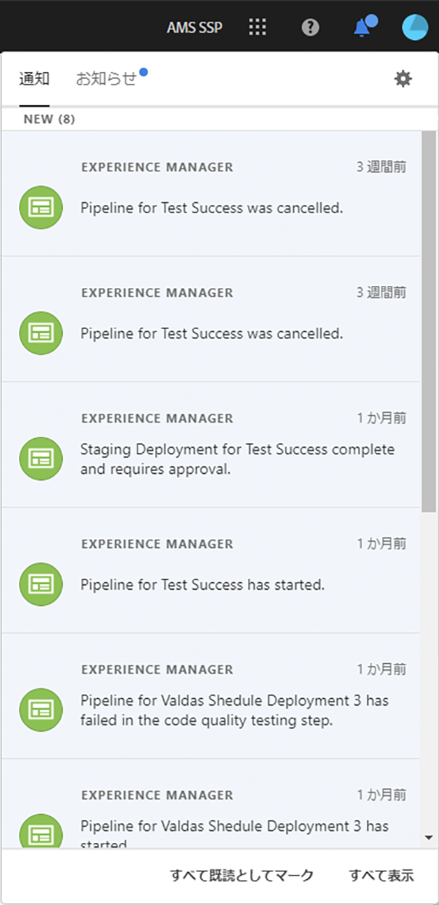
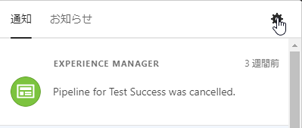

# 通知 {#notifications}

[!UICONTROL Cloud Manager] では、実稼動パイプラインの開始時および正常終了または失敗時、実稼動デプロイメントの開始時、また **GoLive 承認**&#x200B;ステップおよび&#x200B;**スケジュール済み**&#x200B;ステップに達したときに、ユーザーは通知を受け取ることができます。これらの通知は、Adobe [!UICONTROL Experience Cloud] の通知システムを通じて送信されます。

>[!NOTE]
>
>承認およびスケジュール済みの通知は、ビジネスオーナー、プログラムマネージャー、デプロイメントマネージャーの役割のユーザーにのみ送信されます。

通知は、[!UICONTROL Cloud Manager] UI（ユーザーインターフェイス）のサイドバーおよび Adobe [!UICONTROL Experience Cloud] 全体に表示されます。

下の図に示すように、ヘッダーのベルアイコンをクリックしてサイドバーを開き、通知を表示します。

サイドバーには、最新の通知が一覧表示されます。

さらに、これらの通知の 1 つをクリックした後、「**詳細を表示**」をクリックすると、パイプライン実行の詳細ページにアクセスできます。

## 電子メール通知 {#email-notifications}

デフォルトでは、Adobe [!UICONTROL Experience Cloud] ソリューションの Web ユーザーインターフェイスで通知を確認できます。個々のユーザーは、これらの通知を電子メールで即時またはダイジェストベースで受け取ることもできます｡

次の図に示すように、通知サイドバーの下部にある歯車アイコンをクリックします。

これにより、Adobe [!UICONTROL Experience Cloud] の通知環境設定画面に移動します。

ユーザーは電子メール通知をオンにしたり、電子メールで受信する通知のタイプを（オプションで）選択したりできます。

>[!NOTE]
>
>以下に示すように、Adobe [!UICONTROL Experience Cloud] からのダイジェスト作成を有効にすることもできます。

