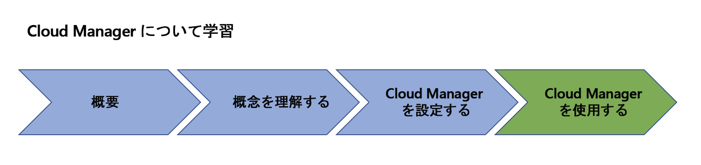

# AEM [!UICONTROL Cloud Manager] の概要{#overview-index}

[!UICONTROL Cloud Manager] は、Adobe Managed Services のすべての顧客が利用できるツールおよびテクノロジーのフレームワークです。

ここでは、[!UICONTROL Cloud Manager] の使用を開始する際に参考になるリソースの一覧を大まかに説明します。

以下のリソースは、[!UICONTROL Cloud Manager] の主要な概念や用語の理解から設定（前提条件）に至るまで、[!UICONTROL Cloud Manager] の使用を開始するうえで参照になります。

以下の図は、[!UICONTROL Cloud Manager] の習得の道筋を示しています。

「概要」節の次のリソースでは、[!UICONTROL Cloud Manager] の基本的事項について説明しています。

* **[[!UICONTROL Cloud Manager] の概要](introduction-to-cloud-manager.md)**
* **[主要な概念](key-concepts.md)**
* **[[!UICONTROL Customer Journey]](customer-journey.md)**

