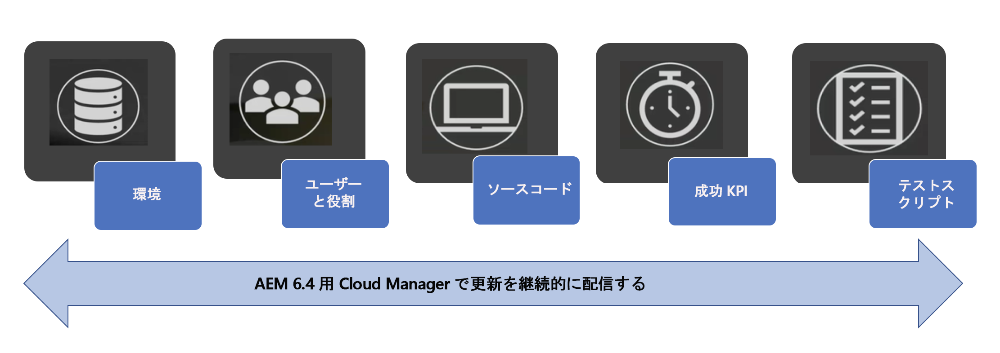
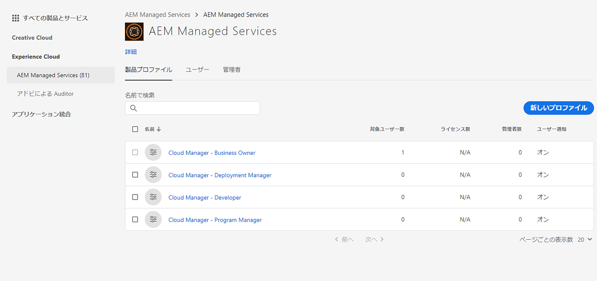
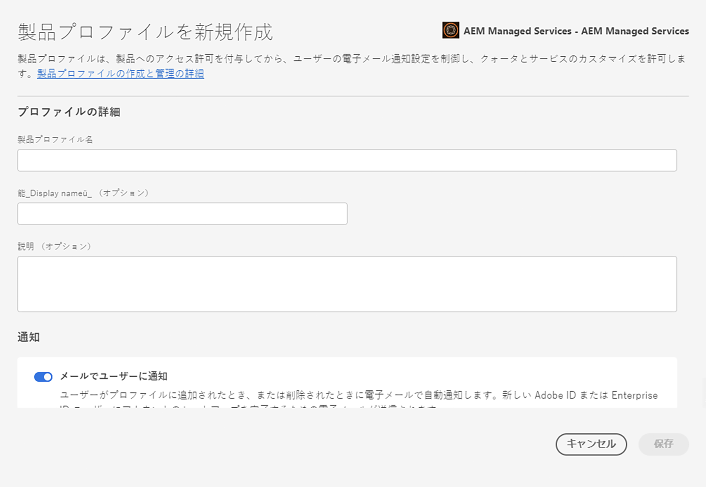

# [!UICONTROL Cloud Manager]{#setting-up-general-configurations-for-cloud-manager} の一般的な設定

以下の節では、[!UICONTROL Cloud Manager] の設定とユーザーインターフェイスからのコンテンツ管理の前提条件について説明します。

このページで扱うトピックは次のとおりです。

* **ユーザーとロールの設定**
* **AEM アプリケーションプロジェクトの設定**
* **Dispatcher の設定**
* **開発のベストプラクティス**

[!UICONTROL Cloud Manager] が最高品質のコードを継続的に提供できるようにするための様々な機能を次の図に示します。



## ユーザーとロールの設定 {#setting-up-users-and-roles}

[!UICONTROL Cloud Manager] のロールは Adobe Admin Console で管理されます。特定のロールメンバーシップは、Admin Console でユーザーを [!UICONTROL Cloud Manager] 製品プロファイルに追加することで提供されます。

>[!CAUTION]
>
>[!UICONTROL Cloud Manager] を使用するには、Adobe ID と Adobe Managed Services 製品コンテキストが必要です。

Admin Console でユーザーを [!UICONTROL Cloud Manager] 製品プロファイルに追加することで、特定のロールメンバーシップを割り当てることができます。

[!UICONTROL Cloud Manager] の Admin Console を使用して、次のロールを作成します。

>[!NOTE]
>
>Adobe Admin Console では、組織全体にわたるアドビ製品の使用権限を一元的に管理できます。
>
>Adobe Admin Console について詳しくは、[Admin Console](https://helpx.adobe.com/jp/enterprise/using/admin-console.html) のドキュメントを参照してください。

| **[!UICONTROL Cloud Manager]のロール** | **説明** |
|---|---|
| ビジネスオーナー | KPI の定義、実稼動デプロイメントの承認、重大な 3 層エラーのオーバーライドを担当します。 |
| プログラムマネージャー | [!UICONTROL Cloud Manager] を使用して、チームの設定、ステータスのレビュー、KPI の確認をおこないます。重大な 3 層エラーを承認することができます。 |
| デプロイメントマネージャー | デプロイメント作業を管理します。[!UICONTROL Cloud Manager] を使用して、ステージング環境または実稼動環境へのデプロイメントを実行します。重大な 3 層エラーを承認することができます。Git にアクセスできます。 |
| デベロッパー | カスタムアプリケーションコードを開発およびテストします。主に [!UICONTROL Cloud Manager] を使用してステータスを確認します。Git にコミットする権限があります。 |
| カスタマーサクセスエンジニア | AMS のお客様のカスタマーサクセスを全般的にサポートします。CSE 管理が必要なデプロイメントを実行するために、[!UICONTROL Cloud Manager] を操作します。 |
| コンテンツ作成者 | 通常は、[!UICONTROL Cloud Manager] を操作しません。（[!UICONTROL Experience Cloud] からナビゲートした）[!UICONTROL Cloud Manager] プログラムスイッチャーを使用して、AEM にアクセスできます。 |

### Admin Console を使用したチームの設定 {#using-admin-console-to-set-up-team}

ロールに基づく適切な権限を [!UICONTROL Cloud Manager] ユーザーに付与するには、顧客の組織の管理者が [!UICONTROL AEM Managed Services] 製品コンテキストの下で新しい製品プロファイルを作成する必要があります。

>[!NOTE]
>
>Admin Console にアクセスしてチーム（ユーザーとロール）を設定するには、ブラウザーを開き、[https://adminconsole.adobe.com](https://adminconsole.adobe.com/enterprise) にアクセスします。

以下の図に示すように、これらの製品プロファイルへのユーザー（またはグループ）の追加は、通常の Admin Console 機能を使用しておこないます。

1. Admin Console にログインし、「**新規プロファイル**」をクリックして新しいプロファイルを追加します。

   

1. [!UICONTROL Cloud Manager] の新しいロールを設定するためのフィールドに入力します。

   「**プロファイル名**」と「**説明**」を入力して、新しいプロファイルを作成します。また、プロファイルの「**権限グループ**」を選択することもできます。

   「**完了**」をクリックして、プロファイル作成手順を完了します。

   

## AEM アプリケーションプロジェクトの設定 {#aem-application-project-setup}

[!UICONTROL Cloud Manager] でアプリケーションプロジェクトを設定する前に、2 つのシナリオのいずれかを検討する必要があります。AEM 6.4 を初めて使用する場合と、既存の顧客である場合があります。

>[!NOTE]
>
>[!UICONTROL Cloud Manager] にアクセスするには、カスタマーサクセスエンジニア（CSE）に連絡して、使用を開始するための URL と資格情報を取得してください。

次の 2 つのシナリオに基づいて、[!UICONTROL Cloud Manager] のアプリケーションプロジェクトを設定できます。

* **新規 AEM プロジェクト**：

新しい AEM プロジェクトの場合は、既存のプロジェクトを活用し、[!UICONTROL Cloud Manager] を操作します。

詳しくは、[AEM 6.4 のユーザーガイド](https://chl-author./content/help/en/experience-manager/6-4/sites/deploying/using/deploy.html)を参照してください。さらに、[AEM の関連資料](https://www.adobe.com/jp/marketing-cloud/experience-manager/resources.html?promoid=759X6WV8&amp;mv=other)も参照してください。

* **既存の AEM プロジェクト**：

既存の AEM プロジェクトは、プロジェクト設定ルールに従っている必要があります。既存の AEM インストールをアップグレードして、AEM 6.4 で提供されている新機能および機能強化を入手し、[!UICONTROL Cloud Manager] の使用を開始することができます。これらの条件は、最小限の変更で達成できます。サポートについては、カスタマーサクセスエンジニア（CSE）にお問い合わせください。

AEM インスタンスの 6.4 へのアップグレードについて詳しくは、[AEM 6.4 へのアップグレード](https://helpx.adobe.com/experience-manager/6-4/sites/deploying/using/upgrade.html)を参照してください。

### リポジトリの設定 {#setting-up-repository}

[!UICONTROL Cloud Manager] でオンボーディングされるプログラムごとに、最初は空の Git リポジトリが 1 つプロビジョニングされます。デベロッパーおよびデプロイメントマネージャーには、担当の CSE から Git の URL と資格情報が提供されます。

この情報を使用して、デベロッパーは、この後の節の「プロジェクトの設定」で示したガイドラインに従ってコードを追加して設定の要件を満たしたうえで、[!UICONTROL Cloud Manager] を使用することができます。

## Dispatcher の設定 {#dispatcher-configurations}

[!UICONTROL Cloud Manager] では、Web サーバーとディスパッチャーの設定ファイルが、通常の AEM コンテンツパッケージに加え、Git リポジトリに格納されていると仮定して、それらの設定ファイルをデプロイできます。

この機能を活用するために、Maven ビルドでは、***conf*** と ***conf.d*** の 2 つのディレクトリを含んだ zip ファイルが生成されます。

ディスパッチャーインスタンスにデプロイすると、ディスパッチャーインスタンス上の既存のディレクトリの内容は、これらのディレクトリの内容で上書きされます。この機能を正しく使用するには、Web サーバーおよびディスパッチャーの設定ファイルに環境固有の情報が必要になることが多いので、まず、カスタマーサクセスエンジニア（CSE）と協力して、これらの環境変数を /etc/sysconfig/httpd に抽出する必要があります。

以下の手順に従って、Dispatcher 設定の最初のプロセスを完了します。

1. 現在の実稼動環境の設定ファイルを CSE から取得します。
1. ハードコードされた環境固有のデータ（例：パブリッシュレンダラーの IP）を削除し、変数に置き換えます。
1. 必要な変数を、各ターゲットディスパッチャーに対するキーと値のペアで定義し、CSE にリクエストして各インスタンス上の ***/etc/sysconfig/httpd*** に追加してもらいます。
1. 更新された設定をステージング環境でテストした後、CSE にリクエストしてそれらの設定を実稼動環境にデプロイしてもらい、正しく動作していることを確認します。
1. ファイルを Git にコミットします。
1. [!UICONTROL Cloud Manager] を使用してデプロイします。

実際の zip ファイルは、maven-assembly-plugin を使用して生成できます。Lazybones AEM マルチモジュールテンプレートを使用して生成されたプロジェクトでは、プロジェクト作成の一環として、適切な Maven プロジェクト構造を作成できます。

>[!NOTE]
>
>ディスパッチャーの設定は、[!UICONTROL Cloud Manager] でのオンボーディング中におこなわれますが、後の段階でおこなうこともできます。

### パフォーマンステスト用の Dispatcher の設定 {#configuring-dispatcher-for-performance-testing}

[!UICONTROL Cloud Manager] がパフォーマンステストを適切に実行するには、ステージディスパッチャーサーバーが、実稼動サーバーと一貫性のある方法で、実稼動ディスパッチャーと同じホスト名に応答する必要があります。

*例えば、*顧客の実稼動ホスト名が [www.myco.com](http://www.myco.com/) と [www.myotherco.com](http://www.myotherco.com/) で、ステージホスト名が stage-myco.adobecqms.net の場合は、次のような要求に適切に応答する必要があります。

```
curl -H"Host: www.myco.com" http://stage-myco.adobecqms.net/en/home.html
```

それには、Dispatcher 設定でホスト名を正しく設定するだけでなく、ステージ環境と実稼動環境で一貫性のある方法を使用して ***/etc/map***、任意の Apache リライト、その他のすべてのパス***マッピング／フィルター***ルールを実装する必要があります。

## 開発のベストプラクティス {#development-best-practices}

[!UICONTROL Cloud Manager] を使用する前に、プロジェクトの設定と Web サーバーまたはディスパッチャーの設定に関するベストプラクティスを理解しておくとよいでしょう。

### プロジェクトの設定 {#project-set-up}

[!UICONTROL Cloud Manager] を操作するには、プロジェクトがいくつかの条件に従っている必要があります。

[!UICONTROL Cloud Manager] でプロジェクトを設定するためのベストプラクティスに従います。

* 用意されサポートされているビルドツールは Apache Maven のみです。Apache Maven 3.3.9 がインストールされています。
* ビルドは、Docker コンテナ内の Linux 環境でルートユーザーとして実行されます。
* インストールされている Java のバージョンは Oracle JDK 8u161 です。
* bzip2、unzip、libpng、imagemagick、graphicsmagick などの追加のシステムパッケージがインストールされています。他のパッケージが必要な場合は、担当の CSE を通じてリクエストする必要があります。
* Maven は常に「mvn -B clean package」というコマンドで実行されます。
* 1 つの Git リポジトリが提供されます。このリポジトリのルートには pom.xml ファイルが必要です。この pom.xml ファイルでは、必要な数のサブモジュールを参照できます（それらのサブモジュールでさらに他のサブモジュールを参照している場合もあります）が、必要なエントリポイントは 1 つだけです。
* Maven は、settings.xml ファイルを使用してシステムレベルで設定されます。このファイルには、アドビの公開アーティファクトリポジトリ（repo.adobe.com）が自動的に含まれています。
* pom.xml ファイルにさらにリポジトリを追加できます。ただし、パスワードで保護またはネットワークで保護されたアーティファクトリポジトリへのアクセスはサポートされていません。
* デプロイ可能なコンテンツパッケージは、target という名前のディレクトリに含まれている zip ファイルをスキャンすることで検出されます。さらに、任意の数のサブモジュールでコンテンツパッケージを作成することもできます。
* 複数のコンテンツパッケージがある場合、パッケージデプロイメントの順序は保証されません。特定の順序が必要な場合は、コンテンツパッケージの依存関係を使用して順序を定義できます。

<!-- 

Comment Type: annotation
Last Modified By: jsyal
Last Modified Date: 2018-05-02T18:18:15.028-0400

change as per KT

 -->

### 次の手順 {#the-next-steps}

一般的な設定が完了したら、いつでも [!UICONTROL Cloud Manager] を使用できます。

[!UICONTROL Cloud Manager] の使用を開始するには、[[!UICONTROL Cloud Manager] の使用](https://helpx.adobe.com/experience-manager/cloud-manager/using/using-cloud-manager.html)を参照してください。
