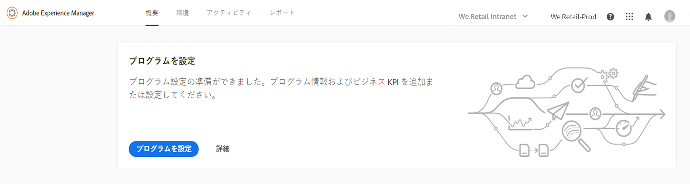
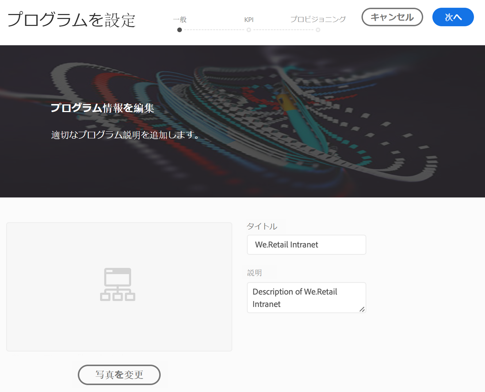
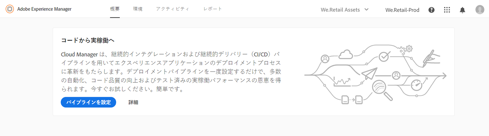
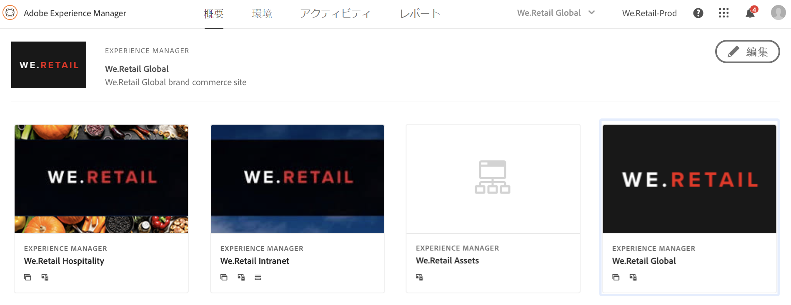
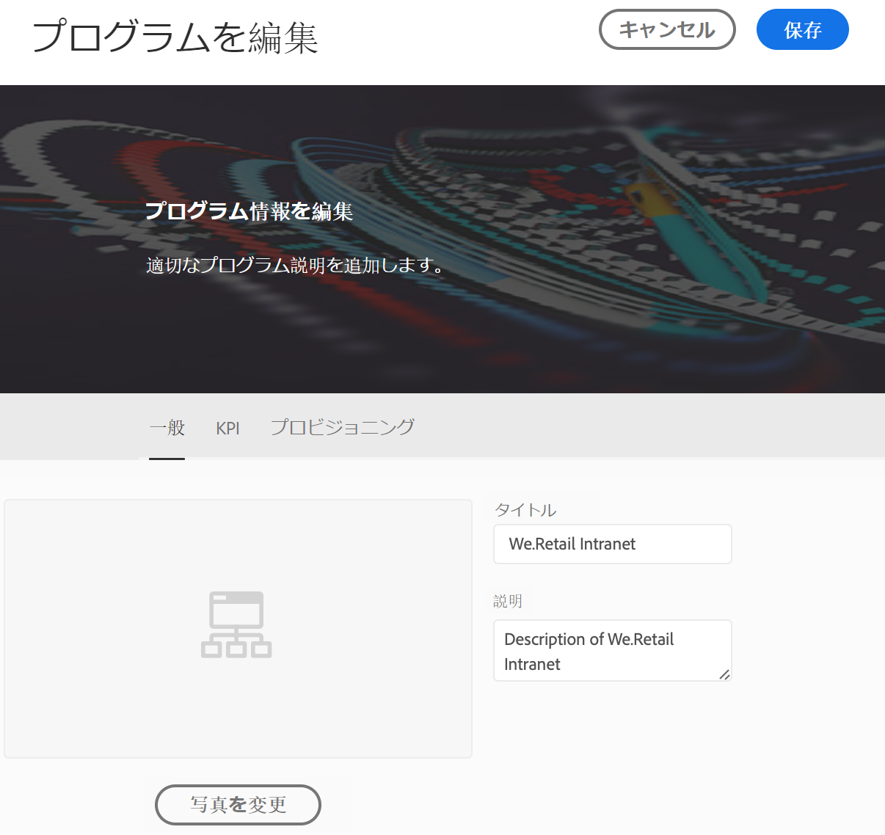

# プログラムの設定 {#setup-your-program}

オンボーディング後、ビジネスオーナーはプログラムの初期設定を完了する必要があります。これには、プログラムの説明の設定や、パフォーマンステストに使用する主要業績評価指標（KPI）の定義が含まれます。オプションで、サムネールをアップロードできます。さらに、ビジネスオーナーはプログラムの設定中に環境のプロビジョニングを設定できます。

定義した KPI は、パイプラインが実行されるたびに通るパフォーマンステストのベースラインになります。

>[!NOTE]
>
>定義した KPI は、**ステージング**環境で実行されるテストで測定されます。一般に、これらの KPI はステージング環境の能力に合わせて縮小されます。
>
>例えば、実稼働**環境**で 1 分あたり平均 1,000 ページビューを見込めるユーザーが実稼動環境 に 4 台のディスパッチャー／パブリッシュサーバーがある場合は、これを 1 分あたり 250 ページビューに縮小する必要があります（ステージング環境が 1 つのディスパッチャー／パブリッシュサーバーペアのみで構成されていると仮定）。
>
>また、多くのユーザーには、実稼働環境の前に Akamai や CloudFront などのコンテンツ配信ネットワーク（CDN）があります。[!UICONTROL Cloud Manager] はステージング環境に対して直接テストするので、KPI は、CDN を経由すると予想されるトラフィック（つまり、キャッシュミス）のみを反映している必要があります。通常、これは実稼動トラフィック全体の比較的小さいサブセットになります。

## [!UICONTROL Cloud Manager] を使用したプログラムの設定 {#using-cloud-manager-to-setup-your-program}

プログラムを設定し KPI を定義するには、以下の手順に従います。

1. [!UICONTROL Cloud Manager] で、「**プログラムを設定**」をクリックして設定プロセスを開始します。

   

1. **プログラムを設定**画面に「プログラム情報を編集」セクションが表示されます。

1. 3 つのオプションが「**一般**」、「**KPI**」、「**プロビジョニング**」の各タブとして表示されます。

1. 「**一般**」タブでは、プログラムにサムネールをアップロードします。関連する説明をプログラムに追加することもできます。

   

1. 「**KPI**」では、2 つの KPI（各デプロイメントの期待値）を定義できます。**AEM Sites** と **AEM Assets** に別個の KPI を定義します。ライセンス取得済みの製品の KPI を指定できます。

   **AEM Sites**

   1. 許容できる第 95 百分位応答時間はどれくらいか

      * 推奨値 - 3 秒
   1. ピーク負荷時のページビュー数/分はどれくらいか

      * 推奨値 - 1 分あたり 200 ページビュー
   **AEM Assets**

   初期のリリースから、Cloud Manager では AEM Sites プログラムのパフォーマンステストを実行できていました。本リリースでは、AEM Assets プログラムのパフォーマンステストも実行できるようになりました。Assets のパフォーマンステストでは、30 分間のテスト期間中にアセットを繰り返しアップロードし、各アセットの処理時間および様々なシステムレベルの指標を測定します。
プログラム設定中に、Assets 固有の次の KPI が指定されます。

   * 第 95 百分位処理時間
   * アップロードされたアセット（1 分あたり）
   

1. 「**プロビジョニング**」では、プログラムの実稼働環境および非実稼働環境用のプロビジョニング設定を表示または編集できます。プログラムの自動スケーリングが有効になっている場合は 「**自動スケーリングがオン**」が表示されます。

   >[!NOTE]
   >
   >* 自動スケーリング機能は実稼働環境のみに適用でき、すべての顧客プログラムには使用できない可能性があります。
   >* このリリースの [!UICONTROL Cloud Manager] では、オンデマンドスケーリングは利用できません。

   

1. 「**保存**」をクリックして、設定プウィザードを完了します。

   >[!NOTE]
   >
   >プログラムの初期設定が完了したら、いつでもプログラムを編集できます。詳しくは、以下の手順に従ってください。

## プログラムの編集

1. **Cloud Manager** のホーム画面でソリューションに移動します。

   

1. プログラムを更新または変更するには、以下の図に示すように、ソリューションを選択し「**編集**」をクリックします。

   

1. **プログラムを編集**画面が表示され、プログラムを更新または変更できます。

   

## 次の手順 {#the-next-steps}

**パイプライン**を設定済みの場合、更新された設定は次回の実行で考慮されます。まだパイプラインを設定していない場合は、まず手順に従ってパイプラインを設定します。

パイプラインのセットアップについては、&quot;CI/CDパイプライン  の設定」を参照してください。
