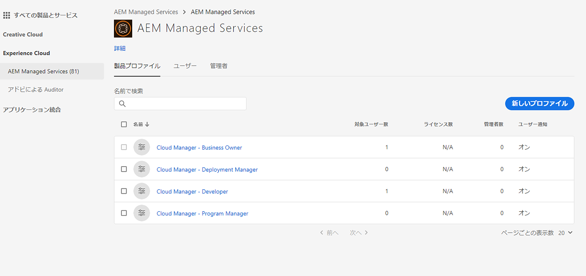
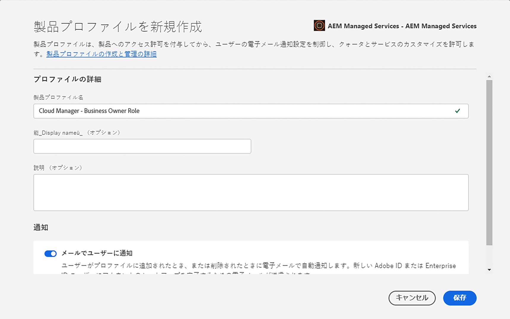
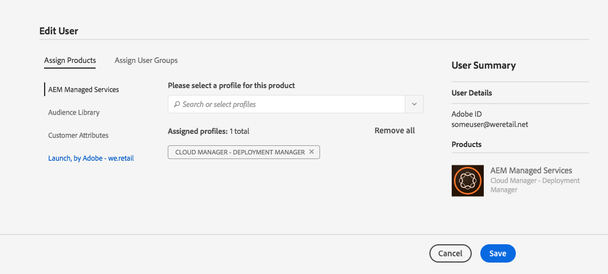
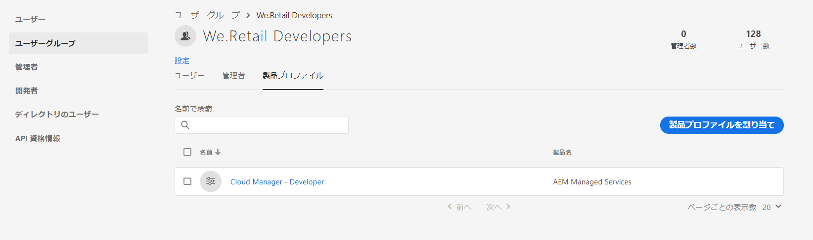

# ユーザーとロールの追加 {#add-users-and-roles}

[!UICONTROL Cloud Manager] の多くの機能には、使用するための特定の権限が必要です。例えば、プログラムの主要業績評価指標（KPI）を設定できるのは、特定のユーザーだけです。これらの権限は、論理的にグループ化されてロールになります。

[!UICONTROL Cloud Manager] では、現在、特定の機能を使用できるかどうかを制御する次の 4 つのユーザーロールを定義しています。

* ビジネスオーナー
* プログラムマネージャー
* デプロイメントマネージャー
* デベロッパー

>[!CAUTION]
>
>[!UICONTROL Cloud Manager] を使用するには、Adobe ID と Adobe Managed Services 製品コンテキストが必要です。

## ロールの定義 {#role-definitions}

>[!NOTE]
>
>Admin Console の「開発者」ペルソナは、[!UICONTROL Cloud Manager] の「デベロッパー」ロールとは無関係です。

ロールの概要を次の表に示します。

| [!UICONTROL Cloud Manager] のロール | 説明 |
|--- |--- |
| ビジネスオーナー | KPI の定義、実稼動デプロイメントの承認、重大な 3 層エラーのオーバーライドを担当します。 |
| プログラムマネージャー | [!UICONTROL Cloud Manager] を使用して、チームの設定、ステータスのレビュー、KPI の確認をおこないます。重大な 3 層エラーを承認することができます。 |
| デプロイメントマネージャー | デプロイメント作業を管理します。[!UICONTROL Cloud Manager] を使用して、ステージング環境または実稼動環境へのデプロイメントを実行します。CI/CD パイプラインを編集できます。重大な 3 層エラーを承認することができます。Git リポジトリにアクセスできます。 |
| デベロッパー | カスタムアプリケーションコードを開発およびテストします。主に [!UICONTROL Cloud Manager] を使用してステータスを確認します。Git リポジトリにアクセスして、コードをコミットできます。 |
| カスタマーサクセスエンジニア | AMS のお客様のカスタマーサクセスを全般的にサポートします。CSE 管理が必要なデプロイメントを実行するために、[!UICONTROL Cloud Manager] を操作します。 |
| コンテンツ作成者 | 通常は、[!UICONTROL Cloud Manager] を操作しません。（[!UICONTROL Experience Cloud] からナビゲートした）[!UICONTROL Cloud Manager] プログラムスイッチャーを使用して、AEM にアクセスできます。 |

## Admin Console を使用したプロファイルの作成 {#using-admin-console-to-create-a-profile}

[!UICONTROL Cloud Manager] のロールは Adobe Admin Console で管理されます。特定のロールメンバーシップは、Admin Console でユーザーを [!UICONTROL Cloud Manager] 製品プロファイルに追加することで提供されます。

Adobe Admin Console でユーザーを [!UICONTROL Cloud Manager] **製品プロファイル**&#x200B;に追加することで、特定のロールメンバーシップを割り当てることができます。Admin Console では、組織全体にわたるアドビ製品の使用権限を一元的に管理できます。Adobe Admin Console について詳しくは、[Admin Console](https://helpx.adobe.com/jp/enterprise/using/admin-console.html) のドキュメントを参照してください。

>[!NOTE]
>
>Admin Console にアクセスしてチーム（ユーザーとロール）を設定するには、ブラウザーを開き、[https://adminconsole.adobe.com](https://adminconsole.adobe.com/enterprise) にアクセスします。

ロールに基づく適切な権限を [!UICONTROL Cloud Manager] ユーザーに付与するには、顧客の&#x200B;**組織**&#x200B;の管理者が [!UICONTROL AEM Managed Services] 製品コンテキストの下で新しい製品プロファイルを作成する必要があります。

ロールに基づく適切な権限を [!UICONTROL Cloud Manager] ユーザーに与えるには、4 つの [!UICONTROL Cloud Manager] ロールに対応する 4 つの新しい製品プロファイルを管理者が [!UICONTROL AEM Managed Services] 製品コンテキストの下に作成する必要があります。

* ビジネスオーナー
* デプロイメントマネージャー
* デベロッパー
* プログラムマネージャー

以下の図に示すように、[!UICONTROL Cloud Manager] の [Admin Console](https://adminconsole.adobe.com/) で、これらの製品プロファイルにユーザーやグループを作成または追加できます。

1. Admin Console にログインし、「**新規プロファイル**」をクリックして新しいプロファイルを追加します。

   

1. [!UICONTROL Cloud Manager] の新しいロールを設定するためのフィールドに入力します。

   「**プロファイル名**」と「**表示名**」を入力して、新しいプロファイルを作成します。また、プロファイルの「**権限グループ**」を選択することもできます。

   「**完了**」をクリックして、プロファイル作成手順を完了します。

   >[!NOTE]
   >
   >これらの製品プロファイルを作成する際、**表示名**&#x200B;は、[!UICONTROL Cloud Manager] で定義されている値（以下の表を参照）である必要があります。**プロファイル名**&#x200B;は任意ですが、混乱を避けるために、以下の&#x200B;*推奨プロファイル名*&#x200B;列の値を使用することをお勧めします。それには、製品プロファイルの作成時に「**プロファイル名と同じ**」チェックボックスをオフにし、対応する値を「**表示名**」として指定します。

   | **ロール** | **表示名（必須）** | **推奨プロファイル名** |
   |---|---|---|
   | ビジネスオーナー | CM_BUSINESS_OWNER_ROLE_PROFILE | [!UICONTROL Cloud Manager] - ビジネスオーナーロール |
   | デプロイメントマネージャー | CM_DEPLOYMENT_MANAGER_ROLE_PROFILE | [!UICONTROL Cloud Manager] - デプロイメントマネージャーロール |
   | デベロッパー | CM_DEVELOPER_ROLE_PROFILE | [!UICONTROL Cloud Manager] - デベロッパーロール |
   | プログラムマネージャー | CM_PROGRAM_MANAGER_ROLE_PROFILE | [!UICONTROL Cloud Manager] - プログラムマネージャーロール |

   

1. 製品プロファイルを作成したら、それらの製品プロファイルにユーザー（またはグループ）を追加できます。

   

   
