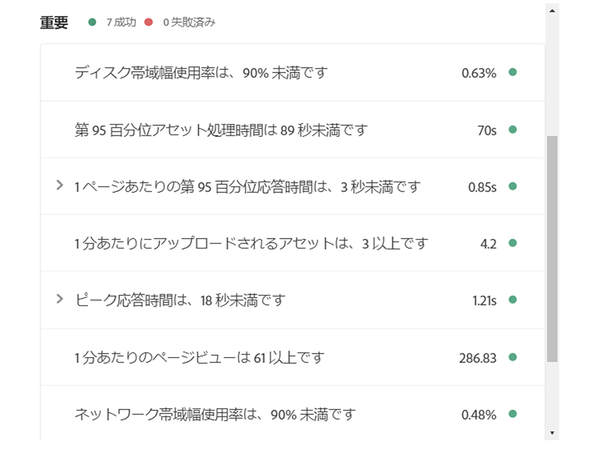
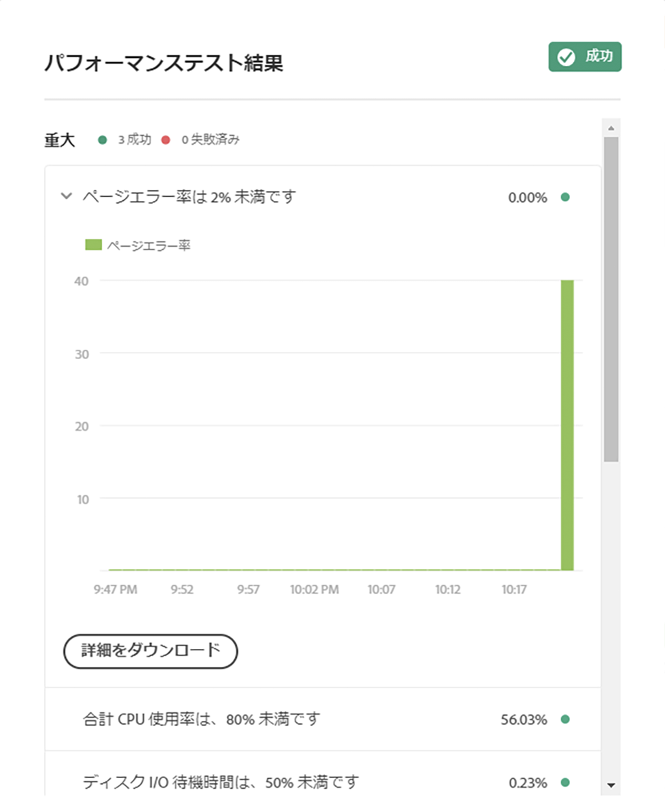

# テスト結果の理解 {#understand-your-test-results}

パイプラインの実行中に、多数の指標が取り込まれ、ビジネス所有者が定義した主要業績評価指標(KPI)、またはAdobe Managed Servicesが設定した標準と比較されます。

これらは、この節で定義する 3 層ゲートシステムを使用して報告されます。

## パイプライン実行中の 3 層ゲート {#three-tier-gates-while-running-a-pipeline}

パイプラインには次の 3 つのゲートがあります。

* コード品質
* パフォーマンステスト
* セキュリティテスト

これらの各ゲートで特定された問題には、3 段階の構造があります。

* **重大** - ゲートで特定される問題のうち、パイプラインの即時失敗につながるもの。
* **重要** - ゲートで特定される問題のうち、パイプラインの一時停止につながるもの。デプロイメントマネージャー、プロジェクトマネージャーまたはビジネスオーナーは、問題をオーバーライドできます。この場合、パイプラインは続行されます。または、問題を承認できます。この場合、パイプラインはエラーで停止します。
* **情報** - ゲートで特定される問題のうち、情報提供だけを目的とするもの。パイプラインの実行には影響しません。

>[!NOTE]
>
>コード品質専用パイプラインでは、コード品質テストステップがパイプラインの最終ステップであるため、コード品質テストゲートでの重要なエラーは無効にはできません。

## コード品質テスト {#code-quality-testing}

この手順では、アプリケーションコードの質を評価します。 これは、コード品質のみのパイプラインの中核となる目的で、実稼働環境と実稼働環境以外のすべてのパイプラインのビルド手順の直後に実行されます。 さまざまなタイプのパイプラインの詳細については、 [『CI-CDパイプラインの](/help/using/configuring-pipeline.md) 設定』を参照してください。

### Understanding Code Quality Testing {#understanding-code-quality-testing}

コード品質テストでは、ソースコードが特定の品質基準を満たしていることを確認するためにスキャンされます。 現在、これは SonarQube と、OakPAL を使用したコンテンツパッケージレベルの調査を組み合わせて実装されています。汎用の Java ルールと AEM 固有のルールを組み合わせた 100 以上のルールがあります。AEM固有のルールの一部は、AEM Engineeringのベストプラクティスに基づいて作成され、「 [カスタムコード品質ルール](/help/using/custom-code-quality-rules.md)」と呼ばれます。

>[!NOTE]
>You can download the complete list of rules [here](/help/using/assets/CodeQuality-rules-latest.xlsx).

この手順の結果は、 *評価として提供されます*。 次の表に、様々なテスト条件の評価の概要を示します。

| 名前 | 定義 | カテゴリ | 不合格のしきい値 |
|--- |--- |--- |--- |
| セキュリティ評価 | A = 脆弱性なし <br/>B = 軽度の脆弱性が 1 つ以上 <br/>C = 重要な脆弱性が 1 つ以上 <br/>C = の重大な脆弱性が 1 つ以上 <br/>E = 致命的な脆弱性が 1 つ以上 | 重大 | &lt; B |
| 信頼性評価 | A = バグなし <br/>B = 軽度のバグが 1 つ以上 <br/>C = 重要なバグが 1 つ以上 <br/>D = 重大なバグが 1 つ以上 E = 致命的なバグが 1 つ以上<br/> | 重要 | &lt; C |
| 保守性評価 | コードスメルに対する未処理の修正コスト：<br/><ul><li>アプリケーションに既に投入された時間の 5％以下であれば、評価は A </li><li>上記時間の 6～10％であれば、評価は B </li><li>上記時間の 11～20％であれば、評価は C </li><li>上記時間の 21～50％であれば、評価は D</li><li>上記時間の 50％を超えれば、評価は E</li></ul> | 重要 | &lt; A |
| カバレッジ | ユニットテストのラインカバレッジと条件カバレッジを次の式で計算した結果：<br/>`Coverage = (CT + CF + LC)/(2*B + EL)`<br/> CT = ユニットテスト実行中に 1 回以上「真」と評価された条件の数 <br/>CF = ユニットテスト実行中に 1 回以上「偽」と評価された条件の数 <br/>LC = 実行された行の数 = lines_to_cover - uncovered_lines <br/><br/> B = 条件の合計数 <br/>EL = 実効行の合計数（lines_to_cover） | 重要 | &lt; 50％ |
| スキップした単体テスト | スキップした単体テストの数。 | 情報 | > 1 |
| 未解決の問題 | 問題の全体的なタイプ - 脆弱性、バグ、コードスメル | 情報 | > 0 |
| 重複行 | 重複しているブロックに含まれている行の数。<br/>コードブロックが重複していると見なされるための条件：<br/><ul><li>**Java 以外のプロジェクトの場合：**</li><li>100 個以上の連続した重複トークンが必要です。</li><li>これらのトークンは、少なくとも次の場所に分散している必要があります。 </li><li>30 行の COBOL コード </li><li>20 行の ABAP コード </li><li>10 行の他言語コード</li><li>**Java プロジェクトの場合：**</li><li> トークンと行の数にかかわらず、10 個以上の連続した重複ステートメントが必要です。</li></ul> <br/>重複を検出する際は、インデントの違いと文字列リテラルの違いは無視されます。 | 情報 | > 1％ |
| Cloud Service の互換性 | 識別された Cloud Service の互換性に関する問題の数です。 | 情報 | > 0 |


>[!NOTE]
>
>詳しくは、[指標の定義](https://docs.sonarqube.org/display/SONAR/Metric+Definitions)を参照してください。

>[!NOTE]
>
>[!UICONTROL Cloud Manager] で実行されるカスタムコード品質ルールについて詳しくは、[カスタムコード品質ルール](custom-code-quality-rules.md)を参照してください。

### 偽陽性の処理 {#dealing-with-false-positives}

品質スキャンプロセスは完璧ではなく、実際には問題がないにもかかわらず問題として誤って特定することもあります。これは「偽陽性」と呼ばれます。

この場合、ルール ID を注釈属性として指定した標準の Java `@SuppressWarnings` 注釈を使用して、ソースコードに注釈を付けることができます。例えば、よくある問題の 1 つとして、ハードコードされたパスワードを検出する SonarQube ルールにおいて、ハードコードされたパスワードの識別方法が強引な場合があります。

具体的な例を見てみましょう、次のコードは、一部の外部サービスに接続するコードを含んだ AEM プロジェクトではかなり一般的なものです。

```java
@Property(label = "Service Password")
private static final String PROP_SERVICE_PASSWORD = "password";
```

この場合、SonarQube は致命的脆弱性を報告します。コードを見直した後、これが脆弱性でないことを確認し、適切なルール ID でこれに注釈を付けることができます。

```java
@SuppressWarnings("squid:S2068")
@Property(label = "Service Password")
private static final String PROP_SERVICE_PASSWORD = "password";
```

一方、コードが実際には次のようになっていた場合は、

```java
@Property(label = "Service Password", value = "mysecretpassword")
private static final String PROP_SERVICE_PASSWORD = "password";
```

ハードコードされたパスワードを削除するのが正しい解決策です。

>[!NOTE]
>
>`@SuppressWarnings` 注釈をできるだけ具体的にすることをお勧めします。つまり、問題の原因となっている特定のステートメントまたはブロックにのみ注釈を付けます。ただし、クラスレベルで注釈を付けることもできます。

## セキュリティテスト {#security-testing}

[!UICONTROL Cloud Manager] では、デプロイメント後に既存の ***AEM セキュリティヘルスチェック***&#x200B;を実行し、UI を通じてそのステータスを報告します。結果は、環境内のすべての AEM インスタンスから集計されます。

いずれかの&#x200B;**インスタンス**&#x200B;が特定のヘルスチェックに対して不合格を報告した場合、**環境**&#x200B;全体がそのヘルスチェックに対して不合格となります。コード品質テストやパフォーマンステストと同様に、これらのヘルスチェックもいくつかのカテゴリにまとめられ、3 層ゲートシステムを使用して報告されます。セキュリティテストの場合にはしきい値がない点だけが異なります。すべてのヘルスチェックでは、単純に合格または不合格のみの結果になります。

現在のチェックは次の表のとおりです。

| **名前** | **ヘルスチェックの実装** | **カテゴリ** |
|---|---|---|
| デシリアライゼーションファイアウォール添付 API レディネスが、受け入れ可能な状態である | デシリアライゼーションファイアウォール添付 API レディネス | 重大 |
| デシリアライゼーションファイアウォールが機能している | デシリアライゼーションファイアウォール機能 | 重大 |
| デシリアライゼーションファイアウォールが読み込まれている | デシリアライゼーションファイアウォール読み込み | 重大 |
| AuthorizableNodeName 実装において、認証可能な ID がノード名／パスで公開されていない | 認証可能なノード名生成 | 重大 |
| デフォルトのパスワードが変更されている | デフォルトのログインアカウント | 重大 |
| Sling のデフォルトの GET サーブレットが DOS 攻撃から保護されている | Sling Get Servlet | 重大 |
| Sling Java Script Handler が適切に設定されている | Sling Java Script Handler | 重大 |
| Sling JSP Script Handler が適切に設定されている | Sling JSP Script Handler | 重大 |
| SSL が正しく設定されている | SSL 設定 | 重大 |
| 安全でないことが明確なユーザープロファイルポリシーが存在しない | ユーザープロファイルへのデフォルトアクセス | 重大 |
| Sling Referrer Filter が CSRF 攻撃を防止するように設定されている | Sling Referrer Filter | 重要 |
| Adobe Granite HTML Library Manager が適切に設定されている | CQ HTML Library Manager 設定 | 重要 |
| CRXDE サポートバンドルが無効である | CRXDE サポート | 重要 |
| Sling DavEx のバンドルおよびサーブレットが無効である | DavEx ヘルスチェック | 重要 |
| サンプルコンテンツがインストールされていない | サンプルコンテンツパッケージ | 重要 |
| WCM Request Filter と WCM Debug Filter が両方とも無効になっている | WCM フィルター設定 | 重要 |
| Sling WebDAV のバンドルおよびサーブレットが適切に設定されている | WebDAV ヘルスチェック | 重要 |
| Web サーバーが、クリックジャッキングを防止するように設定されている | Web サーバー設定 | 重要 |
| レプリケーションが「管理者」ユーザーを使用していない | レプリケーションとトランスポートユーザー | 情報 |

## パフォーマンステスト {#performance-testing}

[!UICONTROL Cloud Manager] の&#x200B;*パフォーマンステスト*&#x200B;は、30 分間のテストを使用して実装されます。

パイプラインの設定中に、デプロイメントマネージャーは各バケットに送るトラフィックの量を決定できます。

バケット制御について詳しくは、[CI／CD パイプラインの設定](configuring-pipeline.md)を参照してください。

>[!NOTE]
>
>プログラムを設定し KPI を定義するには、[プログラムの設定](setting-up-program.md)を参照してください。

3 層ゲートシステムを使用したパフォーマンステストマトリックスの概要を次の表に示します。

| **指標** | **カテゴリ** | **不合格のしきい値** |
|---|---|---|
| ページリクエストエラー率 % | 重大 | >= 2% |
| CPU 使用率 | 重大 | >= 80% |
| ディスク I/O 待機時間 | 重大 | >= 50% |
| 第 95 百分位応答時間 | 重要 | >= プログラムレベルの KPI |
| ピーク応答時間 | 重要 | >= 18 秒 |
| 1 分あたりのページビュー数 | 重要 | &lt; プログラムレベルの KPI |
| ディスク帯域幅使用量 | 重要 | >= 90% |
| ネットワーク帯域幅使用量 | 重要 | >= 90% |
| 1 分あたりのリクエスト数 | 情報 | &lt; 6000 |

### パフォーマンステスト結果のグラフ {#performance-testing-results-graphs}

パフォーマンステスト結果ダイアログに、新しいグラフおよびダウンロードオプションが追加されました。

パフォーマンステストダイアログを開いた場合、指標パネルを展開して、グラフやダウンロードへのリンクを表示することができます。

[!UICONTROL Cloud Manager] リリース 2018.7.0 の場合、この機能は次の指標で利用できます。

* **CPU 使用率**
   * テスト期間中の CPU 使用率のグラフ。

* **ディスク I/O 待機時間**
   * テスト期間中のディスク I/O 待機時間のグラフ。

* **ページエラー率**
   * テスト期間中の 1 分あたりのページエラー数のグラフ。
   * テスト中にエラーが発生したページの一覧を示す CSV ファイル。

* **ディスク帯域幅使用量**
   * テスト期間中のディスク帯域幅使用量のグラフ。

* **ネットワーク帯域幅使用量**
   * テスト期間中のネットワーク帯域幅使用量のグラフ。

* **ピーク応答時間**
   * テスト期間中の 1 分あたりのピーク応答時間のグラフ。

* **第 95 百分位応答時間**
   * テスト期間中の 1 分あたりの第 95 百分位応答時間のグラフ。
   * 第 95 百分位応答時間が定義済みの KPI を超えたページの一覧を示す CSV ファイル。

パフォーマンステストグラフの表示例を次の図に示します。





