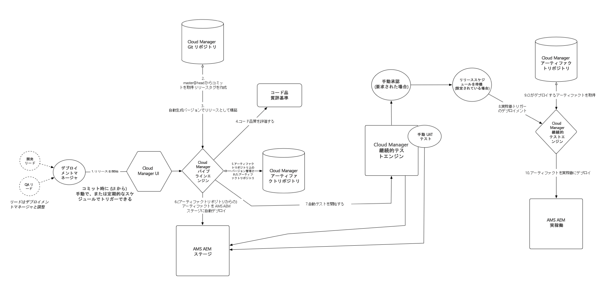

# Cloud Manager を使用するうえで必要な概念の理解{#understanding-concepts-before-using-cloud-manager}

この節では、Cloud Manager で作業する前に知っておくとよい概念と用語について説明します。ここで扱うトピックは次のとおりです。

* **デプロイメント環境**
* **ソースコードリポジトリ**
* **セキュリティとプライバシー**
* **パイプラインの概要**
* **ヘルプリソース**

## デプロイメント環境 {#deployment-environment}

Adobe Experience Manager（AEM）6.4 の新規ユーザーであるか、AEM 6.4 リリースへのアップグレードが必要になる場合があります。

AEM 6.4 を初めて使用する場合は、既に Cloud Manager にアクセスできるようになっています。

既存ユーザーの場合は、AEM 6.4 にアップグレードして Cloud Manager にアクセスできるようにする必要があります。カスタマーサクセスエンジニア（CSE）から URL および資格情報を受け取ったら、Cloud Manager の使用を開始できます。

<!-- 

Comment Type: annotation
Last Modified By: ptager
Last Modified Date: 2018-05-02T17:19:24.147-0400

Section is redundant with the section in the Overview topic

 -->

## ソースコードリポジトリ {#source-code-repository}

**複数の Git サーバー**：顧客が既存の Git リポジトリを引き続き使用するよう希望することがあります。

そのような場合は、複数のリモートリポジトリをサポートする Git の機能を使用できます。日々の開発作業は自分の Git リポジトリで引き続きおこない、デプロイメントが必要になったら、最新のコードを Cloud Manager の Git リポジトリにプッシュするだけです。

<!-- 

Comment Type: annotation
Last Modified By: ptager
Last Modified Date: 2018-05-02T17:20:46.002-0400

Looks like we lost some content, compared to the previous version

 -->

## セキュリティとプライバシー {#security-and-privacy}

<!-- 

Comment Type: annotation
Last Modified By: jsyal
Last Modified Date: 2018-04-21T02:38:21.417-0400

Query for Brad B.

 -->

## パイプラインの概要 {#pipeline-overview}

Cloud Manager では、プログラム（定義は上記のとおり）ごとに、ステージング環境および実稼動環境へのデプロイメントを処理する 1 つのパイプラインをサポートします。****

ステージングおよび実稼動デプロイメントに使用される Git ブランチはマスターです。

>[!NOTE]
>
>マスターをステージングおよび実稼動環境の Git ブランチとして使用することをお勧めしますが、パイプラインの設定時に任意のブランチを使用することもできます。

単一パイプラインプロセスを下図に示します。

### フローについて {#understanding-the-flow}

Cloud Manager UI の[!UICONTROL パイプライン設定]タイルからパイプラインを設定することができます。

詳しくは、[Cloud Manager の使用](hhttps://helpx.adobe.com/experience-manager/cloud-manager/using/using-cloud-manager.html)を参照してください。

パイプラインの設定はデプロイメントマネージャーが担当します。つまり、

* アプリケーションブランチの割り当て
* デプロイメント環境の割り当て
* テストオプションの定義

その際は、まず Git リポジトリからブランチを選択します。次に、パイプラインを開始するトリガーを定義します。

次に、実稼動デプロイメントを制御するパラメーターを定義できます。

最後に、パフォーマンステストのパラメーターを設定できます。

>[!NOTE]
>
>パイプラインの動作と環境の設定については、[Cloud Manager の使用](using-cloud-manager.md)の&#x200B;**パイプラインの設定**&#x200B;の節を参照してください。

### ヘルプリソース {#help-resources}

サポートを受けるには、Adobe Managed Services のカスタマーサクセスエンジニアにお問い合わせください。

### 次の手順 {#the-next-steps}

これで、Cloud Manager の概念について理解が深まりました。

プロジェクト、環境およびチーム（ユーザーとロール）を設定するには、[Cloud Manager の一般的な設定](setting-configurations-for-cloud-manager.md)を参照してください。
