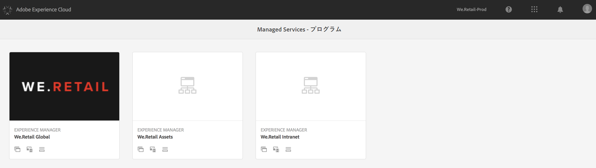
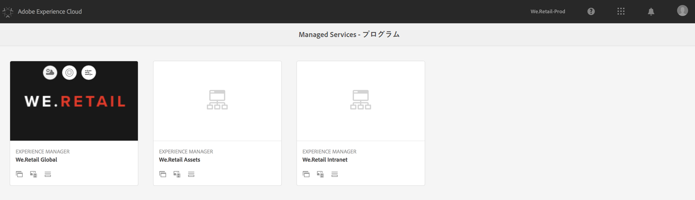
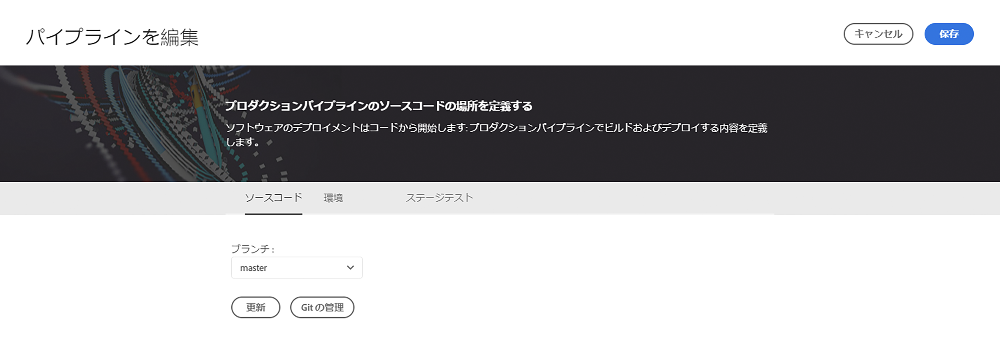
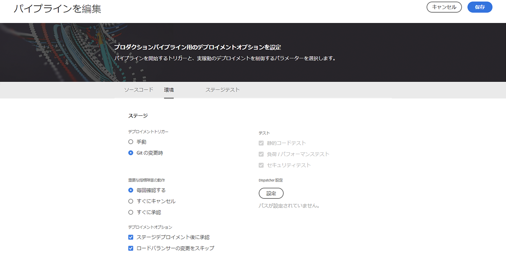
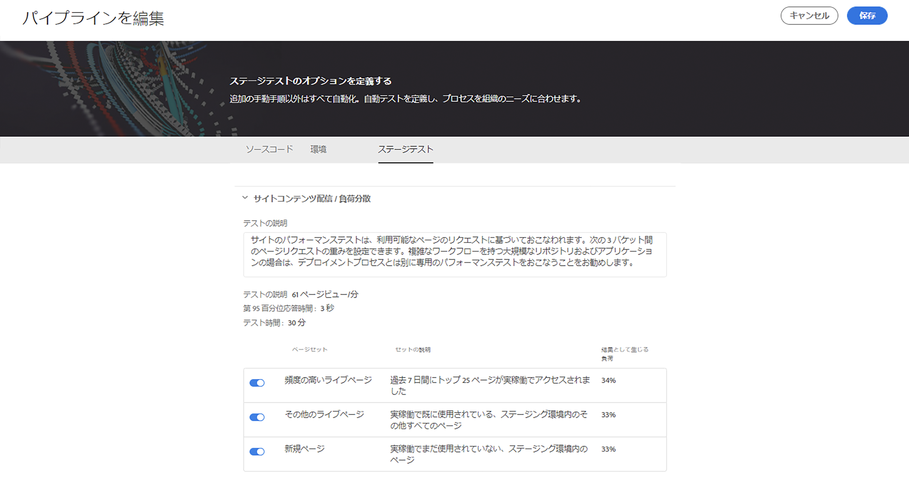
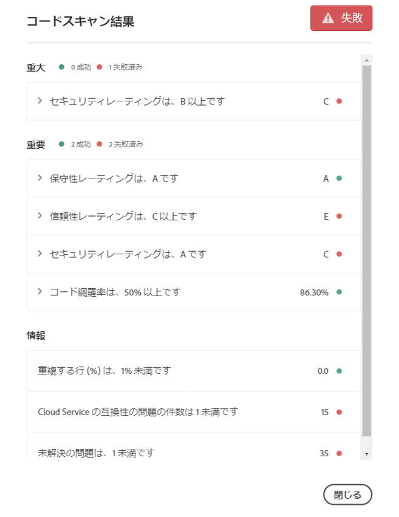
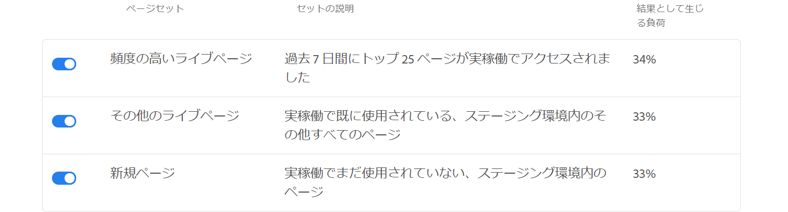

# Cloud Manager の使用{#using-cloud-manager}

ここでは、[!UICONTROL Cloud Manager] のユーザーインターフェイス（UI）、プログラムの設定からコードのデプロイメントまでのワークフロー、さらに品質チェックについて説明します。

## 前提条件 {#prerequisites}

[!UICONTROL Cloud Manager] の使用の詳細について確認する前に、次の節に目を通しておくことをお勧めします。

* [[!UICONTROL Cloud Manager] を使用するうえで必要な概念の理解](understanding-concepts.md)
* [[!UICONTROL Cloud Manager] の一般的な設定](setting-configurations-for-cloud-manager.md)

## [!UICONTROL Cloud Manager] の概要{#getting-started-with-cloud-manager}

[!UICONTROL Cloud Manager] の一般的な設定が完了したら、いつでも [!UICONTROL Cloud Manager] を使用できます。

1. Adobe [!UICONTROL Experience Cloud] にログインすると、ソリューションの一覧が表示されます。

   

1. プログラムを選択し、左上のアイコンをクリックして [!UICONTROL Cloud Manager] を開きます。

   

## プログラムの設定 {#setting-up-program}

オンボーディング後、ビジネスオーナーはプログラムの初期設定をおこなう必要があります。これには、プログラムの説明の設定や、パフォーマンステストに使用する KPI の定義が含まれます。オプションで、サムネールをアップロードできます。

定義した KPI は、パイプラインが実行されるたびにおこなわれるパフォーマンステストのベースラインになります。

>[!NOTE]
>
>定義した KPI は、**ステージング**&#x200B;環境で実行されるテストで測定されます。一般に、これらの KPI はステージング環境の能力に合わせて縮小されます。
>
>例えば、実稼動環境で 1 分あたり平均 1,000 ページビューを見込めるユーザーが実稼動環境に 4 台の`dispatcher/publish`サーバーがある場合は、これを 1 分あたり 250 ページビューに縮小する必要があります（ステージング環境が 1 つの`dispatcher/publish`サーバーペアのみで構成されていると仮定）。
>
>また、多くのユーザーには、実稼動環境の前に CDN（Akamai や CloudFront など）があります。[!UICONTROL Cloud Manager] はステージング環境に対して直接テストするので、KPI は、CDN を経由すると予想されるトラフィック（つまり、キャッシュミス）のみを反映している必要があります。通常、これは実稼動トラフィック全体の比較的小さいサブセットになります。

### [!UICONTROL Cloud Manager] を使用して KPI を定義する {#using-cloud-manager-to-define-kpis}

プログラムを設定し KPI を定義するには、以下の手順に従います。

1. [!UICONTROL Cloud Manager] で、「**プログラムを設定**」をクリックして設定プロセスを開始します。
1. **プログラムを編集**&#x200B;画面が表示されます。

   プログラムにサムネールをアップロードします。関連する説明をプログラムに追加することもできます。その後、「**次へ**」をクリックします。

1. **ユーザーを設定**&#x200B;画面が表示されます。

   チームのロールおよびユーザーを設定できます。「**次へ**」をクリックします。

1. **一般的なビジネス KPI を設定**&#x200B;画面が表示されます。

   2 つの KPI（各デプロイメントの期待値）を定義できます。

   1. 許容できる第 95 百分位応答時間はどれくらいか

      1. 推奨値 - 3 秒
   1. ピーク負荷時のページビュー数/分はどれくらいか

      1. 推奨値 - 200 ページビュー/分


1. 「**送信**」をクリックして、設定ウィザードを完了します。

   [!UICONTROL Cloud Manager] のホーム画面が&#x200B;**デプロイ**&#x200B;に変わります。

## 使用可能な環境 {#available-environments}

[!UICONTROL Cloud Manager] の&#x200B;**使用可能な環境**&#x200B;には、管理対象となるすべての AEM 環境が一覧表示されます。

表示されている各環境には、ステータスが関連付けられています。

## パイプラインの設定 {#configuring-pipeline}

### パイプラインを設定する {#setting-up-pipeline}

>[!CAUTION]
>
>Git リポジトリに 1 つ以上のブランチができるまで、パイプラインは設定できません。

コードのデプロイを開始する前に、[!UICONTROL Cloud Manager] からパイプライン設定を指定する必要があります。

パイプラインの設定について詳しくは、[[!UICONTROL Cloud Manager] を使用するうえで必要な概念の理解](understanding-concepts.md)の&#x200B;**パイプラインの概要**&#x200B;を参照してください。

>[!NOTE]
>
>初期設定後にパイプライン設定を変更できます。

### [!UICONTROL Cloud Manager] からパイプライン設定を指定する {#configuring-pipeline-settings-from-the-cloud-manager}

[!UICONTROL Cloud Manager] から次の手順に従って、パイプラインの動作と環境設定を指定します。

1. 「**ブランチ**」タブにアクセスして、アプリケーションブランチを設定します。

   設定する Git ブランチを選択します。

   >[!NOTE]
   >
   >Git リポジトリにあるブランチがプログラムにリンクされます。

   

1. 「**環境**」タブにアクセスして、「**ステージ**」および「**実稼動**」オプションを選択します。

   パイプラインを開始するトリガーを定義できます。

   * **手動** - UI でユーザーが手動でクリックしてパイプラインを開始する必要があります。
   ここで、実稼動デプロイメントを制御するパラメーターを定義します。次の 3 つのオプションが使用可能です。

   * **GoLive の承認を使用** - [!UICONTROL Cloud Manager] UI を使用して、ビジネスオーナー、プロジェクトマネージャー、デプロイメントマネージャーのいずれかがデプロイメントを手動で承認する必要があります。
   * **CSE Oversight を使用** - CSE が実際にデプロイメントを開始します。
   

1. 「**テスト**」タブにアクセスして、プログラムのテスト条件を定義します。

   ここで、パフォーマンステストのパラメーターを設定できます。

   

## コードのデプロイ {#deploying-code}

パイプライン（リポジトリ、環境、テスト環境）を設定したら、コードをデプロイする準備が整います。

### [!UICONTROL Cloud Manager] からコードをデプロイする{#deploying-code-from-cloud-manager}

コードを実稼動環境にデプロイするには、次の手順に従います。

1. [!UICONTROL Cloud Manager] で「**デプロイ**」をクリックして、デプロイメントプロセスを開始します。
1. **ステージデプロイメント**&#x200B;画面が表示されます。

   「**ビルド**」をクリックしてプロセスを開始します。

1. 完全なビルドプロセスでは、確認が必要なパラメーターを考慮して、コードをデプロイします。

   確認するパラメーターは次のとおりです。

   **ステージのデプロイメント**

   * リポジトリ
   * 単体テスト
   * コードスキャン
   * ステージ環境にデプロイ
   **実稼動前のテスト**

   * セキュリティテスト
   * パフォーマンステスト
   >[!NOTE]
   >
   >さらに、上記のテスト条件のログまたはレビュー結果を表示することもできます。

## 品質チェックの結果 {#results-from-quality-checks}

パイプラインには、コード品質、パフォーマンステスト、セキュリティテストの 3 つのゲートがあり、

これらの各ゲートで特定された問題には、3 段階の構造があります。

* **重大** - ゲートで特定される問題のうち、パイプラインの即時失敗につながるもの。
* **重要** - ゲートで特定される問題のうち、パイプラインの一時停止につながるもの。デプロイメントマネージャー、プロジェクトマネージャーまたはビジネスオーナーは、問題をオーバーライドできます。この場合、パイプラインは続行されます。または、問題を承認できます。この場合、パイプラインはエラーで停止します。
* **情報** - ゲートで特定される問題のうち、情報提供だけを目的とするもの。パイプラインの実行には影響しません。

### コードスキャン {#code-scanning}



### パフォーマンステスト {#performance-testing}

[!UICONTROL Cloud Manager] の&#x200B;*パフォーマンステスト*&#x200B;は、30 分間のテストを使用して実装されます。

パイプラインの設定中に、デプロイメントマネージャーは各バケットに送るトラフィックの量を決定できます。1 つのバケットから 3 つのバケットまで、どれでも選択できます。トラフィックの配分は、選択したバケットの数によって決まります。つまり、3 つのバケットがすべて選択されている場合、合計ページビューの 33% が各バケットに送られます。2 つのバケットが選択されている場合は、各セットに 50% ずつ送られます。1 つのバケットが選択された場合は、トラフィックの 100% がそのセットに送られます。

例えば、「頻度の高いライブページ」と「新規ページ」セットで 50% ずつ配分し（この例では、「その他のライブページ」は使用されていません）、「新規ページ」セットには 3,000 ページが含まれるとします。「1 分あたりのページビュー数」KPI は 200 に設定されます。30 分間のテストの結果は次のようになります。

* 「頻度の高いライブページ」セットの 25 ページが各 240 回ヒットします - `((200 &#42; 0.5) / 25) &#42; 30 = 120`
* 「新規ページ」セットの 3,000 ページが各 1 回ヒットします - `((200 &#42; 0.5) / 3000) &#42; 30 = 1`



### パフォーマンステスト指標 {#performance-test-metrics}

テストの際には、多数の指標を取得し、ビジネスオーナーが定義した KPI または AMS で設定された標準と比較します。

これらは、以下の 3 層ゲートシステムを使用して報告されます。

### パイプライン実行中の 3 層ゲート {#three-tier-gates-while-running-a-pipeline}

パイプラインには、コード品質、パフォーマンステスト、セキュリティテストの 3 つのゲートがあります。

これらのゲートごとに、ゲートで特定される問題の 3 層構造があります。

* **重大** - これらはゲートで特定される問題のうち、パイプラインの即時失敗につながるものです。
* **重要** - これらはゲートで特定される問題のうち、パイプラインの一時停止につながるものです。デプロイメントマネージャー、プロジェクトマネージャーまたはビジネスオーナーは、問題をオーバーライドできます。この場合、パイプラインは続行されます。または、問題を承認できます。この場合、パイプラインはエラーで停止します。
* **情報** - これらはゲートで特定される問題のうち、情報提供だけを目的とするもので、パイプラインの実行には影響しません。

3 層ゲートシステムを使用したパフォーマンステストマトリックスの概要を次の表に示します。

| **指標** | **カテゴリ** | **不合格のしきい値** |
|---|---|---|
| ページリクエストエラー率 % | 重大 | &gt;= 2% |
| CPU 使用率 | 重大 | &gt;= 80% |
| ディスク I/O 待機時間 | 重大 | &gt;= 50% |
| 第 95 百分位応答時間 | 重要 | &gt;= プログラムレベルの KPI |
| ピーク応答時間 | 重要 | &gt;= 18 秒 |
| 1 分あたりのページビュー数 | 重要 | &lt; プログラムレベルの KPI |
| ディスク帯域幅使用量 | 重要 | &gt;= 90% |
| ネットワーク帯域幅使用量 | 重要 | &gt;= 90% |
| 1 分あたりのリクエスト数 | 情報 | &lt; 6000 |

### セキュリティテスト {#security-testing}

[!UICONTROL Cloud Manager] では、デプロイメント後に既存の *AEM セキュリティヘルスチェック*&#x200B;を実行し、UI を通じてそのステータスを報告します。結果は、環境内のすべての AEM インスタンスから集計されます。

いずれかのインスタンスが特定のヘルスチェックに対して不合格を報告した場合、環境全体がそのヘルスチェックに対して不合格となります。コード品質テストやパフォーマンステストと同様に、これらのヘルスチェックもいくつかのカテゴリにまとめられ、3 層ゲートシステムを使用して報告されます。セキュリティテストの場合にはしきい値がない点だけが異なります。すべてのヘルスチェックでは、単純に合格または不合格のみの結果になります。

現在のチェックは次のとおりです。

| **ヘルスチェック** | **カテゴリ** |
|---|---|
| デシリアライゼーションファイアウォール添付 API レディネス | 重大 |
| デシリアライゼーションファイアウォール機能 | 重大 |
| デシリアライゼーションファイアウォール読み込み | 重大 |
| 認証可能なノード名生成 | 重大 |
| デフォルトのログインアカウント | 重大 |
| Sling GET サーブレット | 重大 |
| CQ Dispatcher 設定 | 重大 |
| CQ HTML Library Manager 設定 | 重大 |
| Sling Java Script Handler | 重大 |
| Sling Jsp Script Handler | 重大 |
| Sling Referrer Filter | 重大 |
| SSL 設定 | 重大 |
| ユーザープロファイルへのデフォルトアクセス | 重大 |
| CRXDE サポート | 重要 |
| DavEx ヘルスチェック | 重要 |
| サンプルコンテンツパッケージ | 重要 |
| WCM フィルター設定 | 重要 |
| WebDAV ヘルスチェック | 重要 |
| Web サーバー設定 | 重要 |
| レプリケーションとトランスポートユーザー | 情報 |

### SonarQube による品質チェックの実装 {#quality-check-implementation-by-sonarqube}

上記のように、パイプラインの一環として、コードがスキャンされます（現在は SonarQube で実装されています）。汎用の Java ルールと AEM 固有のルールを組み合わせた 93 個のルールがあります（Cognifide の既存のルールセットを含む）。これらのルールの一覧については、[code-quality-rules.xlsx](/help/using/assets/code-quality-rules.xlsx) を参照してください。

これらのルールからは、様々な指標が計算されます。一部のルールは、ステージ環境へのデプロイメントを許可する前に品質ゲートとして使用されます。

現在のしきい値は次のとおりです。

| 名前 | 定義 | カテゴリ | 不合格のしきい値 |
|--- |--- |--- |--- |
| セキュリティ評価 | A = 脆弱性なし <br/>B = 軽度の脆弱性が 1 つ以上<br/>C = 重要な脆弱性が 1 つ以上 <br/>C = の重大な脆弱性が 1 つ以上 <br/>E = 致命的な脆弱性が 1 つ以上 | 重大 | &lt; B |
| 信頼性評価 | A = バグなし <br/>B = 軽度のバグが 1 つ以上 <br/>C = 重要なバグが 1 つ以上 <br/>D = 重大なバグが 1 つ以上 E = 致命的なバグが 1 つ以上 | 重要 | &lt; C |
| 保守性評価 | コードスメルに対する未処理の修正コスト：<br/><ul><li>アプリケーションに既に投入された時間の 5% 以下であれば、評価は A </li><li>上記時間の 6 ～ 10% であれば、評価は B </li><li>上記時間の 11 ～ 20% であれば、評価は C </li><li>上記時間の 21 ～ 50% であれば、評価は D</li><li>上記時間の 50% を超えれば、評価は E</li></ul> | 重要 | &lt; A |
| カバレッジ | 次の式を使用したラインカバレッジと条件カバレッジの組み合わせ：<br/>`Coverage = (CT + CF + LC)/(2*B + EL)`<br/>CT = 1 回以上「真」と評価された条件の数<br/>CF = 1 回以上「偽」と評価された条件の数<br/>LC = 実行された行の数 = lines_to_cover（実行する行の数） - uncovered_lines（未実行の行の数）<br/><br/>B = 条件の合計数 <br/>EL = 実行可能な行の合計数（lines_to_cover） | 重要 | &lt; 50% |
| スキップした単体テスト | スキップした単体テストの数。 | 情報 | &gt; 1 |
| 未解決の問題 | 問題の全体的なタイプ - 脆弱性、バグ、コードスメル | 情報 | &gt; 1 |
| 重複行 | 重複しているブロックに含まれている行の数。<br/>コードブロックが重複していると見なされるための条件： <ul><li> **Java 以外のプロジェクトの場合：**</li><li>100 個以上の連続した重複トークンが必要です。</li><li>これらのトークンは、少なくとも次の場所に分散している必要があります。 </li><li>30 行の COBOL コード </li><li>20 行の ABAP コード </li><li>10 行の他言語コード</li></ul><ul><li>**Java プロジェクトの場合：**</li><li> トークンと行の数にかかわらず、10 個以上の連続した重複ステートメントが必要です。</li></ul>重複を検出する際は、インデントの違いと文字列リテラルの違いは無視されます。 | 情報 | &gt; 1% |

### 偽陽性 {#false-positives}

品質スキャンプロセスは完璧ではなく、実際には問題がないにもかかわらず問題として誤って特定することもあります。これは&#x200B;*偽陽性*&#x200B;と呼ばれます（ただし、意味的には&#x200B;*偽陰性*&#x200B;の方が正しいかもしれません）。この場合、ルール ID を注釈属性として指定した標準の Java `@SuppressWarnings` 注釈を使用して、ソースコードに注釈を付けることができます。例えば、よくある問題の 1 つとして、ハードコードされたパスワードを検出する SonarQube ルールにおいて、ハードコードされたパスワードと見なされる条件が非常に緩い場合があります。

具体的な例を見てみましょう、次のコードは、一部の外部サービスに接続するコードを含んだ AEM プロジェクトではかなり一般的なものです。

```java
@Property(label = "Service Password")
private static final String SERVICE_PASSWORD = "password";
```

SonarQube はこれを致命的脆弱性として報告します。この場合、顧客は、これが脆弱性でないことを確認し、次のように、適切なルール ID でこれに注釈を付けることができます。

```java
@SuppressWarnings("squid:S2068")
@Property(label = "Service Password")
private static final String SERVICE_PASSWORD = "password";
```

一方、コードが実際には次のようになっていた場合は、

```java
@Property(label = "Service Password", value = "mysecretpassword")
private static final String SERVICE_PASSWORD = "password";
```

顧客は SonarQube の警告を深刻に受け止め、ハードコードされたパスワードを削除する必要があります。ただし、それでも、SonarQube ルールは実際にはキーワード `password` によってトリガーされるので、やはり `@SuppressWarnings` 注釈を追加する必要があります。

>[!NOTE]
>
>`@SuppressWarnings` 注釈は、できるだけ具体的に設定する（例：問題の原因となっている特定のステートメントまたはブロックにのみ注釈を付ける）ことをお勧めします。クラスレベルで注釈を付けることもできます。

