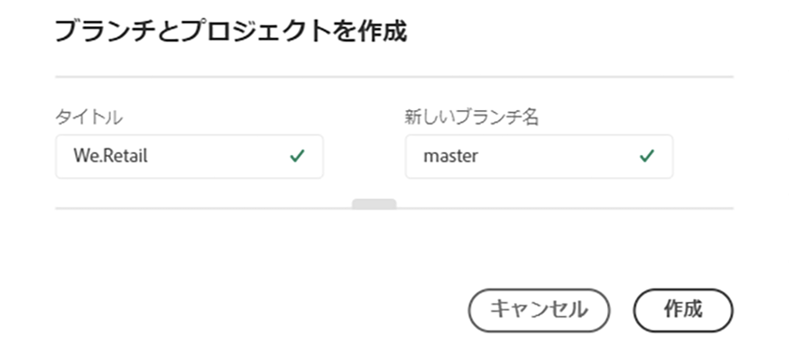
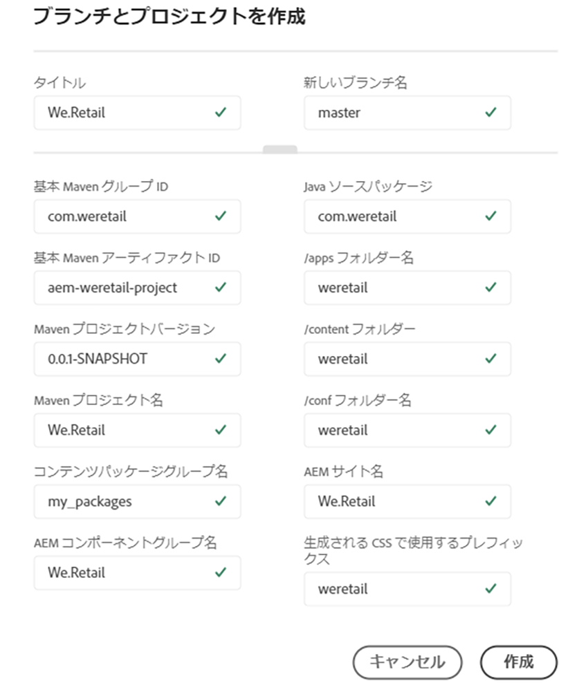

# ウィザードの使用 {#using-wizard-to-create-an-aem-application-project}

ユーザーが Cloud Manager にオンボーディングされると、空の Git リポジトリが提供されます。現在の Adobe Managed Services（AMS）ユーザー（または AMS に移行中のオンプレミス AEM ユーザー）は、通常、プロジェクトコードを既に Git（または別のバージョン管理システム）に格納してあり、プロジェクトを Cloud Manager の Git リポジトリにインポートすることになります。ただし、新規ユーザーは既存のプロジェクトを持っていません。

新規ユーザーが作業に着手しやすくなるように、Cloud Manager では、最小限の AEM プロジェクトを出発点として作成できるようになりました。このプロセスは、[**AEM プロジェクトアーキタイプ**](https://github.com/Adobe-Marketing-Cloud/aem-project-archetype)に基づいておこなわれます。

Cloud Manager で AEM アプリケーションプロジェクトを作成するには、次の手順に従います。

1. Cloud Manager にログインし、基本的なプログラム設定が完了すると、リポジトリが空の場合、**概要**&#x200B;画面に特別なコールトゥアクションカードが表示されます。

   

1. 「**作成**」をクリックして、ダイアログボックスを開きます。ここで、AEM プロジェクトアーキタイプで必要なパラメーターを指定できます。デフォルトでは、ダイアログボックスで次の 2 つの値が要求されます。

   * **タイトル** - デフォルトでは&#x200B;*プログラム名*&#x200B;に設定されています。

   * **新しいブランチ名** - デフォルトでは *master* になっています。

   

   ダイアログボックスには、ダイアログの下部近くにあるハンドルをクリックして開くことができるドロワーがあります。これを展開すると、そのアーキタイプの設定パラメーターがすべてダイアログに表示されます。これらのパラメーターの多くは、**タイトル**&#x200B;に基づいて生成されるデフォルト値を持っています。

   

   >[!NOTE]
   >
   >例えば、**Title** が ***We.Finance*** の場合、「ベース Maven アーティファクト ID」パラメーターは ***com.wefinance*** として生成されます。これらの値は、必要に応じて変更できます。
   >
   >
   >例えば、生成された値を ***com.wefinance*** から ***net.wefinance*** に変更できます。

1. 前の手順で「**作成**」をクリックして、アーキタイプを使用してスタータープロジェクトを作成し、名前付き Git ブランチにコミットします。これが完了したら、パイプラインを設定できます。